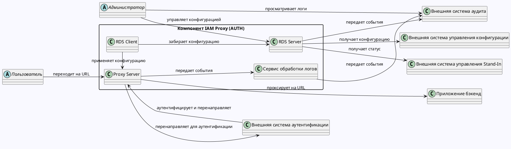

# Концептуальная модель предметной области

На диаграмме элементы соответствуют следующим компонентам Platform V:

1. "Внешняя система аутентификации" - подсистема компонента Keycloak.SE (KCSE).
2. "Proxy Server" - подсистема компонента IAM Proxy (AUTH).
3. "RDS Server" - подсистема компонента IAM Proxy (AUTH).
4. "RDS Client" - подсистема компонента IAM Proxy (AUTH).
5. "Сервис обработки логов" - подсистема (на базе Fluent Bit) компонента IAM Proxy (AUTH).
6. "Внешняя система управления конфигурации" - подсистема компонента PACMAN (CFGA).
7. "Внешняя система аудита" - подсистема компонента Audit (AUDT).
8. "Внешняя система управления Stand-In" - подсистема компонента Прикладной журнал (APLJ).
9. "Приложение бэкенд" - абстрактное приложение в бэкенд, которое защищается с помощью IAM Proxy.
