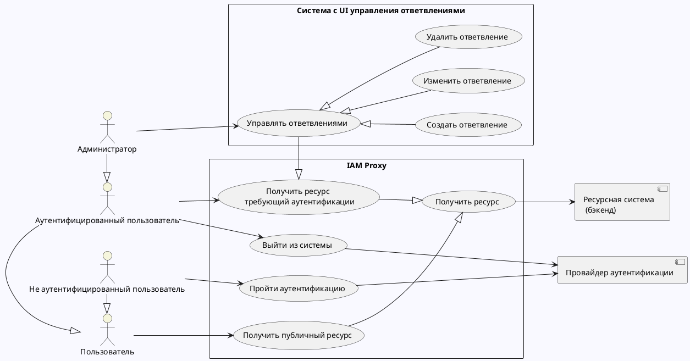

# Варианты и сценарии использования

## Варианты использования

## Сценарии использования

IAM Proxy реализует следующие сценарии:

- [Пройти аутентификацию](use-case-authentification.md)
- [Получить ресурс требующий аутентификации](use-case-accessing-resource.md)
- [Получить публичный ресурс](use-case-accessing-public-resource.md)
- [Управление ответвлениями](use-case-junctions-management.md)
- [Выход из системы](use-case-user-logout.md)

