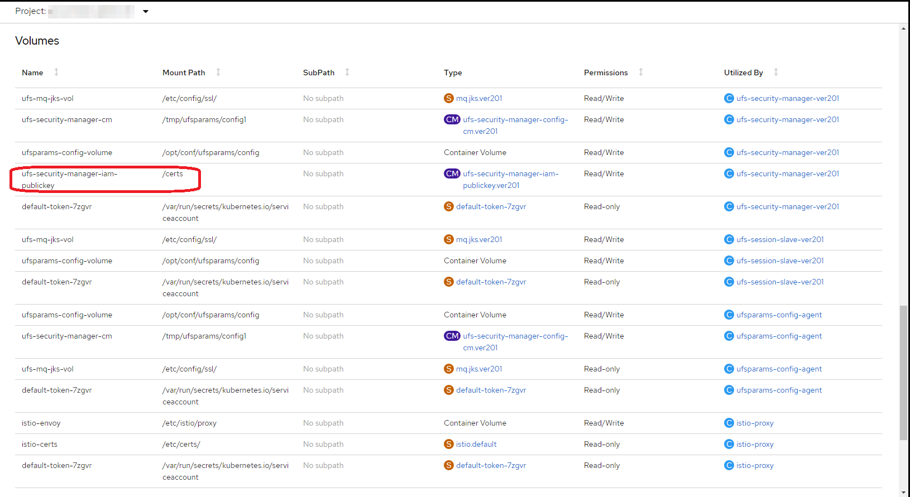

# Настройка веб-приложений Platform V и интеграции IAM

Для приложений, использующих фреймворк Platform V UI и использующих провайдер аутентификации
IAMTokenAuthenticatorProvider, в среде контейнеризации настраивается объект с типом config-map, содержащий открытый ключ
IAM, на котором производится проверка подписи токена от IAM.

На рисунке ниже приведен пример уже смонтированного config-map в папку контейнера (в файл).

Открытый ключ IAM доставляется до config-map job Jenkins при развертывании приложения.

Данный ключ хранится в common разделе, по пути /ansible/files/publickey.pem .

Пример размещения

- <https://git.mycompany.ru/bitbucket/projects/DITEFS_NT/repos/ci0000000_name/browse/ansible/files/publickey.pem>

В случае проблем с проверкой подписи токена необходимо проверить, что открытый ключ в контейнере содержит актуальное
значение из IAM, и что при развертывании используется его актуальное значение.

> :warning: **ВНИМАНИЕ!!!** 
>
> Использование публичного ключа хранимого в файле не является целевым.
> Необходимо использовать endpoint JWKS_URI для получения ключей, который можно задать через переменную окружения
> `iam.auth.publickey.locations`,
> как пример в случае IDP Keycloak
> `iam.auth.publickey.locations="https://platformauth.*\\.mycompany\\.ru/auth/realms/.*=$0/protocol/openid-connect/certs"`.
> 
>

