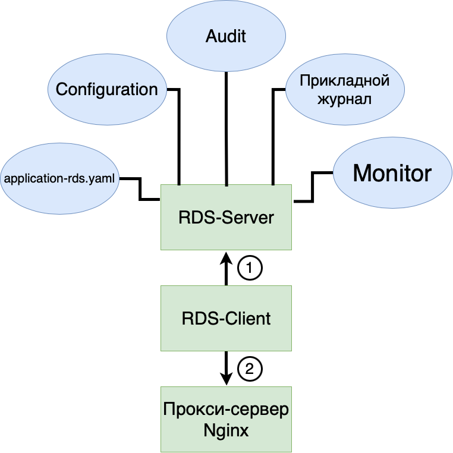

# RDS Server

RDS Server - сервер предоставляющий информацию о текущей конфигурации маршрутов IAM Proxy для конкретного стенда.

Руководство поможет:

- понять, что такое RDS Server и какие задачи он выполняет;
- настроить RDS Server;
- получить данные для конфигурации прокси-сервера IAM Proxy;
- интегрировать такие сервисы как PACMAN (CFGA), Audit (AUDT), Прикладной журнал (APLJ) и другие.

RDS Server (Route Discovery Service Server) - web-приложение по управлению маршрутами и конфигурацией прокси-сервера
IAM Proxy, размещаемое на сервере.

RDS Client - клиентская часть RDS Server, устанавливается рядом с IAM Proxy, и вызывает API RDS Server по HTTP,
получая таким образом актуальную информацию о маршрутах и обновляя конфигурацию IAM Proxy.

Задачи, которые решает RDS Server:

- сбор, обработка, формирование данных из нескольких источников, позволяющих получить конфигурацию для прокси-сервера;
- хранение параметров о маршрутизации и балансировки (конфигурации) сервиса по управлению параметрами PACMAN (CFGA).
  Позволит оперативно через UI / API добавить / удалить сервера в пуле балансировки в реальном времени;
- автоматическое переключение пула балансировки (бэкенд) прокси-сервера на резервный контур (StandIn) по данным из
  Прикладного Журнала (APLJ);
- предоставление конфигурации для RDS Client в формате JSON по HTTP.