# Администрирование с помощью компонента PACMAN (CFGA)

> Вариант администрирования с помощью PACMAN (CFGA) является устаревшим (deprecated).
> Для администрирования с использованием PACMAN (CFGA) или yaml-файла в формате PACMAN, требуется наличие RDS Server на
> стенде. Поддержку данной интеграции и RDS Server планируется прекратить с релиза Platform V IAM 5.0.0.

## Введение

Раздел содержит описание администрирования компонента IAM Proxy с помощью компонента PACMAN (CFGA).

## Предусловие

Перед началом использования компонента PACMAN (CFGA) необходимо выполнить следующие действия:

1. Ознакомиться с документацией на компонент [PACMAN (CFGA)](doc://CFGA).
2. Получить роль `platformauth_admin` - необходимо для доступа в UI RDS (задается на стороне компонента KeyCloak.SE
   (KCSE) продукта Platform V IAM (IAM)). Роль `platformauth_admin` обладает правами на чтение статуса.
3. Иметь установленный RDS Server - необходимо для использования компонента PACMAN (CFGA). Подробнее в
   разделе [Установка RDS Server в OSE/k8s](../additional-materials/rds-server-deploy-ose.md).
4. Иметь настроенную интеграцию RDS Server с компонентом PACMAN (CFGA). Подробнее в разделе
   [Настройка получения конфигурации](../additional-materials/rds-server-get-conf.md).

## Доступ к приложению

Для получения доступа к настройкам приложения IAM Proxy, в компоненте PACMAN (CFGA), выполните следующие действия:

1. Перейдите в браузере на UI PACMAN;
2. Пройдите аутентификацию в PACMAN;
3. После успешной аутентификации, в списке операций выберите пункт "Управление параметрами 2.0".
   > Откроется единое окно «PACMAN (CFGA): параметры и конфигурации»

   *Управление параметрами 2.0*\
   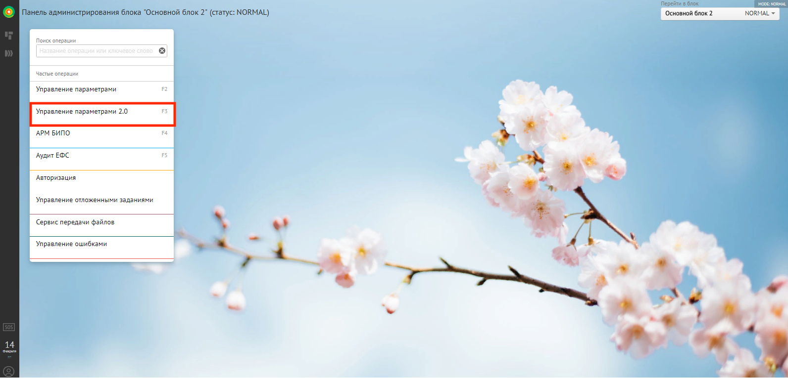

4. Выберите модуль "Конфигурации. Управление и настройка конфигураций артефактов".

   *Конфигурации. Управление и настройка конфигураций артефактов*\
   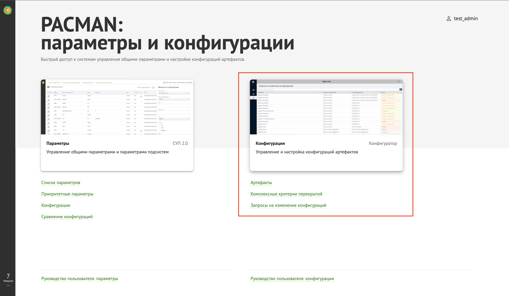

   > Откроется АРМ компонента Platform V Configurator

## Использование приложения администратором

### Загрузка модели конфигурации артефакта

Для загрузки модели конфигурации артефакта IAM Proxy, необходимо обладать правами не ниже администратора.

Для загрузки модели конфигурации артефакта IAM Proxy, выполните следующие действия:

1. Пройдите авторизацию в АРМ компонента Platform V Configurator;
   > Откроется главная страница
2. Нажмите "Импорт модели";
   > Откроется окно импорта моделей
3. Нажмите "Выбрать файлы";
   > Откроется окно выбора файлов для импорта
4. Укажите в файловой системе путь к xml-файлу модели конфигурации:(Расположение файла в дистрибутиве:
   `/config/rds-server-config-struct.xml`);
5. Нажмите "Импортировать".
   > Выполнится импорт указанного артефакта
   > При импорте существующего артефакта, выполнится его обновление до последней версии
   > Невозможно повторно импортировать уже существующую версию артефакта с заполненными
   > настройками (появится сообщение о необходимости удаления артефакта и его перекрытий)

   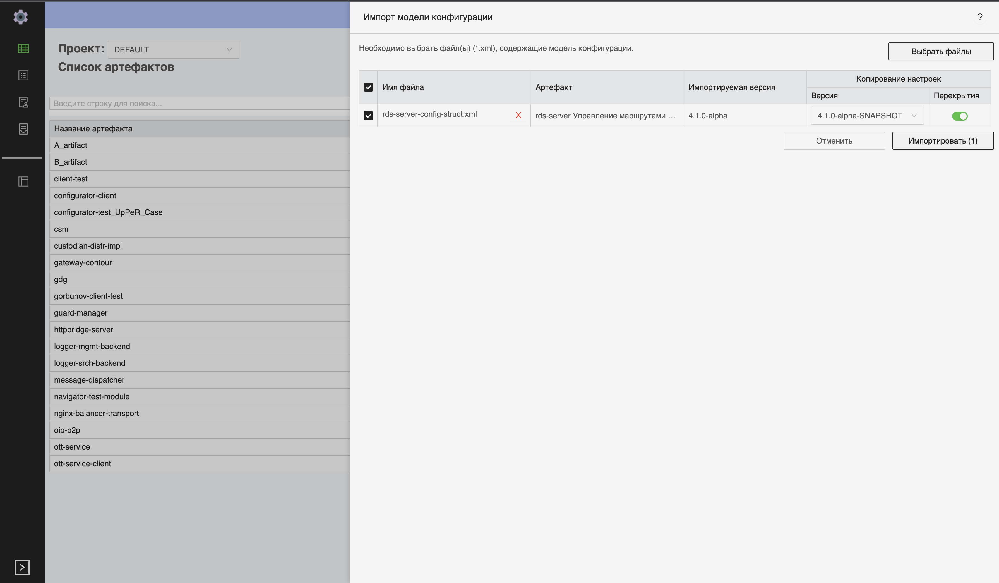

Описание полей таблицы с файлами для импорта:

| Наименование поля    | Описание                                                                                                                                                                            |
|----------------------|-------------------------------------------------------------------------------------------------------------------------------------------------------------------------------------|
| Имя файла            | Содержит наименование выбранного для импорта файла и кнопку для удаления файла из списка                                                                                            |
| Артефакт             | Содержит название артефакта и оригинальное имя артефакта                                                                                                                            |
| Импортируемая версия | Содержит название версии артефакта                                                                                                                                                  |
| Копируемая версия    | Содержит элементы управления, обеспечивающие копирование настроек из выбранной версии в импортируемую с дополнительной возможностью копирования всех перекрытий из указанной версии |

### Изменение значений параметров конфигураций с помощью интерфейса

Для изменения значение настройки, выполните следующие действия:

1. Нажмите на иконку `Артефакты`;
   > Откроется окно артефактов

   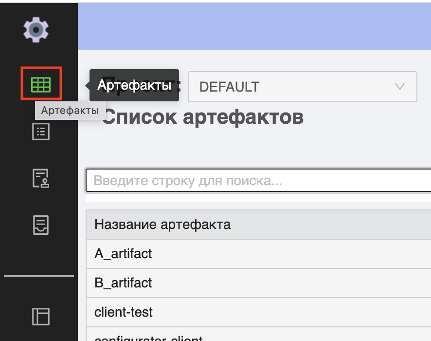

2. Откройте всплывающие меню `Проект` и выберите проект `default`;

   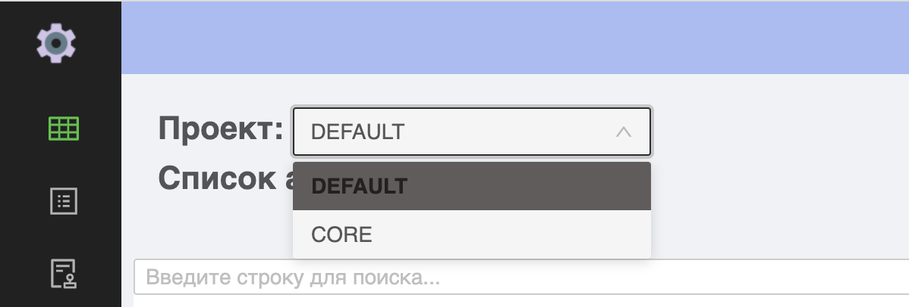

3. В поисковой строке, введите `rds-server` и нажмите "Поиск";
   > На экран будут выведены результаты поиска по заданным параметрам

   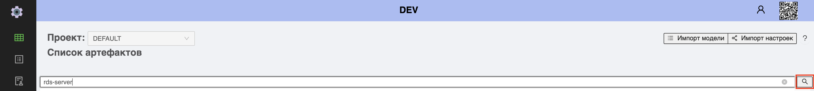

4. Из результатов поиска, выберите артефакт соответсвующий параметрам:

    - название артефакта: "Управление маршрутами прокси-сервера (Route Discovery Service)";
    - оригинальное имя артефакта: `rds-server`.
   > Откроется окно выбранного артефакта

   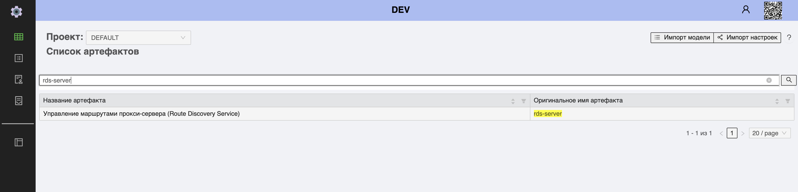

5. Выберите необходимую версию артефакта;
   > Откроется окно выбранной версии артефакта

   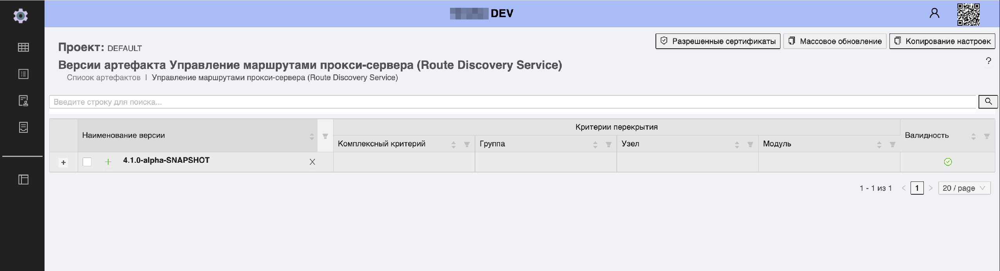

6. Раскройте дерево конфигурации выбранной версии.
   > Раскроется дерево конфигурации

   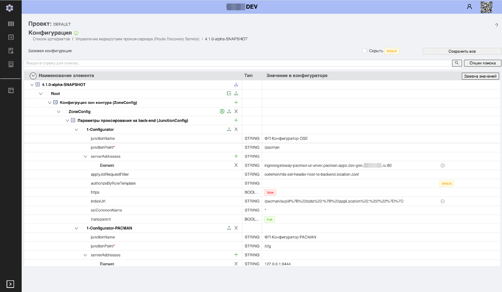

   **Пример работы с деревом конфигурации: Создание нового узла дерева конфигурации**

   > Для избежания ошибок имя узла дерева (группы) должно быть уникально, например:`GROUP123`

Для создания нового узла дерева конфигурации, выполните следующие действия:

1. Нажмите на иконку "Добавить узел дерева";
   > Откроется окно создания нового узла

   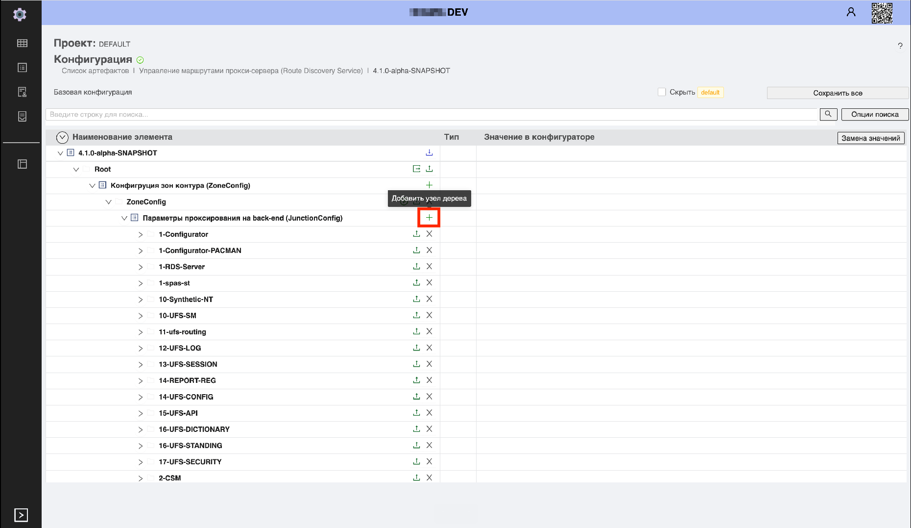

2. Заполните значения параметров в соответствующих полях (например:`junctionPoint`);

   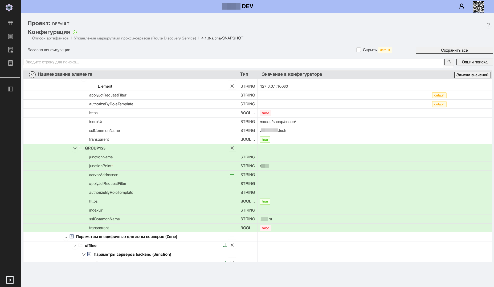

3. Нажмите "Сохранить все".
   > Изменения сохранятся, созданный узел дерева будет добавлен в общий список

   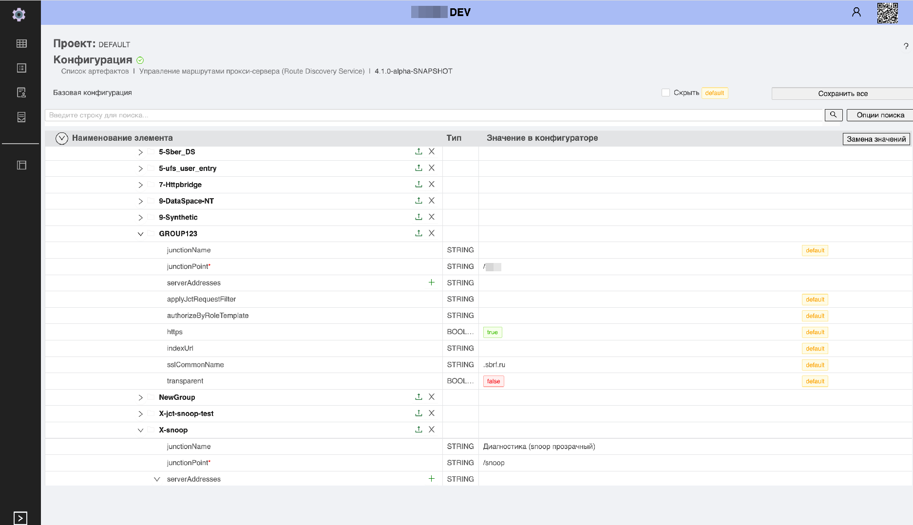

> Примечание:
> Сохранение выполняется посредством нажатия кнопки "Сохранить все". В ином случае изменения не сохранятся.
> При сохранении выполняется итоговая проверка конфигурации в соответствии с моделью. При неуспешной валидации
> выводится предупреждающее сообщение о причине.

### Загрузка значений параметров конфигурации

При необходимости загрузки значений параметров из файла `*.properties` предусмотрена функция импорта в PACMAN.

Текущие параметры в файл возможно экспортировать с помощью функции экспорта конфигурации (кнопка "Экспорт").

Загрузка значений параметров конфигурации артефакта осуществляется одним из перечисленных способов:

- через дерево конфигурации;
- с помощью кнопки "Импорт настроек".

Пример файла `*.properties`:

```
#@artifact=rds-server
#@artifact_version=4.1.0-alpha-SNAPSHOT
#@version.crit=[;;]
#Tue Feb 08 09:35:46 MSK 2022

rds-server@ZoneConfig[ZoneConfig]/JunctionConfig[1-Configurator]/applyJctRequestFilter=set-header-host-to-backend
rds-server@ZoneConfig[ZoneConfig]/JunctionConfig[1-Configurator]/authorizeByRoleTemplate=
rds-server@ZoneConfig[ZoneConfig]/JunctionConfig[1-Configurator]/https=false
rds-server@ZoneConfig[ZoneConfig]/JunctionConfig[1-Configurator]/indexUrl=/pacman/sup/#%7B%22data%22:%7B%22appLocation%22:%22/%22%7D%7D
rds-server@ZoneConfig[ZoneConfig]/JunctionConfig[1-Configurator]/junctionName=#BD/Platform V Configuration OSE
rds-server@ZoneConfig[ZoneConfig]/JunctionConfig[1-Configurator]/description=Расширенное описание #BD/Platform V Configuration OSE
rds-server@ZoneConfig[ZoneConfig]/JunctionConfig[1-Configurator]/junctionPoint=/pacman
rds-server@ZoneConfig[ZoneConfig]/JunctionConfig[1-Configurator]/serverAddresses=ingressgateway-pacman-ui-unver.pacman.apps.dev-gen.mycompany.ru:80;
rds-server@ZoneConfig[ZoneConfig]/JunctionConfig[1-Configurator]/sslCommonName=*
rds-server@ZoneConfig[ZoneConfig]/JunctionConfig[1-Configurator]/transparent=true
rds-server@ZoneConfig[ZoneConfig]/JunctionConfig[1-Configurator-PACMAN]/applyJctRequestFilter=
rds-server@ZoneConfig[ZoneConfig]/JunctionConfig[1-Configurator-PACMAN]/authorizeByRoleTemplate=
rds-server@ZoneConfig[ZoneConfig]/JunctionConfig[1-Configurator-PACMAN]/https=true
rds-server@ZoneConfig[ZoneConfig]/JunctionConfig[1-Configurator-PACMAN]/indexUrl=/ufs-config-manager/pacman/configurator/
rds-server@ZoneConfig[ZoneConfig]/JunctionConfig[1-Configurator-PACMAN]/junctionName=#BD/Platform V Configuration
rds-server@ZoneConfig[ZoneConfig]/JunctionConfig[1-Configurator-PACMAN]/description=Расширенное описание #BD/Platform V Configuration
rds-server@ZoneConfig[ZoneConfig]/JunctionConfig[1-Configurator-PACMAN]/junctionPoint=/cfg
rds-server@ZoneConfig[ZoneConfig]/JunctionConfig[1-Configurator-PACMAN]/serverAddresses=127.0.0.1:9444;
rds-server@ZoneConfig[ZoneConfig]/JunctionConfig[1-Configurator-PACMAN]/sslCommonName=*
rds-server@ZoneConfig[ZoneConfig]/JunctionConfig[1-Configurator-PACMAN]/transparent=true
...
```

Подробную информацию по каждому из параметров можно найти в разделе: [Параметры для настройки RDS Server](config-parameters.md)

#### Загрузка значений параметров конфигураций через дерево конфигурации

> Перед загрузкой значений параметров конфигураций, необходимо выполнить загрузку модели конфигурации артефакта

Для загрузки параметров конфигурации артефакта, через дерево конфигурации, в окне просмотра параметров конкретной
конфигурации, выполните следующие действия:

1. Перейдите в окно просмотра параметров конфигурации.
   > Откроется окно просмотра параметров
2. Нажмите на иконку 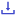, на уровне конфигурационного
   элемента.
   > Откроется окно импорта конфигураций
3. Нажмите "Выбрать файлы".
   > Откроется окно выбора файлов
4. Укажите путь к файлу `*.properties` в файловой системе.
   > Наименование файла отобразится под кнопкой "Выбрать файлы"
5. Нажмите "Импортировать".
   > Начнется импорт выбранного файла

> При загрузке конфигурации выполняется ее проверка в соответствии с моделью конфигурации артефакта.
> При неуспешной валидации появляется предупреждающее сообщение о причине. При этом сохранение в базу
> выполняется независимо от результата валидации.
> Из файла не загружаются поля с признаком запрета миграции значения – `transient`.
> После завершения импорта необходимо заполнить такие поля вручную и сохранить конфигурацию.

6. Дождитесь завершения импорта и заполните оставшиеся поля.
7. Нажмите "Сохранить".
   > Параметры конфигурации сохранены

   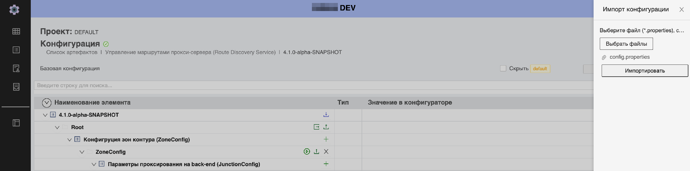

#### Загрузка с помощью кнопки «Импорт настроек»

**Предусловие**

При импорте конфигураций для компонента обязательно должны быть выполнены условия:

- Перед загрузкой значений параметров конфигураций, необходимо выполнить загрузку модели конфигурации артефакта;
- В импортируемом файле обязательно наличие разделов:
    - `#@artifact=`;
    - `#@artifact_version=`.
- Для значений параметров применяются следующие ограничения:
    - при использовании DNS-имен в `serverAddresses` они должны успешно разрешаться в IP на DNS-сервере, который
      используется на IAM Proxy (иначе конфигурация не будет применена);
    - `applyJctRequestFilter` должен содержать пути к существующим файлам на IAM Proxy;
    - при `https = true` необходимо обеспечить наличие сертификатов ЦС в TrustStore IAM Proxy;
    - параметр `junctionPoint` должен быть уникален и не должен заканчиваться на "/";
    - в случае наличия у всех запросов на приложение, одного базового корневого контекста, рекомендуется
      использовать `transparent = true`;
    - использовать в `applyJctRequestFilter` опции `set-header-host-to-backend`
      и/или `ssl-sni-on` при проксировании в `k8s/OS`.

**Импорт настроек**

«Импорт настроек» позволяет импортировать любые значения конкретной указанной версии.

Для загрузки значений параметров конфигурации артефакта с помощью импорта настроек, выполните следующие действия:

1. Нажмите "Артефакты";
   > Откроется окно артефактов

   

2. На главной странице нажмите "Импорт настроек";
   > Откроется окно импорта настроек

   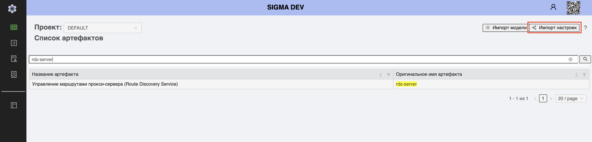

3. Нажмите "Выбрать файлы";
   > Откроется окно выбора файлов для импорта
4. Выберите файлы `*.properties` со значениями параметров конфигурации.

Файлы с настройками должны соответствовать требованиям к структуре файла (поля должны соответствовать загруженной ранее
схеме артефакта `rds-server`), при этом обязательно наличие следующих разделов:

```
#@artifact=rds-server
#@artifact_version=....
```

5. Нажмите "Импортировать".
   > При успешном импорте окно закроется автоматически
   >
   > При возникновении ошибки система проинформирует сообщением

   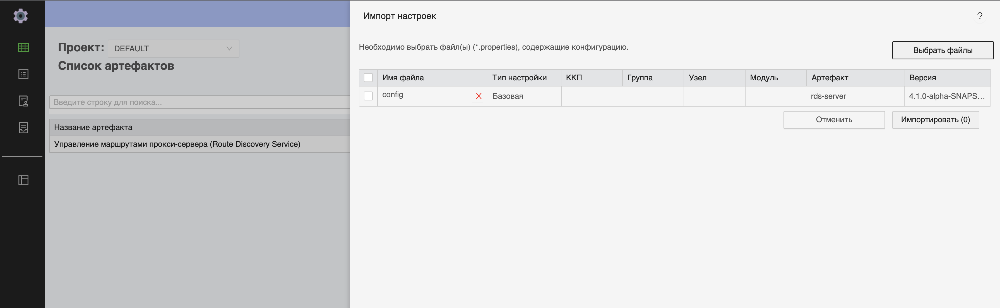

