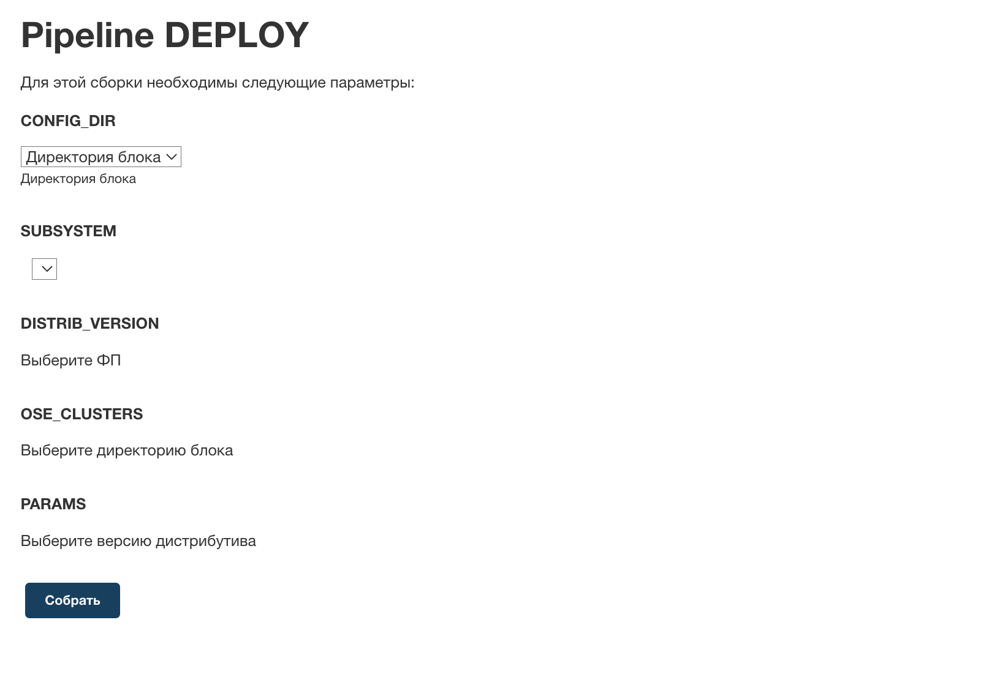
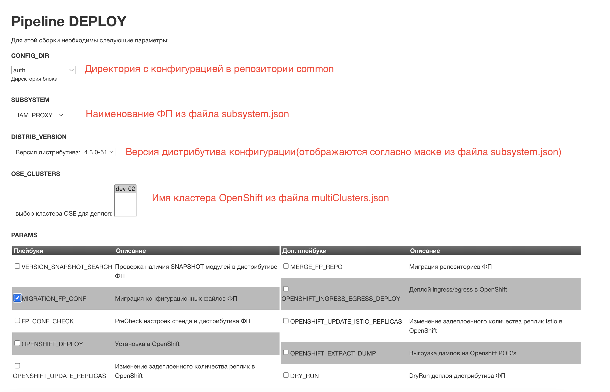
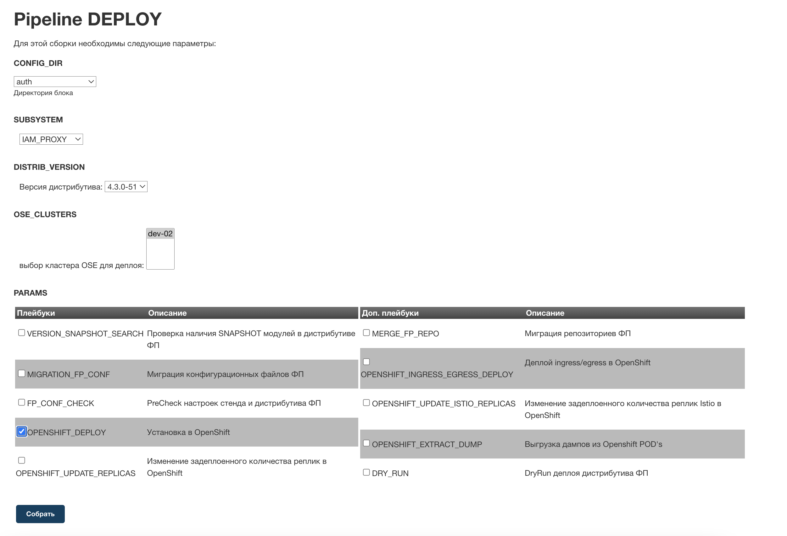

# Установка IAM Proxy в OpenShift/k8s при помощи инструментов Platform V DevOps Tools

## Введение

Данное руководство предназначено для описания установки IAM Proxy в OpenShift при помощи инструментов Platform V DevOps
Tools.

В руководстве даны пояснения как настроить Jenkins job, для установки IAM Proxy в среду контейнеризации OpenShift.

Далее указана минимальная часть конфигурации необходимая для установки IAM Proxy.

Более подробную информацию по использованию компонента Deploy tools (CDJE) продукта Platform V DevOps Tools (DOT),
смотрите в документации на одноименный компонент.

**Примечание**:При развертывании с использованием инструментов Platform V DevOps Tools на промышленные стенды, отключена
возможность включения уровня логирования `debug`.

## Предусловия

Должен быть установлен Platform V DevOps Tools.
> Для получения информации по установке, ознакомьтесь с документацией на Platform V DevOps Tools.

Для соответствия требованиям безопасности, необходимо выполнить подключение к Platform V Synapse Service Mesh средствами
администратора кластера (подробнее в
разделе [Настройка конфигурационных параметров](proxy-deploy-ose-cd.md)).

В случае отсутствия необходимости обеспечения безопасности, установка IAM Proxy поддерживает эксплуатацию без
использования Platform V Synapse Service Mesh (подробнее в разделе "Настройка конфигурационных параметров").

## Подготовка конфигурации CDJE

Для подготовки конфигурации CDJE, пройдите в репозиторий "common", созданный в результате развертывания Platform V
DevOps Tools, и сконфигурируйте следующие файлы:

- `subsystems.json`  - параметры NEXUS репозитория с настройками артефакта (конфигурацией компонента). Пример
  представлен ниже.

```json5
{
  "__default": {
    // Секция по умолчанию. При миграции конфигурации из дистрибутива DevOpsTools перезаписывается.
    "classifier": "distrib",
    "groupId": "Nexus_PROD",
    "packaging": "zip",
    "strict": "true",
    "limit": 101,
    "deployType": "manual",
    "openshiftProject": "",
    "at": {
      "groupId": "Nexus_PROD",
      "branch": "master",
      "classifier": "distrib",
      "packaging": "zip"
    },
    "at_ui": {
      "groupId": "Nexus_PROD",
      "branch": "master",
      "classifier": "distrib",
      "packaging": "zip"
    }
  },
  "IAM_PROXY": {
    // Наименование блока настроек. Настройки в этом блоке, будут перекрывать соответсвующее из блока __default
    "fpi_name": "component-name",
    // Название ФП в Installer. Задает список приложений из дистрибутива ФП, которые нужно установить.
    // Соответствует id КЛЮЧА из словаря applications. Для данного id КЛЮЧА из словаря applications
    // будут также считываться параметры "deploy_group", "config_fp_name".
    // Если приложений несколько - нужно перечислить через запятую. Это наименование будет отображаться в UI CDJE.
    "groupId": "some.group.id",
    // GroupId артефакта конфигурации
    "artifactId": "component-cfg",
    // ArtifactId артефакта конфигурации
    "versionFilter": "4.3",
    // Фильтр версий артефакта конфигурации, которые будут отображаться в UI CDJE
    "strict": "false",
    // Режим миграции настроек ФП, true - будут мигрировать только файлы, начинающиеся на <fpi_name>,
    // false - все конфигурационные файлы.
    "fpType": "bts",
    // Указывается тип приложения для фильтрации в Jenkins job. Для выбора нескольких вариантов
    // необходимо указать в настройках job: FP_TYPE_FILTER=bts, bfs
    "deployType": "consistently"
    // Тип автоматического развертывания (parallel - параллельный, consistently - последовательный)
  }
}
```

- `multiClusters.json`  - настройка кластеров OpenShift, в которые будет производиться установка компонента. Пример
  представлен ниже.

```json5
{
  "datacenters": {
    "dev-02": {
      // Наименование кластера, которое будет отображаться в UI Jenkins job
      "openshiftCluster": "https://openshift.my.company.ru:6443",
      // api кластера openshift
      "openshiftNewRoute": "myproject.apps.openshift.my.company.ru",
      // Параметр содержащий постфикс ссылки для route манифеста
      "openshiftProjectName": "myproject",
      // Наименование проекта (project)
      "openshiftSATokenCred": "openshift_credential",
      // id credential в jenkins содержащий токен доступа к проекту в openshift
      "openshiftAppsDomain": "apps.openshift.mycompany.ru",
      // Суффикс домена для сервисов кластера
      "openshiftWebConsole": "https://console-openshift-console.mycompany.ru/k8s/cluster/projects",
      // Ссылка на кластер для формирования корректной ссылки на проект в описании job для развертывания
      "openshiftControlPlaneIstiodService": "istiod-basic",
      "openshiftControlPlaneProject": "my-istio-system"
    }
  }
}
```

- `environment.json`  - основной конфигурационный файл. Пример представлен ниже.

> Секция "__default" файла  `environment.json`  перезаписывается при каждой миграции. Для установки собственных
> параметров, необходимо создать дополнительную секцию, в которой можно переопределить параметры по умолчанию, так
> же убрать неиспользуемые опции CDJE, например отключить список параметров запуска связанный с WAS.

```json5
{
  "__default": {
    // Секция по умолчанию. При миграции конфигурации из дистрибутива DevOpsTools перезаписывается.
    "disableDistrDownload": "true",
    "pipeline_extensions": {
      "GAC": {
        "enable": false,
        "description": "Проверка GAC",
        "extend": {
          "instead": [
            "START_DEPLOY"
          ]
        },
        "withJobs": [
          "deploy",
          "spo",
          "elk"
        ],
        "failJobOnError": false,
        //...
        //...
        //...
        "DRY_RUN": {
          "id": 14
        }
      }
    },
    "dev1": {
      // Секция с custom настройками
      "iag_configuration": {
        // Секция переопределяет отображение опций запуска CDJE в разделе настроек IAG
      },
      "tooling": "true",
      // Включает возможность использовать альтернативные версии вспомогательных приложений, таких как ansible, java и т.д.
      "toolingAnsibleForceVersion": "ansible29",
      // Устанавливает используемую версию ansible при развертывании
      "openshiftMultiClusters": "true",
      // Переключатель (true/false) механизма для работы с несколькими кластерами.
      // При активации часть параметров OpenShift будет браться из файла multiClusters.json
      "openshiftDeploySafeMode": "false",
      // Флаг проверки иммутабельности критичных полей openshift-конфигураций istio
      "openShiftPrecheck": "warning",
      // Флаг включения/выключения валидации конфигураций дистрибутива OpenShift; fail/warning/off-режимы
      "openshiftCheckConfNames": "warning",
      // Флаг включения/выключения валидации имен onf-файлов; fail/warning/off-режимы
      "iag": "false",
      // Если "true", то в меню пайплайна появляется список выбора репозитория с конфигурациями "current", "last", "previous"
      "mavenArtifactsUrls": [
        // Список репозиториев nexus в которых будет производиться поиск необходимых компонентов CDJE
        "https://mycompany.ru/nexus-ci/repository/maven/",
        "https://mycompany.ru/nexus-cd/repository/nexus_prod/",
        "https://mycompany.ru/nexus-cd/repository/PROD/"
      ],
      "installer": {
        // Реквизиты установщика ФП (Installer) в хранилище Nexus
        "common": {
          "groupId": "mycompany_PROD.CI90000011_run4c",
          "artifactId": "CI01027901_AS_EFS_Installer.Common",
          "version": "D-02.001.00-*",
          "classifier": "distrib",
          "packaging": "zip"
        },
        "migration": {
          "groupId": "Nexus_PROD",
          "artifactId": "CI01027846_AS_EFS_Installer.Migration",
          "version": "D-02.001.00-343",
          "classifier": "distrib",
          "packaging": "zip"
        }
      },
      "playbooks_fpi": {
        // Сценарии развертывания для Pipeline AutoDeploy (переопределяет аналогичное поле в секции __default).
        // при помощи данной настройки убираются неиспользуемые опции job.
        "VERSION_SNAPSHOT_SEARCH": {
          "id": 18
        },
        "MIGRATION_FP_CONF": {
          "id": 19
        },
        "FP_CONF_CHECK": {
          "id": 21
        },
        "OPENSHIFT_DEPLOY": {
          "id": 23
        },
        "OPENSHIFT_UPDATE_REPLICAS": {
          "id": 24
        },
        "MERGE_FP_REPO": {
          "id": 25
        },
        "OPENSHIFT_INGRESS_EGRESS_DEPLOY": {
          "id": 26
        },
        "OPENSHIFT_UPDATE_ISTIO_REPLICAS": {
          "id": 27
        },
        "OPENSHIFT_EXTRACT_DUMP": {
          "id": 28
        },
        "DRY_RUN": {
          "id": 29
        }
      },
      "playbooks_extra": {
        // Отключает опции, которые не используются при установке IAM Proxy
      },
      "playbooks_security": {
        // Отключает опции, которые не используются при установке IAM Proxy
      },
      "playbooks_import": {
        // Отключает опции, которые не используются при установке IAM Proxy
      }
    }
  }
}
```

### Дополнительная информация по конфигурации

- в репозитории common в файле  `<директория с конфигурацией>/parameters/common.conf.yml` должна быть определена хотя бы
  одна переменная.
- в репозитории common в директории  `<директория с конфигурацией>/secrets` в файлах `secret.yml` и `_passwords.conf`
  должны быть определены параметры, а содержимое файлов должно быть зашифровано.
  `secret.yml`  шифруется стандартными средствами Ansible при помощи ansible-vault encrypt, а `_passwords.conf` -
  выполнив в терминале команду:\
  `openssl enc -aes-256-cbc -md md5 -salt -in _passwords_d.conf -out _passwords.conf`
- id jenkins credentials определяются в  `environment.json`  в параметрах:
    - для  `_passwords.conf`  -  `"credentials": { "openshiftOpsPasswordsCred": "vault_cred_openshift_ops" }`;
    - для  `secret.yml`  - `"credentials": {"ansible_vault_id": "<credential id>"}`;
    - эти параметры так же можно переопределить в секции с custom настройками файла  `environment.json`.

## Удаление ресурсов из namespace Kubernetes/OpenShift

Удаление ресурсов из namespace Kubernetes/OpenShift выполняется сценариями `Deploy job`.

### Предусловие

Перед выполнением удаления рекомендуется проверить:

* в Jenkins доступен Tool с kubectl версии не ниже 1.18;
* наличие настройки имени tool в параметре `kubectlToolName` в `environment.json`;
* наличие настройки имени tool в параметре `jqToolName` в `environment.json`;
* (Опционально). Для возможности удалять ресурсы используя фильтр jq должен быть доступен Tool с jq.

### Deploy job

Для удаления ресурсов из namespace Kubernetes/OpenShift в `Deploy job` используются сценарии `OPENSHIFT_PURGE_PROJECT` и
`KUBERNETES_PURGE_PROJECT`.

Оба файла сценариев (playbooks) удаляют только объекты подпадающие под фильтр который настроенный по полю объектов
label.

Поле label должно содержать параметры `SUBSYSTEM` и `distribReleaseVersion`, значения которых соответствуют значениям
соответствующих параметров запуска `Deploy job`.

Для использования сценариев (playbooks), `OPENSHIFT_PURGE_PROJECT` и `KUBERNETES_PURGE_PROJECT` должны быть добавлены в
секцию `playbooks_extra` соответствующего стенда в файл `environment.json` Common-репозитория.

После добавления сценариев (playbooks), `Deploy job` необходимо переконфигурировать, используя запуск без параметров.

Пример:

```json
{
  "mycompany": {
    "playbooks_extra": {
      "OPENSHIFT_PURGE_PROJECT": {
        "id": 99
      },
      "KUBERNETES_PURGE_PROJECT": {
        "id": 100
      }
    }
  }
}
```

## Deploy приложения

В результате настройки и подготовки CDJE, в Jenkins появится две jenkins job - `Service` и `Deploy`:

- job `Service` - загружает стандартные конфигурации common из дистрибутива Platform V DevOps Tools в репозитории
  Bitbucket и обновляет версии конфигураций;
- job `Deploy` - устанавливает приложение в кластер OpenShift.

После настройки конфигурационных файлов  `subsystems.json` ,  `multiClusters.json`  и  `environment.json`  необходимо
выполнить шаги для установки приложения в кластер:

1. Выполнить миграцию параметров в job. Для этого нужно запустить job без параметров:
   .
2. Выполнить миграцию стендозависимых параметров из артефакта конфигурации компонента в репозиторий с конфигурациями
   функциональных подсистем. Для этого нужно выполнить job с опцией `MIGRATION_FP_CONF`:
   .
3. Выполнить настройку стендозависимых параметров (подробнее в разделе "Настройка конфигурационных параметров").
4. Выполнить deploy приложения в OpenShift, запустив Deploy job с параметром `OPENSHIFT_DEPLOY`:
   
   

## Настройка конфигурационных параметров

После выполнения миграции конфигурационных файлов, можно приступать к настройке параметров приложений (IAM Proxy,
RDS Server), которые находятся в отдельном репозитории с конфигурациями функциональных подсистем.

### Параметры в файле `<репозиторий подсистемы>/<директория конфигурации>/config/parameters/auth.all.conf`

| Параметр                                                                                            | Описание                                                                                                                                                                                                                                                                                                                                                                | Пример заполнения                                                                                                                        |
|-----------------------------------------------------------------------------------------------------|-------------------------------------------------------------------------------------------------------------------------------------------------------------------------------------------------------------------------------------------------------------------------------------------------------------------------------------------------------------------------|------------------------------------------------------------------------------------------------------------------------------------------|
| auth.k8s.rdsserver.enabled                                                                          | Включение/отключение использования RDS Server (возможные значения к заполнению true/false)                                                                                                                                                                                                                                                                              | true                                                                                                                                     |
| auth.k8s.istio.enabled                                                                              | Включение/отключение использования Platform V Synapse Service Mesh (istio) (возможные значения к заполнению true/false)                                                                                                                                                                                                                                                 | true                                                                                                                                     |
| auth.k8s.secman.enabled                                                                             | Включение/отключение использования SecMan (возможные значения к заполнению true/false)                                                                                                                                                                                                                                                                                  | true                                                                                                                                     |
| auth.k8s.audit.enabled                                                                              | Включение/отключение использования интеграции с Platform V Audit SE (возможные значения к заполнению true/false)                                                                                                                                                                                                                                                        | true                                                                                                                                     |
| auth.k8s.monitoring.enabled                                                                         | Включение/отключение публикации метрик приложений для мониторинга (возможные значения к заполнению true/false)                                                                                                                                                                                                                                                          | true                                                                                                                                     |
| auth.k8s.logger.enabled                                                                             | Включение/отключение использования fluent-bit (возможные значения к заполнению true/false)                                                                                                                                                                                                                                                                              | true                                                                                                                                     |
| registry                                                                                            | Docker Registry FQDN                                                                                                                                                                                                                                                                                                                                                    | example.registry.mycompany.ru                                                                                                            |
| registry_path                                                                                       | Путь до image контейнеров приложений IAM Proxy (rds-server, fluent-bit, iam-proxy)                                                                                                                                                                                                                                                                                      | /some-context/image-path                                                                                                                 |
| auth.k8s.kube.type                                                                                  | Используемый дистрибутив Kubernetes на стенде (поддерживаются значения - k8s, openshift, dropapp), по умолчанию openshift                                                                                                                                                                                                                                               | openshift                                                                                                                                |
| auth.k8s.service-mesh.type                                                                          | Используемый дистрибутив Service Mesh в NS (поддерживаются значения - rhsm, ssm ), по умолчанию rhsm                                                                                                                                                                                                                                                                    | rhsm                                                                                                                                     |
| auth.k8s.managed-by-label                                                                           | Инструмент, который используется для управления приложением                                                                                                                                                                                                                                                                                                             | CDJE                                                                                                                                     |
| auth.k8s.secman.vault.host                                                                          | SecMan  FQDN                                                                                                                                                                                                                                                                                                                                                            | example.secman.mycompany.ru                                                                                                              |
| auth.k8s.secman.vault.port                                                                          | SecMan ip-порт сервера                                                                                                                                                                                                                                                                                                                                                  | 8443                                                                                                                                     |
| auth.k8s.deployment.spec.template.metadata.annotations.vault.hashicorp.com.role                     | Наименование роли используемой для подключения к SecMan                                                                                                                                                                                                                                                                                                                 | some-role-ga-secman-example                                                                                                              |
| auth.k8s.deployment.spec.template.metadata.annotations.vault.hashicorp.com.namespace                | Наименование namespace SecMan в котором расположены секретные данные                                                                                                                                                                                                                                                                                                    | NAMESPACE_NAME                                                                                                                           |
| auth.k8s.spec.template.spec.containers.fluent-bit-sidecar.image                                     | Полная ссылка на контейнер с fluent-bit                                                                                                                                                                                                                                                                                                                                 | example.registry.mycompany.ru/some-context/image-path/fluent-bit@sha256:lgkaldhjasf98696askfbaf7687a6sfjhbasfgas8f58657sadgk7asbdia7sfdf |
| auth.k8s.logger.kafka.bootstrap.server                                                              | Список серверов kafka Platform V Monitor Журналирование (LOGA)                                                                                                                                                                                                                                                                                                          | 10.x.x.257:9092, 10.x.x.258:9092                                                                                                         |
| auth.k8s.logger.kafka.security.protocol                                                             | Наименование протокола защиты при интеграции с компонентом Журналирование (LOGA) (поддерживаются значения - SSL, PLAINTEXT)                                                                                                                                                                                                                                             | SSL                                                                                                                                      |
| auth.k8s.logger.kafka.topic_name                                                                    | Наименование целевого topic kafka для отправки логов в компонент Журналирование (LOGA)                                                                                                                                                                                                                                                                                  | some-name-topic                                                                                                                          |
| auth.k8s.logger.certs.suffix                                                                        | Суффикс имени SSL сертификатов для egress при интеграции с компонентом Журналирование (LOGA), если они отличаются от основных сертификатов используемых для доступа во внешние сети (Имена файлов - root\<suffix\>.crt, tsl\<suffix\>.crt, tls\<suffix\>.key)                                                                                                           | _logger                                                                                                                                  |
| auth.k8s.audit.rest.proxyUrl                                                                        | URL адрес REST API при интеграции RDS Server с Platform V Audit SE                                                                                                                                                                                                                                                                                                      | https://some.audit.url/                                                                                                                  |
| auth.k8s.audit.kafka.bootstrap.servers                                                              | Список серверов kafka при интеграции Fluent Bit с Platform V Audit SE                                                                                                                                                                                                                                                                                                   | 10.x.x.256:9093,10.x.x.257:9093                                                                                                          |
| auth.k8s.audit.kafka.security.protocol                                                              | Наименование протокола защиты при интеграции с Platform V Audit SE (поддерживаются значения - SSL, PLAINTEXT)                                                                                                                                                                                                                                                           | SSL                                                                                                                                      |
| auth.k8s.audit.certs.suffix                                                                         | Суффикс имени SSL сертификатов для egress при интеграции с Platform V Audit SE, если они отличаются от основных сертификатов используемых для доступа во внешние сети (Имена файлов - root\<suffix\>.crt, tsl\<suffix\>.crt, tls\<suffix\>.key)                                                                                                                         | _audit                                                                                                                                   |
| auth.k8s.podDisruptionBudget.spec.minAvailable                                                      | Определение параметров для включения podDisruptionBudget                                                                                                                                                                                                                                                                                                                |                                                                                                                                          |
| auth.k8s.deployment.spec.template.spec.priorityClassName                                            | Определение класса приоритета Deployment                                                                                                                                                                                                                                                                                                                                |                                                                                                                                          |
| auth.k8s.ingress.spec.ingressClassName                                                              | Определение класса ingress-контроллера (поддерживаются реализации IngressClass на основе nginx или haproxy). Если строка не заполнена, то `ingressClassName` не будет установлен, будет использован класс заданный по умолчанию в кластере                                                                                                                              |                                                                                                                                          |
| auth.k8s.peerAuthentication.enable                                                                  | Включение внутреннего mTLS в namespace. Пустое значение означает, что манифест определяющий данные настройки применен не будет                                                                                                                                                                                                                                          | True                                                                                                                                     |
| auth.k8s.logger.kafka.bootstrap.servers                                                             | Адреса kafka (указывать обязательно IP из-за проблем с маршрутизацией Istio по DNS-именам, должны быть указаны все адреса кластера, так же манифесты не смогут пройти проверку walle)                                                                                                                                                                                   | 10.x.x.1:9093,10.x.x.x:9093                                                                                                              |
| auth.k8s.deployment.spec.template.spec.containers.fluent-bit-sidecar.resources.limits.cpu           | CPU-лимит для контейнера приложения                                                                                                                                                                                                                                                                                                                                     | 200m                                                                                                                                     |
| auth.k8s.deployment.spec.template.spec.containers.fluent-bit-sidecar.resources.limits.memory        | Лимит объема памяти для контейнера приложения                                                                                                                                                                                                                                                                                                                           | 200Mi                                                                                                                                    |
| auth.k8s.deployment.spec.strategy.rollingUpdate.maxUnavailable                                      | Максимальное количество pod, которые могут быть недоступны во время обновления (указывается процентах или явное количество)                                                                                                                                                                                                                                             | 0                                                                                                                                        |
| auth.ose.deployment.spec.template.metadata.annotations.vault.hashicorp.com.agent-limits-cpu         | Объем ресурсов CPU, выделяемых для контейнера агента SecMan                                                                                                                                                                                                                                                                                                             | 100m                                                                                                                                     |
| auth.ose.deployment.spec.template.metadata.annotations.vault.hashicorp.com.agent-limits-mem         | Объем памяти, выделяемой для контейнера агента SecMan                                                                                                                                                                                                                                                                                                                   | 128Mi                                                                                                                                    |
| auth.ose.deployment.spec.template.metadata.annotations.vault.hashicorp.com.agent-limits-ephemeral   | Объем ephemeral хранилища, выделяемый для контейнера агента SecMan                                                                                                                                                                                                                                                                                                      | 128Mi                                                                                                                                    |
| auth.ose.deployment.spec.template.metadata.annotations.vault.hashicorp.com.agent-requests-cpu       | Объем ресурсов CPU, выделяемых для контейнера агента SecMan                                                                                                                                                                                                                                                                                                             | 50m                                                                                                                                      |
| auth.ose.deployment.spec.template.metadata.annotations.vault.hashicorp.com.agent-requests-mem       | Объем памяти выделяемый для контейнера агента SecMan                                                                                                                                                                                                                                                                                                                    | 64Mi                                                                                                                                     |
| auth.ose.deployment.spec.template.metadata.annotations.vault.hashicorp.com.agent-requests-ephemeral | Объем ephemeral хранилища, выделяемый для контейнера агента SecMan                                                                                                                                                                                                                                                                                                      | 64Mi                                                                                                                                     |
| auth.k8s.deployment.spec.template.metadata.annotations.vault.hashicorp.com.log-level                | Определение уровня логирования для Vault                                                                                                                                                                                                                                                                                                                                | DEBUG                                                                                                                                    |
| auth.k8s.deployment.spec.template.spec.containers.fluent-bit-sidecar.resources.requests.cpu         | CPU request для контейнера fluent-bit                                                                                                                                                                                                                                                                                                                                   | 100m                                                                                                                                     |
| auth.k8s.deployment.spec.template.spec.containers.fluent-bit-sidecar.resources.requests.memory      | Memory request для контейнера fluent-bit                                                                                                                                                                                                                                                                                                                                | 200Mi                                                                                                                                    |
| auth.k8s.hotReload.enabled                                                                          | Включение/отключение hotReload в контейнере iamproxy                                                                                                                                                                                                                                                                                                                    | true                                                                                                                                     |
| auth.k8s.hotReload.secretRefreshingWindow                                                           | Позволяет дождаться полного обновления файлов с секретами. Начало интервала совпадает с началом интервала secretRefreshLimitingWindow (задается в секундах)                                                                                                                                                                                                             | 5                                                                                                                                        |
| auth.k8s.hotReload.secretMinWaitingWindow                                                           | Минимальное значение (время) ожидания полного обновления файлов с секретами (задается в секундах)                                                                                                                                                                                                                                                                       | 0                                                                                                                                        |
| auth.k8s.hotReload.secretMaxWaitingWindow                                                           | Максимальное значение (время) ожидания полного обновления файлов с секретами (задается в секундах)                                                                                                                                                                                                                                                                      | 30                                                                                                                                       |
| auth.k8s.hotReload.secretRefreshLimitingWindow                                                      | Защищает от частого изменения секретов. Секреты будут применяться не чаще, чем один раз в этот интервал. Если требуется защита от частого изменения секретов, то должно быть установлено значение значительно превышающее secretRefreshingWindow + secretMaxWaitingWindow. Начало интервала совпадает с началом интервала secretRefreshingWindow. (задается в секундах) | 30                                                                                                                                       |
| auth.k8s.hotReload.secretUpdateRetryLimit                                                           | Если обновление секретов завершено провалом и превышено значение параметра secretUpdateRetryLimit, тогда приложение аварийно завершает свою работу                                                                                                                                                                                                                      | 3                                                                                                                                        |
| auth.k8s.hotReload.secretUpdateFailStrategy                                                         | Стратегия обработки запросов при ошибке обновления: "fail-safe" - продолжить работу на старых секретах или "fail-fast" - остановить прием запросов сразу, и отдавать пробу readiness с ошибкой                                                                                                                                                                          | fail-safe                                                                                                                                |
| auth.k8s.hotReload.checkFrequency                                                                   | Частота проверки изменения файлов (задается в секундах)                                                                                                                                                                                                                                                                                                                 | 5                                                                                                                                        |

### Параметры в файле `<репозиторий подсистемы>/<директория конфигурации>/config/parameters/auth.istio.all.conf`

| Параметр                                                                                                  | Описание                                                                                                                                                                                                                                                                                                                                                                                                  | Пример                                                                                                                                    |
|-----------------------------------------------------------------------------------------------------------|-----------------------------------------------------------------------------------------------------------------------------------------------------------------------------------------------------------------------------------------------------------------------------------------------------------------------------------------------------------------------------------------------------------|-------------------------------------------------------------------------------------------------------------------------------------------|
| auth.ose.istio.ingressgateway-mtls.route.spec.host                                                        | Фронтенд FQDN сервиса                                                                                                                                                                                                                                                                                                                                                                                     | portal.my-company.ru                                                                                                                      |
| auth.ose.istio.control-plane-project                                                                      | Настройки подключения к control-plane Platform V Synapse Service Mesh                                                                                                                                                                                                                                                                                                                                     | istio-control-plane-name                                                                                                                  |
| auth.ose.istio.control-plane-istiod-service                                                               | Настройки подключения к Platform V Synapse Service Mesh                                                                                                                                                                                                                                                                                                                                                   | istio-service-name                                                                                                                        |
| iamproxy.k8s.secman.vault.egress_certs.path                                                               | Путь до секретов SecMan (сертификаты/ключи/keystore) для использования на egress                                                                                                                                                                                                                                                                                                                          | NAMESPACE_NAME/A/DEV/KV/OSE.my.egress_certs (ожидается наименование tls.crt,tls.key,root.crt)                                             |
| iamproxy.k8s.secman.vault.ingress_certs.path                                                              | Путь до секретов SecMan (сертификаты/ключи/keystore) для использования на ingress                                                                                                                                                                                                                                                                                                                         | NAMESPACE_NAME/A/DEV/KV/OSE.my.ingress_certs (ожидается наименование tls.crt,tls.key,root.crt)                                            |
| auth.k8s.secman.vault.ingress_certs.engine.type                                                           | Тип поставщика секретов для получения сертификатов для ingress, возможные значения PKI или KV (по умолчанию KV)                                                                                                                                                                                                                                                                                           | PKI                                                                                                                                       |
| auth.k8s.secman.vault.ingress_certs.commonName                                                            | Строка которая будет отображена в CN сертификата. Раздел настроек для подключения к Secman PKI engine, заполняется в случае, если auth.k8s.secman.vault.engine.type=PKI                                                                                                                                                                                                                                   | CI00000019                                                                                                                                |
| auth.k8s.secman.vault.ingress_certs.altNames                                                              | Альтернативные имена субъектов SAN в виде строки                                                                                                                                                                                                                                                                                                                                                          | some.fqdn1.mycompany.ru                                                                                                                   |
| auth.k8s.secman.vault.ingress_certs.pki.path                                                              | Путь для получения сертификатов из PKI engine SecMan для ingress                                                                                                                                                                                                                                                                                                                                          | SOME-TENANT/PKI/fetch/some-path                                                                                                           |
| auth.k8s.secman.vault.ingress_certs.path                                                                  | Путь до секрета в SecMan с сертификатами для Ingress, ожидаются ключи tls.crt,tls.key,root.crt. Для секретов получаемых из  KV, например для интеграции с компонентом Аудит (AUDT) или Журналирование (LOGA). Заполняется своими значениями                                                                                                                                                               |                                                                                                                                           |
| auth.k8s.secman.vault.egress_certs.engine.type                                                            | Тип движка для получения сертификатов egress, возможные значения PKI или KV                                                                                                                                                                                                                                                                                                                               | PKI                                                                                                                                       |
| auth.k8s.secman.vault.egress_certs.commonName                                                             | Строка которая будет отображена в CN сертификата, заполняется в случае, если auth.k8s.secman.vault.egress_certs.engine.type=PKI                                                                                                                                                                                                                                                                           | CI00000019                                                                                                                                |
| auth.k8s.secman.vault.egress_certs.altNames                                                               | Альтернативные имена субъектов SAN в виде строки, заполняется в случае, если auth.k8s.secman.vault.egress_certs.engine.type=PKI                                                                                                                                                                                                                                                                           | some.fqdn1.mycompany.ru                                                                                                                   |
| auth.k8s.secman.vault.egress_certs.pki.path                                                               | Путь для получения сертификатов из PKI engine SecMan для ingress, заполняется в случае, если auth.k8s.secman.vault.egress_certs.engine.type=PKI                                                                                                                                                                                                                                                           | SOME-TENANT/PKI/fetch/some-path                                                                                                           |
| auth.k8s.secman.vault.egress_certs.path                                                                   | Путь до секретов в SecMan/Vault (engine KV) с сертификатами для Egress (ожидаются ключи "tls.crt","tls.key","root.crt"). При необходимости отдельных клиентских сертификатов для интеграции с компонентом Аудит (AUDT), Журналирование (LOGA) или Объединенный сервис авторизации (AUTZ) их можно задать через этот KV-секрет, вне зависимости от значения auth.k8s.secman.vault.egress_certs.engine.type | NAMESPACE_NAME/A/DEV/AUTH/KV/OSE.my-auth-dev-01.ingress_certs                                                                             |
| auth.k8s.secman.vault.ingress_certs.pki.commonName                                                        | CN сертификата получаемого из PKI                                                                                                                                                                                                                                                                                                                                                                         | CI00000019                                                                                                                                |
| auth.k8s.secman.vault.ingress_certs.pki.altNames                                                          | Альтернативные имена субъектов SAN (разделенные запятой), для сертификата получаемого из PKI                                                                                                                                                                                                                                                                                                              | some.fqdn1.mycompany.ru,some.fqdn2.mycompany.ru,some.fqdn3.mycompany.ru                                                                   |
| auth.k8s.secman.vault.egress_certs.pki.commonName                                                         | CN сертификата получаемого из PKI                                                                                                                                                                                                                                                                                                                                                                         | CI00000019                                                                                                                                |
| auth.k8s.secman.vault.egress_certs.pki.altNames                                                           | Альтернативные имена субъектов SAN (разделенные запятой), для сертификата получаемого из PKI                                                                                                                                                                                                                                                                                                              | some.fqdn1.mycompany.ru,some.fqdn2.mycompany.ru,some.fqdn3.mycompany.ru                                                                   |
| auth.k8s.secret.secman.certs.cacert                                                                       | Цепочка сертификатов ЦС для подключения к SecMan в base64-формате                                                                                                                                                                                                                                                                                                                                         | LS0tLS1CRUdJTiBDR...FUlRJRklDQVRFLS0tLS0K                                                                                                 |
| auth.ose.istio.destinationRule.spec.auth-svc-iamproxy.trafficPolicy.outlierDetection.baseEjectionTime     | Продолжительность времени, в течение которого host будет исключен из пула подключений при достижении лимита ошибок, до того, как будет осуществлена попытка снова включить его в балансировку                                                                                                                                                                                                             |                                                                                                                                           |
| auth.ose.istio.destinationRule.spec.auth-svc-iamproxy.trafficPolicy.outlierDetection.consecutive5xxErrors | Количество последовательно повторяющихся ошибок 5xx, после которого host будет исключен из пула подключений                                                                                                                                                                                                                                                                                               |                                                                                                                                           |
| auth.ose.istio.destinationRule.spec.auth-svc-iamproxy.trafficPolicy.outlierDetection.interval             | Временной интервал между анализом исключения host из пула подключений                                                                                                                                                                                                                                                                                                                                     |                                                                                                                                           |
| auth.ose.istio.destinationRule.spec.auth-svc-iamproxy.trafficPolicy.outlierDetection.maxEjectionPercent   | Максимальный процент host в пуле балансировки, который может быть исключен                                                                                                                                                                                                                                                                                                                                |                                                                                                                                           |
| auth.k8s.srls.namespace                                                                                   | Namespace в котором расположен сервис SRLS для управления квотами RateLimit работает при auth.k8s.service-mesh.type=ssm из файла auth.all.conf                                                                                                                                                                                                                                                            | some-name-space                                                                                                                           |
| auth.k8s.srls.unit                                                                                        | Единица измерения лимитов, используется при расчете `overall_limit`, для запросов со значениями заголовка `header`, не указанными в блоке `invokers`, и для неидентифицированных потребителей                                                                                                                                                                                                             | minute                                                                                                                                    |
| auth.k8s.srls.value                                                                                       | Позволяет задать квоту для запросов (количество запросов в единицу времени, указанную в auth.k8s.srls.unit)                                                                                                                                                                                                                                                                                               | 5                                                                                                                                         |

### Параметры в файле `<репозиторий подсистемы>/<директория конфигурации>/config/parameters/auth.iamproxy.conf`

| Параметр                                                                                            | Описание                                                                                                                                                                                                                                                                                                                                                                                                                                                                                                              | Пример                                                                                                                                                                                             |
|-----------------------------------------------------------------------------------------------------|-----------------------------------------------------------------------------------------------------------------------------------------------------------------------------------------------------------------------------------------------------------------------------------------------------------------------------------------------------------------------------------------------------------------------------------------------------------------------------------------------------------------------|----------------------------------------------------------------------------------------------------------------------------------------------------------------------------------------------------|
| iamproxy.k8s.spec.template.spec.containers.iamproxy.image.path                                      | Путь до расположения image IAM Proxy в registry                                                                                                                                                                                                                                                                                                                                                                                                                                                                       | example.registry.mycompany.ru/some-context/image-path/                                                                                                                                             |
| iamproxy.k8s.spec.template.spec.containers.iamproxy.image.version                                   | Версия image IAM Proxy                                                                                                                                                                                                                                                                                                                                                                                                                                                                                                | sha256:2f9942f299b57a98c3a78d8a5b323abfd89755cf2b655000507452fb901e3069 (Для получения image контейнера соответствующего данному конфигурационному артефакту, необходимо оставить значение пустым) |
| iamproxy.k8s.front.https.host                                                                       | FQDN по которому будет доступен IAM Proxy                                                                                                                                                                                                                                                                                                                                                                                                                                                                             | platform-iamproxy.example.mycompany.ru                                                                                                                                                             |
| iamproxy.k8s.secman.vault.path                                                                      | Путь до секретов SecMan (пароли)                                                                                                                                                                                                                                                                                                                                                                                                                                                                                      | NAMESPACE_NAME/A/DEV/KV/OSE.my-keys                                                                                                                                                                |
| iamproxy.k8s.secman.vault.certs.path                                                                | Путь до секретов SecMan (сертификаты, ключи, keystore, ...)                                                                                                                                                                                                                                                                                                                                                                                                                                                           | NAMESPACE_NAME/A/DEV/KV/OSE.my-certs                                                                                                                                                               |
| iamproxy.k8s.secman.vault.certs.engine.type                                                         | Тип движка для получения сертификатов для front, возможные значения PKI или KV (по умолчанию KV)                                                                                                                                                                                                                                                                                                                                                                                                                      | PKI                                                                                                                                                                                                |
| iamproxy.k8s.secman.vault.certs.pki.path                                                            | Путь для получения сертификатов из PKI engine SecMan для фронтенд                                                                                                                                                                                                                                                                                                                                                                                                                                                     | SOME-TENANT/PKI/fetch/some-path                                                                                                                                                                    |
| iamproxy.k8s.secman.vault.certs.pki.commonName                                                      | CN сертификата получаемого из PKI                                                                                                                                                                                                                                                                                                                                                                                                                                                                                     | CI00000019                                                                                                                                                                                         |
| iamproxy.k8s.secman.vault.certs.pki.altNames                                                        | Альтернативные имена субъектов SAN (разделенные запятой), для сертификата получаемого из PKI                                                                                                                                                                                                                                                                                                                                                                                                                          | some.fqdn1.mycompany.ru,some.fqdn2.mycompany.ru,some.fqdn3.mycompany.ru                                                                                                                            |
| iamproxy.k8s.secman.vault.backend_certs.engine.type                                                 | Тип движка для получения сертификатов для вызова бэкенд, возможные значения PKI или KV (по умолчанию KV)                                                                                                                                                                                                                                                                                                                                                                                                              | PKI                                                                                                                                                                                                |
| iamproxy.k8s.secman.vault.backend_certs.pki.path                                                    | Путь для получения сертификатов из PKI engine SecMan для ingress                                                                                                                                                                                                                                                                                                                                                                                                                                                      | SOME-TENANT/PKI/fetch/some-path                                                                                                                                                                    |
| iamproxy.k8s.secman.vault.backend_certs.pki.commonName                                              | CN сертификата получаемого из PKI для вызова бэкенд                                                                                                                                                                                                                                                                                                                                                                                                                                                                   | CI00000019                                                                                                                                                                                         |
| iamproxy.k8s.secman.vault.backend_certs.pki.altNames                                                | Альтернативные имена субъектов SAN (разделенные запятой), для сертификата получаемого из PKI                                                                                                                                                                                                                                                                                                                                                                                                                          | some.fqdn1.mycompany.ru,some.fqdn2.mycompany.ru,some.fqdn3.mycompany.ru                                                                                                                            |
| iamproxy.k8s.keycloak.front.host                                                                    | FQDN для подключения к oidc-provider (в частности KCSE). Задается пустым, если Keycloak не используется                                                                                                                                                                                                                                                                                                                                                                                                               | platformauth-keycloak.mycompany.ru                                                                                                                                                                 |
| iamproxy.k8s.keycloak.front.port                                                                    | IP-порт для подключения oidc-provider (в частности KCSE)                                                                                                                                                                                                                                                                                                                                                                                                                                                              | 443                                                                                                                                                                                                |
| iamproxy.k8s.keycloak.realm                                                                         | Имя realm в Keycloak                                                                                                                                                                                                                                                                                                                                                                                                                                                                                                  | PlatformAuth                                                                                                                                                                                       |
| iamproxy.k8s.deployment.spec.replicas                                                               | Количество реплик подов с IAM Proxy при развертывании                                                                                                                                                                                                                                                                                                                                                                                                                                                                 | 1                                                                                                                                                                                                  |
| iamproxy.k8s.deployment.spec.template.spec.containers.iamproxy.livenessProbe.failureThreshold       | Количество последовательных неудачных проверок, после которых считается, что проверка жизнеспособности контейнера iamproxy не успешна                                                                                                                                                                                                                                                                                                                                                                                 | 2                                                                                                                                                                                                  |
| iamproxy.k8s.deployment.spec.template.spec.containers.iamproxy.livenessProbe.periodSeconds          | Интервал времени в секундах между проверками жизнеспособности (livenessProbe) контейнера iamproxy                                                                                                                                                                                                                                                                                                                                                                                                                     | 60                                                                                                                                                                                                 |
| iamproxy.k8s.deployment.spec.template.spec.containers.iamproxy.livenessProbe.initialDelaySeconds    | Количество секунд, которое должно пройти после запуска контейнера iamproxy перед тем, как будет выполнена первая проверка жизнеспособности (livenessProbe)                                                                                                                                                                                                                                                                                                                                                            | 3                                                                                                                                                                                                  |
| iamproxy.k8s.deployment.spec.template.spec.containers.iamproxy.readinessProbe.failureThreshold      | Количество последовательных неудачных проверок, после которых считается, что проверка готовности (readinessProbe) для контейнера iamproxy не успешна                                                                                                                                                                                                                                                                                                                                                                  | 3                                                                                                                                                                                                  |
| iamproxy.k8s.deployment.spec.template.spec.containers.iamproxy.readinessProbe.periodSeconds         | Интервал времени в секундах между проверками готовности (readinessProbe) контейнера iamproxy                                                                                                                                                                                                                                                                                                                                                                                                                          | 30                                                                                                                                                                                                 |
| iamproxy.k8s.deployment.spec.template.spec.containers.iamproxy.readinessProbe.initialDelaySeconds   | Количество секунд, которое должно пройти после запуска контейнера iamproxy перед тем, как будет выполнена первая проверка готовности (readinessProbe)                                                                                                                                                                                                                                                                                                                                                                 | 3                                                                                                                                                                                                  |
| iamproxy.k8s.deployment.spec.template.spec.containers.iamproxy.startupProbe.failureThreshold        | Количество последовательных неудачных проверок, после которых считается, что проверка старта (startupProbe) для контейнера iamproxy не успешна                                                                                                                                                                                                                                                                                                                                                                        | 1000                                                                                                                                                                                               |
| iamproxy.k8s.deployment.spec.template.spec.containers.iamproxy.startupProbe.periodSeconds           | Интервал времени в секундах между проверками старта (startupProbe) для контейнера iamproxy                                                                                                                                                                                                                                                                                                                                                                                                                            | 5                                                                                                                                                                                                  |
| iamproxy.k8s.deployment.spec.template.spec.containers.iamproxy.startupProbe.initialDelaySeconds     | Количество секунд, которое должно пройти после запуска контейнера iamproxy, до первой проверки старта (startupProbe) контейнера                                                                                                                                                                                                                                                                                                                                                                                       | 3                                                                                                                                                                                                  |
| iamproxy.k8s.deployment.spec.template.spec.containers.iamproxy.resources.limits.cpu                 | Ограничение количества ядер процессора, которое может использовать контейнер iamproxy                                                                                                                                                                                                                                                                                                                                                                                                                                 | 400m                                                                                                                                                                                               |
| iamproxy.k8s.deployment.spec.template.spec.containers.iamproxy.resources.limits.memory              | Ограничение объема памяти, который может использовать контейнер iamproxy                                                                                                                                                                                                                                                                                                                                                                                                                                              | 500Mi                                                                                                                                                                                              |
| iamproxy.k8s.deployment.spec.template.spec.containers.iamproxy.resources.requests.cpu               | Запрос количества ядер процессора, которое контейнер iamproxy ожидает получить от планировщика ресурсов                                                                                                                                                                                                                                                                                                                                                                                                               | 100m                                                                                                                                                                                               |
| iamproxy.k8s.deployment.spec.template.spec.containers.iamproxy.resources.requests.memory            | Запрос объема памяти, который контейнер iamproxy ожидает получить от планировщика ресурсов                                                                                                                                                                                                                                                                                                                                                                                                                            | 200Mi                                                                                                                                                                                              |
| iamproxy.k8s.rdsClient.keyalias                                                                     | Псевдоним записи в keystore с клиентским сертификатом и ключом для приложения rds-client                                                                                                                                                                                                                                                                                                                                                                                                                              | rds-client                                                                                                                                                                                         |
| iamproxy.k8s.cors.header_content_security_policy                                                    | Опция определяющая содержимое заголовка `Сontent-Security-Policy` в ответах по ответвлениям с опцией `rds-enable-cors.location.conf`. Если значение не задано, то заголовок `Сontent-Security-Policy` не будет добавляться или изменяться (при отправке с бэкенд)                                                                                                                                                                                                                                                     | frame-ancestors 'self' https://mycompany2.ru; script-src 'self' https://mycompany.ru                                                                                                               |
| iamproxy.k8s.cors.allow_origins                                                                     | Опциональный, по умолчанию разрешены источники дочерние от fqdn IAM Proxy. Опция задает регулярное выражение определяющее разрешенные источники запроса при `CORS` (проверка на точное совпадение с заголовком `Origin` из запроса), с которых разрешается доступ к ответу на запрос (используется для заполнения заголовка `Access-Control-Allow-Origin`). Значение `**` разрешает доступ для любого источника (всегда возвращает значение из заголовка `Origin`). Применяется для ответвлений с фильтром `rds-enable-cors.location.conf` | https://mycompany2\.com                                                                                                                                                                            |
| iamproxy.k8s.cors.allow_methods                                                                     | Опциональный. По умолчанию значения: `GET, POST, PUT, DELETE, HEAD`. Опция определяющая разрешенные методы для запроса при `CORS` (используется для заполнения заголовка `Access-Control-Allow-Methods`). Значение `**` разрешает использовать все запрошенные методы (возвращается значение из заголовка `Access-Control-Request-Method`). Применяется для ответвлений с фильтром `rds-enable-cors.location.conf`                                                                                                    | POST, GET                                                                                                                                                                                          |
| iamproxy.k8s.cors.allow_headers                                                                     | Опциональный. По умолчанию значения: `Origin, Content-Type`. Опция определяющая список разрешенных HTTP-заголовков, которые могут использоваться в запросе при `CORS`. Значение `**` разрешает использовать все запрошенные заголовки (возвращается значение из заголовка `Access-Control-Request-Headers`). Применяется для ответвлений с фильтром `rds-enable-cors.location.conf`                                                                                                                                   | Origin, Content-Type, X-PINGOTHER                                                                                                                                                                  |
| iamproxy.k8s.cors.expose_headers                                                                    | Опциональный. По умолчанию ''. Опция определяющая список HTTP-заголовков (за исключением тех, что разрешены стандартом CORS по умолчанию), доступных для обработки клиентом посредством JavaScript. Применяется для ответвлений с опцией `rds-enable-cors.location.conf`                                                                                                                                                                                                                                              | X-My-Header                                                                                                                                                                                        |
| iamproxy.k8s.use_server_backend_certificate                                                         | `True`/`False`, опциональный, default `False`. При True - использовать отдельный клиентский сертификат (пару сертификат,ключ: server_backend.crt.pem и server_backend.key.pem) для mTLS при взаимодействии AUTH с backend                                                                                                                                                                                                                                                                                             |                                                                                                                                                                                                    |
| iamproxy.k8s.mtls_front_verify_dn_regex                                                             | Опциональный. По умолчанию ''. Включение проверки по regexp строке “subject DN” клиентского сертификата для установленного на фронте SSL-соединения (* или пустая строка допускает любой DN). Наличие этой опции включает запрос клиентского сертификата на фронте, с проверкой сертификата по ssl/client_trusted_chain.crt.pem.                                                                                                                                                                                      | ^(CN=SMDEVPROFILEPRODusr,OU=MyCompdevices,O=MyCompany,C=RU I CN=SMCONSOLEGWPRODusr,OU=MyCompdevices,O=MyCompany,C=RU)$                                                                             |
| iamproxy.k8s.redirect_from_root_to_url                                                              | Redirect на относительный URL, при запросе на корень.                                                                                                                                                                                                                                                                                                                                                                                                                                                                 | /myApp/start-page                                                                                                                                                                                  |
| iamproxy.k8s.session_idletime                                                                       | Опциональный, default `180`, Время жизни сессии прокси по не активности в минутах. Если оставить пустым, будет использоваться значение по умолчанию                                                                                                                                                                                                                                                                                                                                                                   | 179                                                                                                                                                                                                |
| iamproxy.k8s.session_check_addr                                                                     | Включение привязки сессии к IP (True/False, default False). Если оставить пустым, будет использоваться значение по умолчанию                                                                                                                                                                                                                                                                                                                                                                                          |                                                                                                                                                                                                    |
| iamproxy.k8s.worker_processes                                                                       | Сколько процессов прокси запустить для обработки соединений (по умолчанию `auto`, и будет равно количеству CPU). Если оставить пустым, будет использоваться значение по умолчанию                                                                                                                                                                                                                                                                                                                                     | 1                                                                                                                                                                                                  |
| iamproxy.k8s.worker_connections                                                                     | Опциональный. Значение по умолчанию `4096`. Задает максимальное число tcp соединений(входящих+исходящих), которые одновременно может открыть рабочий процесс. Не должно превышать `RLIMIT_NOFILE/2/worker_processes`                                                                                                                                                                                                                                                                                                  | 4096                                                                                                                                                                                               |
| iamproxy.k8s.syslog.server                                                                          | Опциональный. Включение отправки access-логов на сервер по syslog+udp. Поддерживается/работает только при `auth.k8s.istio.enabled`=`false`. Можно использовать UNIX-сокет, пример: `unix:/var/log/nginx.sock`                                                                                                                                                                                                                                                                                                         |                                                                                                                                                                                                    |
| iamproxy.k8s.syslog.format                                                                          | Значение по умолчанию `main_syslog`. Наименование формата отправляемого события access-лога (имеющиеся форматы из "коробки" - `main_pp`,`main_syslog`,`log_json`,`log_json_small`,`log_json_audit`,`log_req_resp`)                                                                                                                                                                                                                                                                                                    | main_syslog                                                                                                                                                                                        |
| iamproxy.k8s.syslog.filtered                                                                        | `True`/`False`, , по умолчанию `True`. `True` - фильтровать события и отправлять только те, где в Content-Type ответа есть одна из строк `text/html`,`application/json`,`application/x`, `False` - не фильтровать события перед отправкой                                                                                                                                                                                                                                                                             | True                                                                                                                                                                                               | 
| iamproxy.k8s.jct_ssl_name                                                                           | По умолчанию при проверке сертификата на проксируемом сервере считаем валидные CN/SAN (из сертификатов бэкенд) c таким доменом/host (".ru"). Если оставить пустым, будет использоваться значение по умолчанию                                                                                                                                                                                                                                                                                                         |                                                                                                                                                                                                    |
| iamproxy.k8s.healthcheck_enable                                                                     | `True`/`False`, опциональный, default `False`, `True` - включение активного healthcheck до серверов бэкенд                                                                                                                                                                                                                                                                                                                                                                                                            |                                                                                                                                                                                                    |
| iamproxy.k8s.support_isam_headers                                                                   | `True`/`False`, опциональный, default `True`, `True` - добавлять в запросы HTTP-заголовки аналогично ISAM/WebSeal (iv-user, iv-groups, iv-remote-address); Для точечного отключения на ответвлении следует использовать опцию "common/rds-disable-support-isam-headers.location.conf" (в applyJctRequestFilter). Если оставить пустым, будет использоваться значение по умолчанию                                                                                                                                     |                                                                                                                                                                                                    |
| iamproxy.k8s.support_custom_configs                                                                 | `True`/`False`, опциональный, default `True`, `True` - разрешить подключение/include файлов конфигурации из каталога custom.d. Если оставить пустым, будет использоваться значение по умолчанию                                                                                                                                                                                                                                                                                                                       |                                                                                                                                                                                                    |
| iamproxy.k8s.x_forwarded_port                                                                       | `auto`/`номер порта`, опциональный, default `auto`, `auto` - получить номер порта из заголовка `X-Forwarded-Port` или из `$proxy_protocol_port` или из заголовка Host или из заголовка X-Forwarded-Proto или из $scheme (указано в порядке получения). Если оставить пустым, будет использоваться значение по умолчанию                                                                                                                                                                                               |                                                                                                                                                                                                    |
| iamproxy.k8s.x_forwarded_proto                                                                      | `https`/`http`, опциональный, по умолчанию будет `scheme` из `listener`. Если оставить пустым, будет использоваться значение по умолчанию                                                                                                                                                                                                                                                                                                                                                                             |                                                                                                                                                                                                    |
| iamproxy.k8s.sticky_backend_by_session_enable                                                       | Опциональный. `True`/`False`, по умолчанию `False`, настройка использования привязки подключения клиента к серверу группы (в сторону бэкенд) по hash от `session_id+real_ip`                                                                                                                                                                                                                                                                                                                                          |                                                                                                                                                                                                    |
| iamproxy.k8s.session_name                                                                           | Опциональный. По умолчанию имеет значение `PLATFORM_SESSION`. Имя сессионного `cookie`                                                                                                                                                                                                                                                                                                                                                                                                                                |                                                                                                                                                                                                    |
| iamproxy.k8s.session_domain                                                                         | имеет значение `` - атрибут `domain` не будет задан в cookie. Имя домена для сессионной cookie (может потребоваться при CORS запросах). Значение '..' позволяет задать родительский домен от фронтового fqdn. Применяется только если в `iamproxy.k8s.session_name` будет задано значение, отличное от значения по умолчанию (`PLATFORM_SESSION`)                                                                                                                                                                     | mycompany.ru                                                                                                                                                                                       |
| iamproxy.k8s.limit_per_ip_enable                                                                    | `True`/`False`, опциональный, default `False`, включение ограничения скорости запросов, определение источника/клиента производится по его IP (на основе нескольких источников - `X-Forwaded-For`, `PROXY Protocol`, `TCP ip.src`). Если оставить пустым, будет использоваться значение по умолчанию                                                                                                                                                                                                                   |                                                                                                                                                                                                    |
| iamproxy.k8s.limit_per_session_enable                                                               | `True`/`False`, опциональный, default `False`, включение ограничения скорости запросов, определение источника/клиента производится по его сессии аутентификации. Если оставить пустым, будет использоваться значение по умолчанию                                                                                                                                                                                                                                                                                     |                                                                                                                                                                                                    |
| iamproxy.k8s.limit_req_per_sec                                                                      | Запросов/секунду, опциональный, default `60`, ограничение скорости запросов на бэкенд в количестве запросов допустимых в секунду (допускается всплеск запросов по количеству в 4 раза превышающий заданный лимит по r/s, запросы в пределах всплеска будут на время задерживаться, чтобы соблюсти заданную скорость, а по превышению всплеска запросы будут отклоняться с HTTP-кодом 509. Если оставить пустым, будет использоваться значение по умолчанию                                                                  |                                                                                                                                                                                                    |
| iamproxy.k8s.limit_req_oidc_per_min                                                                 | Запросов/минуту, опциональный, default `2`, ограничение скорости запросов по сессии прокси к функционалу OIDC (обращения к провайдеру Open ID Connect) в максимально допустимом количестве запросов в минуту (допускается всплеск в количестве 10 запросов, по превышению всплеска запросы будут отклоняться с HTTP-кодом 509). Если оставить пустым, будет использоваться значение по умолчанию                                                                                                                      |                                                                                                                                                                                                    |
| iamproxy.k8s.limit_req_jct_is_per_session                                                           | По умолчанию `False`, при `True` ограничения по ответвлениям (заданные в limitRequests) будут действовать по каждой сессии аутентификации отдельно                                                                                                                                                                                                                                                                                                                                                                    |                                                                                                                                                                                                    |
| iamproxy.k8s.backend_access_token                                                                   | Опциональный, `True`/`False`. Значение по умолчанию `False`. Настройка использования отправки `access-token` вместо `id-token` в сторону бэкенд                                                                                                                                                                                                                                                                                                                                                                             |                                                                                                                                                                                                    |
| iamproxy.k8s.ssl_session_cache                                                                      | Опциональный. По умолчанию имеет значение `none`, настройка использования cache SSL сессий клиентских подключений, в параметре указывается объем памяти выделенный под cache в мегабайтах (в 1 мегабайте может поместиться около 4000 SSL сессий), так же можно указать `none` (разрешение использования cache на клиенте) или `off` (запрет использования cache)                                                                                                                                                     |                                                                                                                                                                                                    |
| iamproxy.k8s.ssl_stapling_enable                                                                    | Опциональный. `True`/`False`, По умолчанию `False`, настройка использования ssl stapling (кеширование/прикрепление ответов от OCSP на стороне сервера, при установке TLS)                                                                                                                                                                                                                                                                                                                                             |                                                                                                                                                                                                    |
| iamproxy.k8s.keepalive_timeout                                                                      | Опциональный. По умолчанию имеет значение 180 170, параметр `timeout` ограничивающий время клиентских keepalive соединений, второй параметр `header_timeout` попадет в заголовок ответа в формате: `Keep-Alive: timeout=header_timeout` (по умолчанию будет заголовок `Keep-Alive: timeout=170`)                                                                                                                                                                                                                      |                                                                                                                                                                                                    |
| iamproxy.k8s.keepalive_backend_connections                                                          | По умолчанию отключен. Опциональный, параметр устанавливает максимальное число неактивных постоянных соединений с серверами группы (в сторону бэкенд), которые будут сохраняться в cache каждого рабочего процесса (при превышении этого числа наиболее давно не используемые соединения закрываются)                                                                                                                                                                                                                       |                                                                                                                                                                                                    |
| iamproxy.k8s.keepalive_backend_timeout                                                              | По умолчанию `60s`. Опциональный, задает тайм-аут, в течение которого неактивное постоянное соединение с сервером группы (в сторону бэкенд) не будет закрыто                                                                                                                                                                                                                                                                                                                                                                |                                                                                                                                                                                                    |
| iamproxy.k8s.front.https.route.annotations                                                          | Опциональный, аннотации, которые надо добавить на route созданный для iamproxy.k8s.front.https.host (задается в формате "key1=value1,key2=value2,...", пробелы в ключах и значениях игнорируются)                                                                                                                                                                                                                                                                                                                     |                                                                                                                                                                                                    |
| iamproxy.k8s.frontCluster.https.host                                                                | Опциональный. Дополнительный фронтовый fqdn прокси, используемый из браузера задается при необходимости дополнительного fqdn для сервиса (например fqdn для доступа в конкретный кластер)                                                                                                                                                                                                                                                                                                                             |                                                                                                                                                                                                    |
| iamproxy.k8s.lb_https_port                                                                          | Порт, используемый с фронтенд/браузера/LB при обращении к прокси по PROXY_DNSNAME                                                                                                                                                                                                                                                                                                                                                                                                                                     |                                                                                                                                                                                                    |
| iamproxy.k8s.rdsserver.read_data_from_rds_time_in_sec                                               | Частота опроса RDS-серверов на наличие изменений в секундах. Если оставить пустым, будет использоваться значение по умолчанию                                                                                                                                                                                                                                                                                                                                                                                         |                                                                                                                                                                                                    |
| iamproxy.k8s.request_to_ui_regex                                                                    | Опциональный. По умолчанию `/$`, регулярное выражение применяемое к URI запроса, при совпадении считается что тип запроса - запрос к UI                                                                                                                                                                                                                                                                                                                                                                               | ^/api-v[0-9]+/                                                                                                                                                                                     |
| iamproxy.k8s.keycloak.https_admin_port                                                              | Порт к `KEYCLOAK_HTTPS_ADMIN_PORT`                                                                                                                                                                                                                                                                                                                                                                                                                                                                                    |                                                                                                                                                                                                    |
| iamproxy.k8s.oidc.discoveryUrl                                                                      | Задание URL метаданных OIDC IDP (например, `https://all-sh-mycompany.mycompany.mycompany.ru/mga/sps/oauth/oauth20`)                                                                                                                                                                                                                                                                                                                                                                                                   |                                                                                                                                                                                                    |
| iamproxy.k8s.oidc.logoutUri                                                                         | Задание URL на который делать redirect при logout (например, `https://all-sh-mycompany.mycompany.mycompany.ru/pkmslogout`)                                                                                                                                                                                                                                                                                                                                                                                            |                                                                                                                                                                                                    |
| iamproxy.k8s.oidc.post_logon_by_token_call_uri                                                      | Вызвать endpoint на IDP после восстановления по токену сессии на прокси                                                                                                                                                                                                                                                                                                                                                                                                                                               |                                                                                                                                                                                                    |
| iamproxy.k8s.oidc.client_rsa_private_key                                                            | Аутентификация на IDP методом `private_key_jwt` , где указывается "закрытый клиентский ключ"                                                                                                                                                                                                                                                                                                                                                                                                                          |                                                                                                                                                                                                    |
| iamproxy.k8s.oidc.post_logout_redirect_path                                                         | По умолчанию `/openid-connect-auth/logoutSuccessful.html`, относительный путь, на который будет перенаправление после успешного logout                                                                                                                                                                                                                                                                                                                                                                                |                                                                                                                                                                                                    |
| iamproxy.k8s.oidc.scope                                                                             | Задание дополнительных скоупов OIDC при аутентификации `basic access`                                                                                                                                                                                                                                                                                                                                                                                                                                                 |                                                                                                                                                                                                    |
| iamproxy.k8s.use_idp_provider                                                                       | Вход на Keycloak через заранее указанного внешнего провайдера `esia`                                                                                                                                                                                                                                                                                                                                                                                                                                                  |                                                                                                                                                                                                    |
| iamproxy.k8s.use_client_cert                                                                        | `True`/`False`, использовать клиентский сертификат на endpoints OIDC                                                                                                                                                                                                                                                                                                                                                                                                                                                  |                                                                                                                                                                                                    |
| iamproxy.k8s.oidc.host_gray                                                                         | Использовать для подключения к OIDC IDP отдельный ip:port, а не тот который в URL из OIDC_DISCOVERY_URL (может потребоваться при необходимости использовании серых адресов IDP, для включения также необходимо выставить `OIDC_USE_CLIENT_CERT` в `True`). Пример `1.1.1.1:8443`                                                                                                                                                                                                                                      |                                                                                                                                                                                                    |
| iamproxy.k8s.oidc.username_attr                                                                     | Какой атрибут из jwt-токена использовать в качестве имени/логина пользователя, и будет использоваться в логах, в header `iv-user` и тому подобное. По умолчанию `preferred_username`                                                                                                                                                                                                                                                                                                                                  |                                                                                                                                                                                                    |
| iamproxy.k8s.oidc.change_org_endpoint                                                               | Ссылка на endpoint смены организации на IDP (реализован на KCSE в провайдере ЕСИА). При его вызове передаются параметры `client_uuid`, `redirect_uri`, `org_id`. По умолчанию `keycloak_base_url`                                                                                                                                                                                                                                                                                                                     |                                                                                                                                                                                                    |
| iamproxy.k8s.oidc.map_headers                                                                       | Добавить HTTP-заголовки по токену, пример: `header-with-user-id=sub`, `user_roles=realm_access.roles` , `user.audiences=aud`, `User-FIO=name`, `user-access-systems=resource_access`                                                                                                                                                                                                                                                                                                                                  |                                                                                                                                                                                                    |
| iamproxy.k8s.oidc.map_roles                                                                         | Задать маппинг получения ролей из токена, пример: `realm_roles=realm_access.roles`, `root_roles=roles`, `client_roles=resource_access.${client_id}.roles`, `esia.roles.from_userinfo=userinfo@esia.roles`                                                                                                                                                                                                                                                                                                             |                                                                                                                                                                                                    |
| iamproxy.k8s.oidc.userinfo_map                                                                      | Задать маппинг получения части `userinfo` из токена для сохранения/кеширования в сессии, пример: `esia.roles=esia.roles`, `org=upper@organization.org_name`, `client_roles=resource_access.${client_id}.role`. После задания mapping, к сохраненной части можно будет обратиться через модификатор userinfo в mapping, пример: `org_from_userinfo=userinfo@org`                                                                                                                                                       |                                                                                                                                                                                                    |
| iamproxy.k8s.oidc.acces_token_expires_leeway_rand                                                   | За сколько секунд до истечения access-токена обновить токены (реальное количество секунд будет выбрано случайным образом от этого числа, а ошибка обновления будет проигнорирована если access-токен действителен). Можно указать проценты от времени действия access-токена, например 20% или 0.2                                                                                                                                                                                                                    |                                                                                                                                                                                                    |
| iamproxy.k8s.oidc.revoke_tokens_on_logout                                                           | `True`/`False`, по умолчанию `False`. Включить процедуру отзыва токенов при logout (отзываются токены refresh и/или access при их наличии, и при условии что IDP поддерживает отзыв/revoke токенов)                                                                                                                                                                                                                                                                                                                   |                                                                                                                                                                                                    |
| iamproxy.k8s.oidc.disable_logout_in_idp                                                             | `True`/`False`, по умолчанию `False`. Не производить logout сессии пользователя на IDP (logout на IDP обычно закрывает сессии всех клиентов/АС, созданных на данном IDP от имени пользователя)                                                                                                                                                                                                                                                                                                                        |                                                                                                                                                                                                    |
| iamproxy.k8s.oidc.ignore_sso_on_idp                                                                 | `True`/`False`, по умолчанию `False`. Включить принудительный запрос логин/пароля при каждой аутентификации на IDP (игнорируем SSO)                                                                                                                                                                                                                                                                                                                                                                                   |                                                                                                                                                                                                    |
| iamproxy.k8s.oidc.reuse_refresh_count                                                               | Опциональный, по умолчанию `-1`, определяет количество повторных использований одного refresh токена (значение менее `0` снимает ограничение)                                                                                                                                                                                                                                                                                                                                                                         |                                                                                                                                                                                                    |
| iamproxy.k8s.oidc.need_auth                                                                         | `True`/`False`, по умолчанию `True`. Задание необходимости прохождения аутентификации по OIDC                                                                                                                                                                                                                                                                                                                                                                                                                         |                                                                                                                                                                                                    |
| iamproxy.k8s.oidc.access_token_expires_in                                                           | Опциональный, значение по умолчанию `0`, период в секундах, после которого access-токен считается недействительным. Значение `0` отключает периодическую проверку                                                                                                                                                                                                                                                                                                                                                     | 3000                                                                                                                                                                                               |
| iamproxy.k8s.oidc.introspection_interval                                                            | Опциональный, значение по умолчанию `0`, период в секундах, с которым производится проверка access токена на отзыв (вызова introspect API IDP при авторизации запроса). Значение `0` отключает периодическую проверку                                                                                                                                                                                                                                                                                                 | 6000                                                                                                                                                                                               |
| iamproxy.k8s.oidc.direct_auth_enabled                                                               | `True`/`False`, значение по умолчанию `False`. Включить аутентификацию direct-auth по умолчанию на всех ответвлениях                                                                                                                                                                                                                                                                                                                                                                                                  | True                                                                                                                                                                                               |
| iamproxy.k8s.oidc.direct_auth_header                                                                | Значение по умолчанию `Authorization`. Заголовок из запроса, который надо передать на IDP при аутентификации direct-auth                                                                                                                                                                                                                                                                                                                                                                                              | My-Custom-Authorization                                                                                                                                                                            |
| iamproxy.k8s.oidc.direct_auth_grant_type                                                            | Значение по умолчанию `password`. Значение `grant_type`, используемое при вызове IDP, при аутентификации direct-auth                                                                                                                                                                                                                                                                                                                                                                                                  | My-Custom-Type                                                                                                                                                                                     |
| iamproxy.k8s.oidc.direct_auth_challenge_text                                                        | Опциональный, значение `challenge` (HTTP заголовка "WWW-Authenticate"), которое добавляется при ошибке аутентификации direct-auth (пример для BA: `Basic realm="PlatformAuth Users"`)                                                                                                                                                                                                                                                                                                                                 | Basic realm="PlatformAuth Users"                                                                                                                                                                   |
| iamproxy.k8s.use_mobile_restore_session                                                             | `True`/`False`. Опциональный. По умолчанию `False`. При `True` - включить endpoint для поддержки восстановления сессии по offline-токену (для мобильных приложений)                                                                                                                                                                                                                                                                                                                                                   |                                                                                                                                                                                                    |
| iamproxy.k8s.authz.spas_url                                                                         | URL для обращения в API Авторизации                                                                                                                                                                                                                                                                                                                                                                                                                                                                                   | `https://10.x.x.10:8443/spas/rest` (пример url для вызова API SPAS)                                                                                                                                |
| iamproxy.k8s.authz.spas_secret                                                                      | Псевдосекрет для вызова API Авторизации                                                                                                                                                                                                                                                                                                                                                                                                                                                                               | 123456                                                                                                                                                                                             |
| iamproxy.k8s.authz.spas_tickeet_rights_filed_lifetime                                               | Частота обновления полномочий из Авторизации, если ранее попытка была неуспешной, в секунду.                                                                                                                                                                                                                                                                                                                                                                                                                          | 5                                                                                                                                                                                                  |
| iamproxy.k8s.authz.spas_ssl_verify                                                                  | Проверять сертификат на `endpoint <br/>authz_spas_url`                                                                                                                                                                                                                                                                                                                                                                                                                                                                | False                                                                                                                                                                                              |
| iamproxy.k8s.authz.opa_url                                                                          | URL для вызова API OPA.                                                                                                                                                                                                                                                                                                                                                                                                                                                                                               | https://10.x.x.10:8443/ssp-portal/rm/api/v1/check                                                                                                                                                  |
| iamproxy.k8s.authz.opa_ssl_verify                                                                   | Проверять сертификат на endpoint `authz_spas_url.`                                                                                                                                                                                                                                                                                                                                                                                                                                                                    | False                                                                                                                                                                                              |
| iamproxy.k8s.authz.by_oauth_jwt_enabled                                                             | `True`/`False`. Проверять токен из запроса, в случае отсутствия или ошибок проверки будет 403                                                                                                                                                                                                                                                                                                                                                                                                                         |                                                                                                                                                                                                    |
| iamproxy.k8s.authz.certs.suffix                                                                     | Суффикс клиентского сертификата для подключения к API Авторизация. Пример `_spas`, при установке такого суффикса в хранилище секретов secman для egress, должны располагаться kv вида `tls_spas.crt`, `tls_spas.key` и `root_spac.crt`                                                                                                                                                                                                                                                                                | _spas                                                                                                                                                                                              |
| iamproxy.k8s.authz.http_opts                                                                        | Опциональный, включить авторизацию HTTP-запроса с указанными параметрами, формат "method_and_uri_regexp:post_arg_name=str1${token_attr_name}str2                                                                                                                                                                                                                                                                                                                                                                      | ^POST/adfs/portal/updatepassword : UserName =^ Domain\${sub}                                                                                                                                       |
| iamproxy.k8s.favicon                                                                                | Задать содержимое favicon-иконки по корневому контексту IAM Proxy (/favicon.ico). Опционально. Заполняется содержимым favicon.ico в `base64` формате                                                                                                                                                                                                                                                                                                                                                                  |                                                                                                                                                                                                    |
| iamproxy.k8s.secret.PROXY_OIDC_ALT_IDP_CLIENT_ID                                                    | `CLIENT_ID` используемый на прокси при аутентификации на альтернативном IDP                                                                                                                                                                                                                                                                                                                                                                                                                                           | true                                                                                                                                                                                               |
| iamproxy.k8s.secret.PROXY_OIDC_ALT_IDP_CLIENT_SECRET                                                | Секрет к `CLIENT_ID` при аутентификации на альтернативном IDP                                                                                                                                                                                                                                                                                                                                                                                                                                                         | true                                                                                                                                                                                               |
| iamproxy.k8s.oidc.alt_idp.discoveryUrl                                                              | Опциональный. Задание URL метаданных OIDC альтернативного IDP                                                                                                                                                                                                                                                                                                                                                                                                                                                         | true                                                                                                                                                                                               |
| iamproxy.k8s.oidc.alt_idp.scope                                                                     | Опциональный. Дополнительные scope OIDC при аутентификации на альтернативном IDP                                                                                                                                                                                                                                                                                                                                                                                                                                      | true                                                                                                                                                                                               |
| iamproxy.k8s.oidc.alt_idp.logoutUri                                                                 | Опциональный. URI logout на альтернативном IDP                                                                                                                                                                                                                                                                                                                                                                                                                                                                        | true                                                                                                                                                                                               |
| iamproxy.k8s.oidc.idp_healthcheck.uri                                                               | Опциональный. URL проверки доступности IDP                                                                                                                                                                                                                                                                                                                                                                                                                                                                            | true                                                                                                                                                                                               |
| iamproxy.k8s.oidc.idp_healthcheck.interval                                                          | Опциональный. Частота запроса URL проверки доступности IDP в миллисекундах                                                                                                                                                                                                                                                                                                                                                                                                                                            | true                                                                                                                                                                                               |
| iamproxy.k8s.oidc.idp_healthcheck.timeout                                                           | Опциональный. Timeout подключения при проверке доступности IDP в миллисекундах (по умолчанию 2000)                                                                                                                                                                                                                                                                                                                                                                                                                    | 2000                                                                                                                                                                                               |
| iamproxy.k8s.oidc.idp_healthcheck.fall                                                              | Опциональный. Количество неуспешных запросов подряд к URL проверки доступности IDP (по умолчанию 2)                                                                                                                                                                                                                                                                                                                                                                                                                   | 2                                                                                                                                                                                                  |
| iamproxy.k8s.oidc.idp_healthcheck.rise                                                              | Опциональный. Количество успешных запросов подряд к URL проверки доступности IDP (по умолчанию 2)                                                                                                                                                                                                                                                                                                                                                                                                                     | 2                                                                                                                                                                                                  |
| iamproxy.k8s.oidc.idp_healthcheck.valid_status                                                      | Опциональный. Проверка доступности IDP (по умолчанию 200,204,302)                                                                                                                                                                                                                                                                                                                                                                                                                                                     | 200,204,403,401                                                                                                                                                                                    |

### Параметры в файле `<репозиторий подсистемы>/<директория конфигурации>/config/parameters/auth.rds-server.conf`

| Параметр                                                            | Описание                                                                                                                                                                                                                      | Пример                                                                                                                                                                                             |
|---------------------------------------------------------------------|-------------------------------------------------------------------------------------------------------------------------------------------------------------------------------------------------------------------------------|----------------------------------------------------------------------------------------------------------------------------------------------------------------------------------------------------|
| rdsserver.k8s.spec.template.spec.containers.rdsserver.image.path    | Путь до расположения образа RDS Server в registry                                                                                                                                                                             | example.registry.mycompany.ru/some-context/image-path/                                                                                                                                             |
| rdsserver.k8s.spec.template.spec.containers.rdsserver.image.version | Версия образа RDS Server                                                                                                                                                                                                      | sha256:2f9942f299b57a98c3a78d8a5b323abfd89755cf2b655000507452fb901e3069 (Для получения image контейнера соответствующего данному конфигурационному артефакту, необходимо оставить значение пустым) |
| rdsserver.k8s.secman.vault.path                                     | Путь до секретов SecMan (пароли)                                                                                                                                                                                              | NAMESPACE_NAME/A/DEV/KV/OSE.my-keys.rds                                                                                                                                                            |
| rdsserver.k8s.secman.vault.certs.path                               | Путь до секретов SecMan (сертификаты/ключи/кейсторы)                                                                                                                                                                          | NAMESPACE_NAME/A/DEV/KV/OSE.my-certs.rds                                                                                                                                                           |
| rdsserver.k8s.rds.configSources.pacman.rest-url                     | URL REST API компонента PACMAN (CFGA)                                                                                                                                                                                         | https://pacman.example.mycompany.ru/configuration/v2/configurator-yaml/rn/DEFAULT/configs/,,rds-server                                                                                             |
| rdsserver.k8s.rds.configSources.pacman.certs.suffix                 | Суффикс имени SSL сертификатов для egress при интеграции с компонентом PACMAN (CFGA) продукта Platform V Configuration (CFG), если они отличаются от основных сертификатов используемых для доступа во внешние сети           | _pacman (Имена файлов - root\<suffix\>.crt, tsl\<suffix\>.crt, tls\<suffix\>.key)                                                                                                                  |
| rdsserver.k8s.rds.standin.rest.url                                  | Endpoint для подключения к ПЖ по Rest Api                                                                                                                                                                                     |                                                                                                                                                                                                    |
| rdsserver.k8s.rds.standin.certs.suffix                              | Суффикс клиентского сертификата для подключения к API ПЖ. Пример `_aplj`, при установке такого суффикса в хранилище секретов secman для egress, должны располагаться kv вида `tls_aplj.crt`, `tls_aplj.key` и `root_aplj.crt` |                                                                                                                                                                                                    |
| rdsserver.k8s.rds.configSources.pacman.certs.suffix                 |                                                                                                                                                                                                                               | _pacman                                                                                                                                                                                            |

### Параметры в файле `<репозиторий common>/<директория конфигурации>/secrets/_passwords.conf`

| Параметр                                        | Описание                                                                                                                                   | Пример                                                                                                                 |
|-------------------------------------------------|--------------------------------------------------------------------------------------------------------------------------------------------|------------------------------------------------------------------------------------------------------------------------|
| iamproxy.k8s.secret.PROXY_OIDC_CLIENT_ID        | Client ID полученный из oidc-provider                                                                                                      | PlatformAuth-Proxy                                                                                                     |
| iamproxy.k8s.secret.PROXY_OIDC_CLIENT_SECRET    | Client Secret полученный из oidc-provider                                                                                                  | jgasfjhALJHGhgljhga123lhkjbLH                                                                                          |
| iamproxy.k8s.secret.PROXY_SESSION_SECRET        | Секрет используемый для шифрования сессии IAM Proxy (длинна должна быть > 100 символом, и НЕ должно содержать символов `'`, `\`, `$`, `"`) | jgasfjhALJHGhgljhga123lhkjbLHmhmcasdjhf13l412l4jhljhfkhgf12l31lj2g31hasdasdi765796a5sf765asf059865as9f765asfg2c4jLJHJV |
| iamproxy.k8s.secret.RDS_CLIENT_KEYSTOREPASSWORD | Пароль от keystore RDS-Client                                                                                                              | lsDKGJsdKJ1sd3Ksd12s4HB1ds254Ba                                                                                        |
| iamproxy.k8s.secret.server.crt.pem              | SSL сертификат IAM Proxy закодированный в `base64`                                                                                         | MIIPSQIBAzCCDwIGCSqGSIb3DQEHAaCCDvMEgg7vMIIO6zCCBdIGCSqGSIb3DQEHAaCCBcMEggW...                                         |
| iamproxy.k8s.secret.server.key.pem              | SSL ключ IAM Proxy закодированный в `base64`                                                                                               | MIIPSQIBAzCCDwIGCSqGSIb3DQEHAaCCDvMEgg7vMIIO6zCCBdIGCSqGSIb3DQEHAaCCBcMEggW...                                         |
| iamproxy.k8s.secret.trusted_ca_chain.crt.pem    | Цепочка SSL сертификатов удостоверяющих центров сертификации закодированный в `base64`                                                     | MIIPSQIBAzCCDwIGCSqGSIb3DQEHAaCCDvMEgg7vMIIO6zCCBdIGCSqGSIb3DQEHAaCCBcMEggW...                                         |
| iamproxy.k8s.secret.trusted_chain.crt.pem       | Цепочка доверенных сертификатов в PEM формате (не требуется в случае наличия интеграции с Vault)                                           |                                                                                                                        |
| iamproxy.k8s.secret.rds-keystore.p12            | Keystore для RDS-Sever закодированный в `base64`                                                                                           | MIIPSQIBAzCCDwIGCSqGSIb3DQEHAaCCDvMEgg7vMIIO6zCCBdIGCSqGSIb3DQEHAaCCBcMEggW...                                         |
| auth.k8s.secret.egress.certs.tls.crt            | SSL сертификат egress закодированный в `base64`                                                                                            | MIIPSQIBAzCCDwIGCSqGSIb3DQEHAaCCDvMEgg7vMIIO6zCCBdIGCSqGSIb3DQEHAaCCBcMEggW...                                         |
| auth.k8s.secret.egress.certs.tls.key            | SSL ключ egress закодированный в `base64`                                                                                                  | MIIPSQIBAzCCDwIGCSqGSIb3DQEHAaCCDvMEgg7vMIIO6zCCBdIGCSqGSIb3DQEHAaCCBcMEggW...                                         |
| auth.k8s.secret.egress.certs.root.key           | Цепочка SSL сертификатов удостоверяющих центров сертификации закодированный в `base64` для egress                                          | MIIPSQIBAzCCDwIGCSqGSIb3DQEHAaCCDvMEgg7vMIIO6zCCBdIGCSqGSIb3DQEHAaCCBcMEggW...                                         |
| auth.k8s.secret.egress.certs.root.crt           | SSL сертификат egress закодированный в `base64`                                                                                            |                                                                                                                        |
| auth.k8s.secret.ingress.certs.tls.crt           | SSL сертификат ingress закодированный в `base64`                                                                                           | MIIPSQIBAzCCDwIGCSqGSIb3DQEHAaCCDvMEgg7vMIIO6zCCBdIGCSqGSIb3DQEHAaCCBcMEggW...                                         |
| auth.k8s.secret.ingress.certs.tls.key           | SSL ключ ingress закодированный в `base64`                                                                                                 | MIIPSQIBAzCCDwIGCSqGSIb3DQEHAaCCDvMEgg7vMIIO6zCCBdIGCSqGSIb3DQEHAaCCBcMEggW...                                         |
| auth.k8s.secret.ingress.certs.root.key          | Цепочка SSL сертификатов удостоверяющих центров сертификации закодированный в `base64` для ingress                                         | MIIPSQIBAzCCDwIGCSqGSIb3DQEHAaCCDvMEgg7vMIIO6zCCBdIGCSqGSIb3DQEHAaCCBcMEggW...                                         |
| auth.k8s.secret.ingress.certs.root.crt          | SSL сертификат ingress закодированный в `base64`                                                                                           |                                                                                                                        |

### Параметры в файле `<репозиторий подсистемы>/<директория конфигурации>/custom_property.conf.yml`

#### Настройка параметров ответвлений

Для настройки ответвлений (junctions) необходимо в репозитории конфигурации подсистемы создать
файл `custom_property.conf.yml` и задать в атрибуте `proxy_jct_list` параметры ответвлений (формат используется тот-же,
что и в профиле под VM, смотрите в руководстве по установке
раздел [Заполнение раздела с описанием параметров ответвлений](installation.md)).

Пример:

```yaml
proxy_jct_list:
  - junctionName: RDS Server
    junctionPoint: /rds-for-proxy
    indexUrl: /rds-for-proxy/
    sslCommonName: "*" # шаблон имени из CN сертификата бэкенд-серверов (default .ru)
    https: False # default True
    transparent: True
    serverAddresses: [ "auth-svc-rdsserver:80" ]
  - junctionName: Приложение АС
    junctionPoint: "" # проксирование по корню
    indexUrl: /my-app/index.html
    sslCommonName: "<fqdn>" # шаблон имени из SAN сертификата на бэкенд-серверах, для бэкенд в OSE должно совпадать с fqdn-именем route backend
    https: True # default True
    transparent: True # default False
    serverAddresses: [ "<ip_address_1/fqdn_1>:<port>", "<ip_address_2/fqdn_2>:<port>" ]
```

#### Добавление файлов custom-конфигурации (в том числе статических ресурсов)

Для добавления файлов настроек IAM Proxy, необходимо определить параметр в файле `custom_property.conf.yml` с именем
`custom_files`, в который передать список объектов, содержащих значения имени файла настроек (nameFile), путь
монтирования файла в файловую систему контейнера IAM Proxy (mountPath) и формат данных для передачи.

Поддерживается 3 формата передаваемых данных:

- текст - название параметра `data`;
- текст закодированный в формат `base64` - название параметра `base64data`;
- бинарный файл закодированный в `base64` в виде строки - название параметра `binaryData`.

Пример:

```yaml
custom_files:
  - nameFile: custom.server.conf
    # при отсутствии mountPath, монтирование будет по пути conf/custom.d
    data: |
      #somecomment
      someconfig1;
      someconfig2;
  - nameFile: custom.http.conf
    data: |
      #somecomment
      someconfig;
      someconfig;
  - nameFile: custom.settings.server.conf
    mountPath: conf/common
    base64data: I2F1dG8gcHVzaCBmaWxlIGN1c3RvbS51cHN0cmVhbS5jb25mCg==
  - nameFile: 404.html
    mountPath: html
    base64data: PCFET0NUWVBFIGh0bWw+CjxodG1sIGxhbmc9ImVuIj4KPGhlYWQ+CiAgICA8bWV0YSBjaGFyc2V0PSJVVEY....
  - nameFile: template.index_html.jinja2
    mountPath: rds-client/templates
    binaryData: /9j/4AAQSkZJRgABAQAAAQABAAD/2wCEAAkGBxESERATE....
  - nameFile: bg.png
    mountPath: html
    binaryData: iVBORw0KGgoAAAANSUhEUgAAB4AAAAQ4CAI....
```

> Для замены стандартной статической страницы IAM Proxy, в случае, когда используется RDS Server, точкой
> монтирования будет служить файл `rds-client/templates/template.index_html.jinja2`, в случае, когда RDS Server не
> используется - `html/index.html.j2`

#### Настройка лимитов запросов при использовании SRLS

Есть возможность ограничения запросов с использованием средств SSM и отдельного сервиса SRLS,
для этого необходимо включить интеграцию с компонентом Platform V Synapse Rate Limiter.
Для включения интеграции необходимо определить следующие параметры в файле конфигурации `auth.istio.all.conf`:

- `auth.k8s.srls.namespace` - namespace в котором расположен сервис SRLS для управления квотами RateLimit. Данный параметр приводит к добавлению манифестов для сервиса SRLS;
- `auth.k8s.srls.unit` - единица измерения лимитов;
- `auth.k8s.srls.value` - разрешенное количество запросов в единицу времени указанном в параметре `auth.k8s.srls.unit`.

Для настройки лимитов запросов при включенной интеграции с Synapse Rate Limit Service (SRLS) в
файле `custom_property.conf.yml` в настройке junction, необходимо определить настройки лимитов согласно документации
SRLS (в параметре `srls_uri_prefix` задаются настройки для элемента списка
`GlobalRateLimit.spec.endpoints[].by_header.uri_prefixes[]`).
Детальное описание параметров `kind:GlobalRateLimit` доступно в документации
[Platform V Synapse Rate Limit](doc://SRLS/).

Пример:

```yaml
proxy_jct_list:
  - junctionName: Заглушки / Snoop HTTPS Standin
    description: тестовое приложение для теста нагрузки
    https: True
    junctionPoint: /snoop
    indexUrl: /snoop/
    srls_uri_prefix:
      unit: minute                      # единица измерения лимитов, используется при расчете overall_limit, для запросов со значениями HTTP заголовка synapse-consumerid, не указанными в блоке invokers, и для неидентифицированных потребителей. Возможные значения: second, minute, hour, day. По-умолчанию second
      value: 5                          # позволяет задать квоту для запросов со значениями HTTP заголовка synapse-consumerid, неуказанными в блоке invokers, и для неидентифицированных потребителей
      anon_value: 3                     # позволяет задать квоту для неидентифицированных (анонимных) потребителей, то есть в запросе отсутствует выбранный HTTP-заголовок; если поле не задано, используется значение поля value
      invokers: # позволяет задать квоту для определенных потребителей независимо
        - name: first_invoker           # наименование invoker
          header_value: test_header     # значение ожидаемое в HTTP заголовке synapse-consumerid
          unit: minute                  # единица измерения лимитов
          value: 5                      # позволяет задать квоту для запросов
        - name: second_invoker
          header_value: test_header_2
          unit: minute
          value: 9
```

