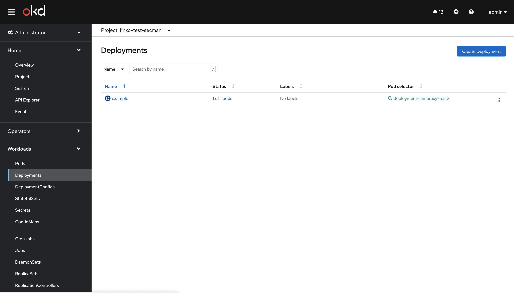
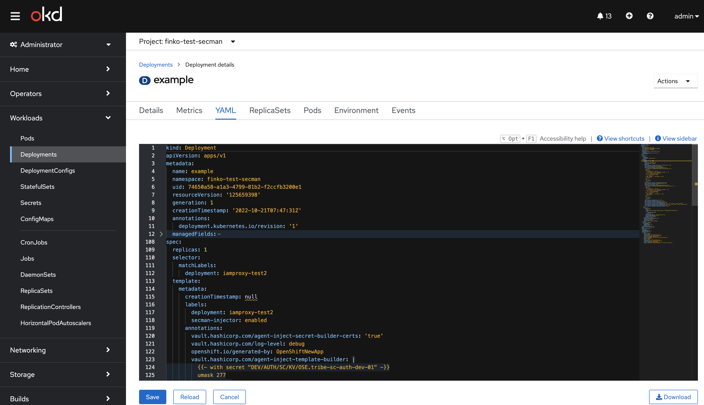

# Интеграция с Vault в OpenShift

## Назначение

Vault - это инструмент, который обеспечивает безопасный и надежный способ хранения, распространения и управления
секретами. IAM Proxy может использовать Vault на этапе развертывания для получения паролей от учетных записей,
сертификатов, закрытых ключей.

## Настройка интеграции с Vault в OpenShift

Для интеграции Vault с IAM Proxy потребуется выполнить несколько шагов:

1. Перейти в Vault и создать два хранилища с типом KV
   
   В них будут храниться секретные данные - пароли, ssl сертификаты (закрытый и открытый ключи) и хранилища ключей
   (keystore).
2. В одно из хранилищ помещаем пароли в виде <имя_переменной>:<пароль>. Имена переменных должны соответствовать именам
   переменных приведенных в Таблице 1, так как они используются при формировании файла main_vault.yml
3. Во второе хранилище помещаем сертификаты и хранилища ключей в виде <имя_файла_сертификата>:<содержимое_сертификата>.
   В случае с хранилищами ключей, файл хранилища должен быть закодирован по методу base64 и передан в значение секрета
   как строка, а имя файла должно иметь окончание ".base64" (Например keycloak-keystore.p12.base64). Имена файлов
   должны соответствовать Таблице 2.

Таблица 1

| Имя переменной                    | Описание                                                                                                                   |
|-----------------------------------|----------------------------------------------------------------------------------------------------------------------------|
| deployer_pass                     | Пароль пользователя deployer                                                                                               |
| keycloak_admin_password           | Пароль администратора realm master компонента KeyCloak.SE                                                                  |
| keycloak_admin_password_temporary | Временный пароль администратора realm master компонента KeyCloak.SE                                                        |
| keycloak_db_password              | Пароль пользователя БД Postgres компонента KeyCloak.SE                                                                     |
| keycloak_funcadmin_password       | Пароль функционального администратора realm PlatformAuth компонента KeyCloak.SE                                            |
| keycloak_keystore_password        | Пароль от хранилища ключей для компонента KeyCloak.SE                                                                      |
| keycloak_rest_api_user_password   | Пароль пользователя для доступа к api компонента KeyCloak.SE                                                               |
| nexus_url_password                | Пароль пользователя nexus для скачивания дистрибутива IAM Proxy                                                            |
| proxy_session_secret              | Секрет используемый для шифрования сессии IAM Proxy (длина должна быть > 100 символом, и НЕ должно содержать символов " $) |
| rds_client_keyStorePassword       | Пароль хранилища ключей приложения RDS Client                                                                              |
| spas_wsSyncSpas_password          | Пароль пользователя для синхронизации с Авторизацией                                                                       |
| proxy_oidc_client_secret          | client_secret для подключения IAM Proxy к KeyCloak.SE по OIDC                                                              |

Таблица 2

| Имя файла                              | Описание                                                                                                                                                                                                                                                       |
|----------------------------------------|----------------------------------------------------------------------------------------------------------------------------------------------------------------------------------------------------------------------------------------------------------------|
| auth.k8s.audit.certs.suffix            | Суффикс имени SSL сертификатов для egress при интеграции с Platform V Audit SE, если они отличаются от основных сертификатов используемых для доступа во внешние сети (Имена файлов - root\<suffix\>.crt, tsl\<suffix\>.crt, tls\<suffix\>.key)                |
| rdsserver.k8s.rds.standin.certs.suffix | Суффикс клиентского сертификата для подключения к API ПЖ. Пример `_aplj`, при установке такого суффикса в хранилище секретов secman для egress, должны располагаться kv вида `tls_aplj.crt`, `tls_aplj.key` и `root_aplj.crt`                                  |
| auth.k8s.logger.certs.suffix           | Суффикс имени SSL сертификатов для egress при интеграции с компонентом Журналированием (LOGA), если они отличаются от основных сертификатов используемых для доступа во внешние сети (Имена файлов - root\<suffix\>.crt, tsl\<suffix\>.crt, tls\<suffix\>.key) |
| iamproxy.k8s.authz.certs.suffix        | Суффикс клиентского сертификата для подключения к API Авторизации. Пример `_spas`, при установке такого суффикса в хранилище секретов secman для egress, должны располагаться kv вида `tls_spas.crt`, `tls_spas.key` и `root_spac.crt`                         |
| server.crt.pem                         | Серверный сертификат IAM Proxy                                                                                                                                                                                                                                 |
| server.key.pem                         | Серверный ключ IAM Proxy                                                                                                                                                                                                                                       |
| trusted_chain.crt.pem                  | Цепочка доверенных сертификатов                                                                                                                                                                                                                                |
| rds-keystore.p12.base64                | Keystore для RDS Client                                                                                                                                                                                                                                        |
| server_backend.key.pem                 | Клиентский сертификат для соединения с бэкенд если используются отдельные сертификаты и включен `iamproxy.k8s.use_server_backend_certificate=true`                                                                                                             |
| server_backend.crt.pem                 | Клиентский ключ для соединения с бэкенд если используются отдельные сертификаты и включен `iamproxy.k8s.use_server_backend_certificate=true`                                                                                                                   |
| client_trusted_chain.crt.pem           | Цепочка доверенных сертификатов для бэкенд, используется если определен `iamproxy.k8s.mtls_front_verify_dn_regex`                                                                                                                                              |

4. Перейти в OpenShift, открыть вкладку "WorkLoads" и нажать "Deployments"
   
5. В списке выбрать свой контроллер развертывания.
6. Перейти во вкладку YAML и в kind: Deployment задать параметры, которые создают скрипт генерации секрет-файлов в
   конкретном каталоге секрета, а потом его запускают

- Вариант 1. Подключение всех переменных в файлы из конкретного секрета

Ниже пример подключения секретов для прокси:

```
spec:
  replicas: 1
  selector:
    matchLabels:
      deployment: iamproxy-test2
  template:
    metadata:
      creationTimestamp: null
      labels:
        deployment: iamproxy-test2
        secman-injector: enabled
      annotations:
        openshift.io/generated-by: OpenShiftNewApp
        sidecar.istio.io/inject: 'false'
        vault.hashicorp.com/log-level: debug
        vault.hashicorp.com/role: role-ga-secman-iam-proxy
        vault.hashicorp.com/agent-inject: 'true'
        vault.hashicorp.com/agent-init-first: 'true'
        vault.hashicorp.com/agent-pre-populate-only: 'true'
        traffic.sidecar.istio.io/excludeOutboundPorts: '443'
        vault.hashicorp.com/secret-volume-path: /secrets

        vault.hashicorp.com/agent-inject-secret-builder: 'true'
        vault.hashicorp.com/agent-inject-command-builder: sh -c "cd /secrets ; source ./builder"
        vault.hashicorp.com/agent-inject-template-builder: |
          {{- with secret "DEV/AUTH/SC/KV/OSE.tribe-sc-auth-dev-01" -}}
          umask 277
          pwd; ls -la
            {{ range $k, $v := .Data }}
              {{ $filename := ($k | replaceAll ".base64" "") }}
          echo '*** Create file {{ $filename }}'
              {{- if eq $k $filename }}
          cat > '{{ $filename }}' <<EOF
              {{- else }}
          base64 --decode > '{{ $filename }}' <<EOF
              {{- end }}
          {{ $v }}
          EOF
            {{- end }}
          {{- end }}
          ls -la

        vault.hashicorp.com/agent-inject-secret-builder-certs: 'true'
        vault.hashicorp.com/secret-volume-path-builder-certs: /certs
        vault.hashicorp.com/agent-inject-command-builder-certs: sh -c "cd /certs ; source ./builder-certs"
        vault.hashicorp.com/agent-inject-template-builder-certs: |
          {{- with secret "DEV/AUTH/SC/KV/OSE.tribe-sc-auth-dev-01.certs" -}}
          umask 277
          pwd; ls -la
            {{ range $k, $v := .Data }}
              {{ $filename := ($k | replaceAll ".base64" "") }}
          echo '*** Create file {{ $filename }}'
              {{- if eq $k $filename }}
          cat > '{{ $filename }}' <<EOF
              {{- else }}
          base64 --decode > '{{ $filename }}' <<EOF
              {{- end }}
          {{ $v }}
          EOF
            {{- end }}
          {{- end }}
          ls -la
```

4. Нажимаем кнопку сохранить
   

5. Смотрим логи Vault Agent

Пример логов Vault Agent

```

==> Vault agent started! Log data will stream in below:

==> Vault agent configuration:

                     Cgo: enabled
               Log Level: debug
                 Version: Vault v1.7.0-0.11.1
             Version Sha: 7fdc0748ddc57511a5223c2dd9a6841ff0770246+CHANGES

2022-09-08T22:40:00.993Z [INFO]  sink.file: creating file sink
2022-09-08T22:40:00.994Z [INFO]  sink.file: file sink configured: path=/home/vault/.vault-token mode=-rw-r-----
2022-09-08T22:40:00.994Z [INFO]  sink.server: starting sink server
2022-09-08T22:40:00.994Z [INFO]  auth.handler: starting auth handler
2022-09-08T22:40:00.994Z [INFO]  auth.handler: authenticating
2022-09-08T22:40:00.994Z [INFO]  template.server: starting template server
2022-09-08T22:40:00.994Z [INFO] (runner) creating new runner (dry: false, once: false)
2022-09-08T22:40:00.995Z [DEBUG] (runner) final config: {"Consul":{"Address":"","Namespace":"","Auth":{"Enabled":false,"Username":"","Password":""},"Retry":{"Attempts":12,"Backoff":250000000,"MaxBackoff":60000000000,"Enabled":true},"SSL":{"CaCert":"","CaPath":"","Cert":"","Enabled":false,"Key":"","ServerName":"","Verify":true},"Token":"","Transport":{"DialKeepAlive":30000000000,"DialTimeout":30000000000,"DisableKeepAlives":false,"IdleConnTimeout":90000000000,"MaxIdleConns":100,"MaxIdleConnsPerHost":33,"TLSHandshakeTimeout":10000000000}},"Dedup":{"Enabled":false,"MaxStale":2000000000,"Prefix":"consul-template/dedup/","TTL":15000000000,"BlockQueryWaitTime":60000000000},"DefaultDelims":{"Left":null,"Right":null},"Exec":{"Command":"","Enabled":false,"Env":{"Denylist":[],"Custom":[],"Pristine":false,"Allowlist":[]},"KillSignal":2,"KillTimeout":30000000000,"ReloadSignal":null,"Splay":0,"Timeout":0},"KillSignal":2,"LogLevel":"DEBUG","MaxStale":2000000000,"PidFile":"","ReloadSignal":1,"kafka":{"Enabled":false,"Facility":"LOCAL0","Name":""},"Templates":[{"Backup":false,"Command":"sh -c \"cd /secrets ; source ./builder\"","CommandTimeout":30000000000,"Contents":"{{- with secret \"DEV/AUTH/SC/KV/OSE.tribe-sc-auth-dev-01\" -}}\numask 277\npwd; ls -la\n  {{ range $k, $v := .Data }}\n    {{ $filename := ($k | replaceAll \".base64\" \"\") }}\necho '*** Create file {{ $filename }}'\n    {{- if eq $k $filename }}\ncat \u003e '{{ $filename }}' \u003c\u003cEOF\n    {{- else }}\nbase64 --decode \u003e '{{ $filename }}' \u003c\u003cEOF\n    {{- end }}\n{{ $v }}\nEOF\n  {{- end }}\n{{- end }}\nls -la\n","CreateDestDirs":true,"Destination":"/secrets/builder","ErrMissingKey":false,"Exec":{"Command":"sh -c \"cd /secrets ; source ./builder\"","Enabled":true,"Env":{"Denylist":[],"Custom":[],"Pristine":false,"Allowlist":[]},"KillSignal":2,"KillTimeout":30000000000,"ReloadSignal":null,"Splay":0,"Timeout":30000000000},"Perms":256,"Source":"","Wait":{"Enabled":false,"Min":0,"Max":0},"LeftDelim":"{{","RightDelim":"}}","FunctionDenylist":[],"SandboxPath":""},{"Backup":false,"Command":"sh -c \"cd /certs ; source ./builder-certs\"","CommandTimeout":30000000000,"Contents":"{{- with secret \"DEV/AUTH/SC/KV/OSE.tribe-sc-auth-dev-01.certs\" -}}\numask 277\npwd; ls -la\n  {{ range $k, $v := .Data }}\n    {{ $filename := ($k | replaceAll \".base64\" \"\") }}\necho '*** Create file {{ $filename }}'\n    {{- if eq $k $filename }}\ncat \u003e '{{ $filename }}' \u003c\u003cEOF\n    {{- else }}\nbase64 --decode \u003e '{{ $filename }}' \u003c\u003cEOF\n    {{- end }}\n{{ $v }}\nEOF\n  {{- end }}\n{{- end }}\nls -la\n","CreateDestDirs":true,"Destination":"/certs/builder-certs","ErrMissingKey":false,"Exec":{"Command":"sh -c \"cd /certs ; source ./builder-certs\"","Enabled":true,"Env":{"Denylist":[],"Custom":[],"Pristine":false,"Allowlist":[]},"KillSignal":2,"KillTimeout":30000000000,"ReloadSignal":null,"Splay":0,"Timeout":30000000000},"Perms":256,"Source":"","Wait":{"Enabled":false,"Min":0,"Max":0},"LeftDelim":"{{","RightDelim":"}}","FunctionDenylist":[],"SandboxPath":""}],"Vault":{"Address":"http://10.x.x.239:8200","Enabled":true,"Namespace":"","RenewToken":false,"Retry":{"Attempts":12,"Backoff":250000000,"MaxBackoff":60000000000,"Enabled":true},"SSL":{"CaCert":"","CaPath":"","Cert":"","Enabled":false,"Key":"","ServerName":"","Verify":false},"Transport":{"DialKeepAlive":30000000000,"DialTimeout":30000000000,"DisableKeepAlives":false,"IdleConnTimeout":90000000000,"MaxIdleConns":100,"MaxIdleConnsPerHost":33,"TLSHandshakeTimeout":10000000000},"UnwrapToken":false,"DefaultLeaseDuration":300000000000},"Wait":{"Enabled":false,"Min":0,"Max":0},"Once":false,"BlockQueryWaitTime":60000000000}
2022-09-08T22:40:00.995Z [INFO] (runner) creating watcher
2022-09-08T22:40:01.019Z [INFO]  auth.handler: authentication successful, sending token to sinks
2022-09-08T22:40:01.019Z [INFO]  auth.handler: starting renewal process
2022-09-08T22:40:01.019Z [INFO]  template.server: template server received new token
2022-09-08T22:40:01.020Z [INFO] (runner) stopping
2022-09-08T22:40:01.020Z [DEBUG] (runner) stopping watcher
2022-09-08T22:40:01.020Z [DEBUG] (watcher) stopping all views
2022-09-08T22:40:01.020Z [INFO] (runner) creating new runner (dry: false, once: false)
2022-09-08T22:40:01.020Z [DEBUG] (runner) final config: {"Consul":{"Address":"","Namespace":"","Auth":{"Enabled":false,"Username":"","Password":""},"Retry":{"Attempts":12,"Backoff":250000000,"MaxBackoff":60000000000,"Enabled":true},"SSL":{"CaCert":"","CaPath":"","Cert":"","Enabled":false,"Key":"","ServerName":"","Verify":true},"Token":"","Transport":{"DialKeepAlive":30000000000,"DialTimeout":30000000000,"DisableKeepAlives":false,"IdleConnTimeout":90000000000,"MaxIdleConns":100,"MaxIdleConnsPerHost":33,"TLSHandshakeTimeout":10000000000}},"Dedup":{"Enabled":false,"MaxStale":2000000000,"Prefix":"consul-template/dedup/","TTL":15000000000,"BlockQueryWaitTime":60000000000},"DefaultDelims":{"Left":null,"Right":null},"Exec":{"Command":"","Enabled":false,"Env":{"Denylist":[],"Custom":[],"Pristine":false,"Allowlist":[]},"KillSignal":2,"KillTimeout":30000000000,"ReloadSignal":null,"Splay":0,"Timeout":0},"KillSignal":2,"LogLevel":"DEBUG","MaxStale":2000000000,"PidFile":"","ReloadSignal":1,"kdfka":{"Enabled":false,"Facility":"LOCAL0","Name":""},"Templates":[{"Backup":false,"Command":"sh -c \"cd /secrets ; source ./builder\"","CommandTimeout":30000000000,"Contents":"{{- with secret \"DEV/AUTH/SC/KV/OSE.tribe-sc-auth-dev-01\" -}}\numask 277\npwd; ls -la\n  {{ range $k, $v := .Data }}\n    {{ $filename := ($k | replaceAll \".base64\" \"\") }}\necho '*** Create file {{ $filename }}'\n    {{- if eq $k $filename }}\ncat \u003e '{{ $filename }}' \u003c\u003cEOF\n    {{- else }}\nbase64 --decode \u003e '{{ $filename }}' \u003c\u003cEOF\n    {{- end }}\n{{ $v }}\nEOF\n  {{- end }}\n{{- end }}\nls -la\n","CreateDestDirs":true,"Destination":"/secrets/builder","ErrMissingKey":false,"Exec":{"Command":"sh -c \"cd /secrets ; source ./builder\"","Enabled":true,"Env":{"Denylist":[],"Custom":[],"Pristine":false,"Allowlist":[]},"KillSignal":2,"KillTimeout":30000000000,"ReloadSignal":null,"Splay":0,"Timeout":30000000000},"Perms":256,"Source":"","Wait":{"Enabled":false,"Min":0,"Max":0},"LeftDelim":"{{","RightDelim":"}}","FunctionDenylist":[],"SandboxPath":""},{"Backup":false,"Command":"sh -c \"cd /certs ; source ./builder-certs\"","CommandTimeout":30000000000,"Contents":"{{- with secret \"DEV/AUTH/SC/KV/OSE.tribe-sc-auth-dev-01.certs\" -}}\numask 277\npwd; ls -la\n  {{ range $k, $v := .Data }}\n    {{ $filename := ($k | replaceAll \".base64\" \"\") }}\necho '*** Create file {{ $filename }}'\n    {{- if eq $k $filename }}\ncat \u003e '{{ $filename }}' \u003c\u003cEOF\n    {{- else }}\nbase64 --decode \u003e '{{ $filename }}' \u003c\u003cEOF\n    {{- end }}\n{{ $v }}\nEOF\n  {{- end }}\n{{- end }}\nls -la\n","CreateDestDirs":true,"Destination":"/certs/builder-certs","ErrMissingKey":false,"Exec":{"Command":"sh -c \"cd /certs ; source ./builder-certs\"","Enabled":true,"Env":{"Denylist":[],"Custom":[],"Pristine":false,"Allowlist":[]},"KillSignal":2,"KillTimeout":30000000000,"ReloadSignal":null,"Splay":0,"Timeout":30000000000},"Perms":256,"Source":"","Wait":{"Enabled":false,"Min":0,"Max":0},"LeftDelim":"{{","RightDelim":"}}","FunctionDenylist":[],"SandboxPath":""}],"Vault":{"Address":"http://10.x.x.239:8200","Enabled":true,"Namespace":"","RenewToken":false,"Retry":{"Attempts":12,"Backoff":250000000,"MaxBackoff":60000000000,"Enabled":true},"SSL":{"CaCert":"","CaPath":"","Cert":"","Enabled":false,"Key":"","ServerName":"","Verify":false},"Transport":{"DialKeepAlive":30000000000,"DialTimeout":30000000000,"DisableKeepAlives":false,"IdleConnTimeout":90000000000,"MaxIdleConns":100,"MaxIdleConnsPerHost":33,"TLSHandshakeTimeout":10000000000},"UnwrapToken":false,"DefaultLeaseDuration":300000000000},"Wait":{"Enabled":false,"Min":0,"Max":0},"Once":false,"BlockQueryWaitTime":60000000000}
2022-09-08T22:40:01.020Z [INFO]  sink.file: token written: path=/home/vault/.vault-token
2022-09-08T22:40:01.020Z [INFO]  sink.server: sink server stopped
2022-09-08T22:40:01.020Z [INFO]  sinks finished, exiting
2022-09-08T22:40:01.020Z [INFO] (runner) creating watcher
2022-09-08T22:40:01.020Z [INFO] (runner) starting
2022-09-08T22:40:01.020Z [DEBUG] (runner) running initial templates
2022-09-08T22:40:01.020Z [DEBUG] (runner) initiating run
2022-09-08T22:40:01.020Z [DEBUG] (runner) checking template 105292efd41a7c9975e2a29948f47d65
2022-09-08T22:40:01.021Z [DEBUG] (runner) missing data for 1 dependencies
2022-09-08T22:40:01.021Z [DEBUG] (runner) missing dependency: vault.read(DEV/AUTH/SC/KV/OSE.tribe-sc-auth-dev-01)
2022-09-08T22:40:01.021Z [DEBUG] (runner) add used dependency vault.read(DEV/AUTH/SC/KV/OSE.tribe-sc-auth-dev-01) to missing since isLeader but do not have a watcher
2022-09-08T22:40:01.021Z [DEBUG] (runner) was not watching 1 dependencies
2022-09-08T22:40:01.021Z [DEBUG] (watcher) adding vault.read(DEV/AUTH/SC/KV/OSE.tribe-sc-auth-dev-01)
2022-09-08T22:40:01.021Z [DEBUG] (runner) checking template 59a664fe261e3af4e0e21f2899ca1399
2022-09-08T22:40:01.021Z [DEBUG] (runner) missing data for 1 dependencies
2022-09-08T22:40:01.021Z [DEBUG] (runner) missing dependency: vault.read(DEV/AUTH/SC/KV/OSE.tribe-sc-auth-dev-01.certs)
2022-09-08T22:40:01.021Z [DEBUG] (runner) add used dependency vault.read(DEV/AUTH/SC/KV/OSE.tribe-sc-auth-dev-01.certs) to missing since isLeader but do not have a watcher
2022-09-08T22:40:01.021Z [DEBUG] (runner) was not watching 1 dependencies
2022-09-08T22:40:01.021Z [DEBUG] (watcher) adding vault.read(DEV/AUTH/SC/KV/OSE.tribe-sc-auth-dev-01.certs)
2022-09-08T22:40:01.021Z [DEBUG] (runner) diffing and updating dependencies
2022-09-08T22:40:01.021Z [DEBUG] (runner) watching 2 dependencies
2022-09-08T22:40:01.023Z [INFO]  auth.handler: renewed auth token
2022-09-08T22:40:01.123Z [DEBUG] (runner) receiving dependency vault.read(DEV/AUTH/SC/KV/OSE.tribe-sc-auth-dev-01)
2022-09-08T22:40:01.123Z [DEBUG] (runner) initiating run
2022-09-08T22:40:01.123Z [DEBUG] (runner) checking template 105292efd41a7c9975e2a29948f47d65
2022-09-08T22:40:01.124Z [DEBUG] (runner) rendering "(dynamic)" => "/secrets/builder"
2022-09-08T22:40:01.124Z [INFO] (runner) rendered "(dynamic)" => "/secrets/builder"
2022-09-08T22:40:01.124Z [DEBUG] (runner) appending command "sh -c \"cd /secrets ; source ./builder\"" from "(dynamic)" => "/secrets/builder"
2022-09-08T22:40:01.124Z [DEBUG] (runner) checking template 59a664fe261e3af4e0e21f2899ca1399
2022-09-08T22:40:01.124Z [DEBUG] (runner) missing data for 1 dependencies
2022-09-08T22:40:01.124Z [DEBUG] (runner) missing dependency: vault.read(DEV/AUTH/SC/KV/OSE.tribe-sc-auth-dev-01.certs)
2022-09-08T22:40:01.124Z [DEBUG] (runner) missing data for 1 dependencies
2022-09-08T22:40:01.124Z [DEBUG] (runner) diffing and updating dependencies
2022-09-08T22:40:01.124Z [DEBUG] (runner) vault.read(DEV/AUTH/SC/KV/OSE.tribe-sc-auth-dev-01) is still needed
2022-09-08T22:40:01.124Z [DEBUG] (runner) vault.read(DEV/AUTH/SC/KV/OSE.tribe-sc-auth-dev-01.certs) is still needed
2022-09-08T22:40:01.124Z [INFO] (runner) executing command "sh -c \"cd /secrets ; source ./builder\"" from "(dynamic)" => "/secrets/builder"
2022-09-08T22:40:01.124Z [INFO] (child) spawning: sh -c cd /secrets ; source ./builder
/secrets
total 4
drwxrwsrwt. 2 root       1001640000  60 Sep  8 22:40 .
drwxr-xr-x. 1 root       root        34 Sep  8 22:40 ..
-r--------. 1 1001640000 1001640000 496 Sep  8 22:40 builder
*** Create file PROXY_OIDC_CLIENT_ID
*** Create file PROXY_OIDC_CLIENT_SECRET
*** Create file PROXY_SESSION_SECRET
*** Create file RDS_CLIENT_KEYSTOREPASSWORD
total 20
drwxrwsrwt. 2 root       1001640000 140 Sep  8 22:40 .
drwxr-xr-x. 1 root       root        45 Sep  8 22:40 ..
-r--------. 1 1001640000 1001640000  19 Sep  8 22:40 PROXY_OIDC_CLIENT_ID
-r--------. 1 1001640000 1001640000  33 Sep  8 22:40 PROXY_OIDC_CLIENT_SECRET
-r--------. 1 1001640000 1001640000  29 Sep  8 22:40 PROXY_SESSION_SECRET
-r--------. 1 1001640000 1001640000   9 Sep  8 22:40 RDS_CLIENT_KEYSTOREPASSWORD
-r--------. 1 1001640000 1001640000 496 Sep  8 22:40 builder
2022-09-08T22:40:01.136Z [DEBUG] (runner) watching 2 dependencies
2022-09-08T22:40:01.136Z [DEBUG] (runner) receiving dependency vault.read(DEV/AUTH/SC/KV/OSE.tribe-sc-auth-dev-01.certs)
2022-09-08T22:40:01.136Z [DEBUG] (runner) initiating run
2022-09-08T22:40:01.136Z [DEBUG] (runner) checking template 105292efd41a7c9975e2a29948f47d65
2022-09-08T22:40:01.137Z [DEBUG] (runner) rendering "(dynamic)" => "/secrets/builder"
2022-09-08T22:40:01.137Z [DEBUG] (runner) checking template 59a664fe261e3af4e0e21f2899ca1399
2022-09-08T22:40:01.137Z [DEBUG] (runner) rendering "(dynamic)" => "/certs/builder-certs"
2022-09-08T22:40:01.137Z [INFO] (runner) rendered "(dynamic)" => "/certs/builder-certs"
2022-09-08T22:40:01.137Z [DEBUG] (runner) appending command "sh -c \"cd /certs ; source ./builder-certs\"" from "(dynamic)" => "/certs/builder-certs"
2022-09-08T22:40:01.137Z [DEBUG] (runner) diffing and updating dependencies
2022-09-08T22:40:01.137Z [DEBUG] (runner) vault.read(DEV/AUTH/SC/KV/OSE.tribe-sc-auth-dev-01) is still needed
2022-09-08T22:40:01.137Z [DEBUG] (runner) vault.read(DEV/AUTH/SC/KV/OSE.tribe-sc-auth-dev-01.certs) is still needed
2022-09-08T22:40:01.137Z [INFO] (runner) executing command "sh -c \"cd /certs ; source ./builder-certs\"" from "(dynamic)" => "/certs/builder-certs"
2022-09-08T22:40:01.137Z [INFO] (child) spawning: sh -c cd /certs ; source ./builder-certs
/certs
total 16
drwxrwsrwt. 2 root       1001640000    60 Sep  8 22:40 .
drwxr-xr-x. 1 root       root          45 Sep  8 22:40 ..
-r--------. 1 1001640000 1001640000 13956 Sep  8 22:40 builder-certs
*** Create file rds-keystore.p12
*** Create file server.crt.pem
*** Create file server.key.pem
*** Create file test_xxx
*** Create file trusted_ca_intermediate.crt.pem
*** Create file trusted_ca_root.crt.pem
total 44
drwxrwsrwt. 2 root       1001640000   180 Sep  8 22:40 .
drwxr-xr-x. 1 root       root          45 Sep  8 22:40 ..
-r--------. 1 1001640000 1001640000 13956 Sep  8 22:40 builder-certs
-r--------. 1 1001640000 1001640000  4438 Sep  8 22:40 rds-keystore.p12
-r--------. 1 1001640000 1001640000  2833 Sep  8 22:40 server.crt.pem
-r--------. 1 1001640000 1001640000  3273 Sep  8 22:40 server.key.pem
-r--------. 1 1001640000 1001640000    11 Sep  8 22:40 test_xxx
-r--------. 1 1001640000 1001640000   676 Sep  8 22:40 trusted_ca_intermediate.crt.pem
-r--------. 1 1001640000 1001640000   619 Sep  8 22:40 trusted_ca_root.crt.pem
2022-09-08T22:40:01.151Z [DEBUG] (runner) watching 2 dependencies
2022-09-08T22:40:01.151Z [DEBUG] (runner) all templates rendered
2022-09-08T22:40:01.151Z [INFO] (runner) stopping
2022-09-08T22:40:01.151Z [DEBUG] (runner) stopping watcher
2022-09-08T22:40:01.151Z [DEBUG] (watcher) stopping all views
2022-09-08T22:40:01.152Z [INFO]  template.server: template server stopped
2022-09-08T22:40:01.152Z [INFO] (runner) received finish
2022-09-08T22:40:01.152Z [INFO]  auth.handler: shutdown triggered, stopping lifetime watcher
2022-09-08T22:40:01.152Z [INFO]  auth.handler: auth handler stopped
```

- Вариант 2. Подключение переменных по одной в файл из конкретного секрета

Ниже пример задания двух переменных:

```
spec:
  replicas: 1
  selector:
    matchLabels:
      deployment: iamproxy-test2
  template:
    metadata:
      creationTimestamp: null
      labels:
        deployment: iamproxy-test2
        secman-injector: enabled
      annotations:
        sidecar.istio.io/inject: 'false'
        traffic.sidecar.istio.io/excludeOutboundPorts: '443'

        vault.hashicorp.com/role: role-ga-secman-iam-proxy
        vault.hashicorp.com/agent-inject: 'true'
        vault.hashicorp.com/agent-init-first: 'true'
        vault.hashicorp.com/agent-pre-populate-only: 'true'

        vault.hashicorp.com/secret-volume-path-rds-keystore: /certs
        vault.hashicorp.com/agent-inject-template-file-rds-keystore: rds-keystore.p12
        vault.hashicorp.com/agent-inject-secret-rds-keystore: "true"
        vault.hashicorp.com/agent-inject-template-rds-keystore: |
           {{- with secret "DEV/AUTH/SC/KV/OSE.tribe-sc-auth-dev-01.certs" -}}
           {{ base64Decode (index .Data "rds-keystore.p12.base64") }}
           {{- end }}

        vault.hashicorp.com/secret-volume-path-server.key.pem: /certs
        vault.hashicorp.com/agent-inject-template-file-server.key.pem: rds-keystore.p12
        vault.hashicorp.com/agent-inject-secret-server.key.pem: "true"
        vault.hashicorp.com/agent-inject-template-server.key.pem: |
           {{- with secret "DEV/AUTH/SC/KV/OSE.tribe-sc-auth-dev-01.certs" -}}
           {{ index .Data "server.key.pem" }}
           {{- end }}

```