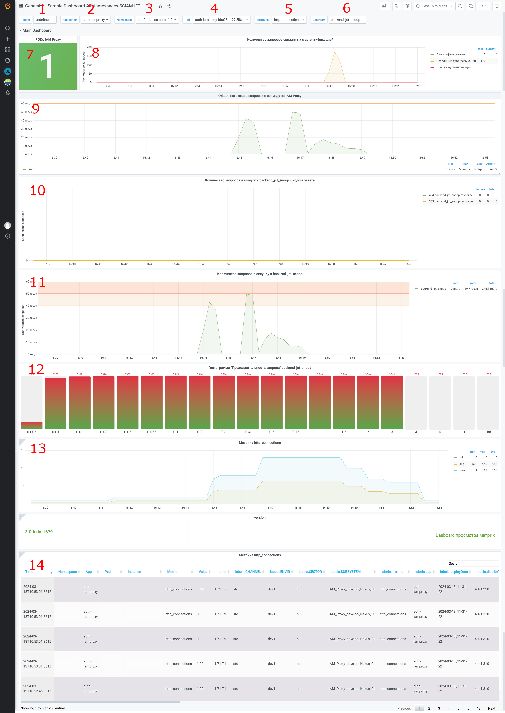
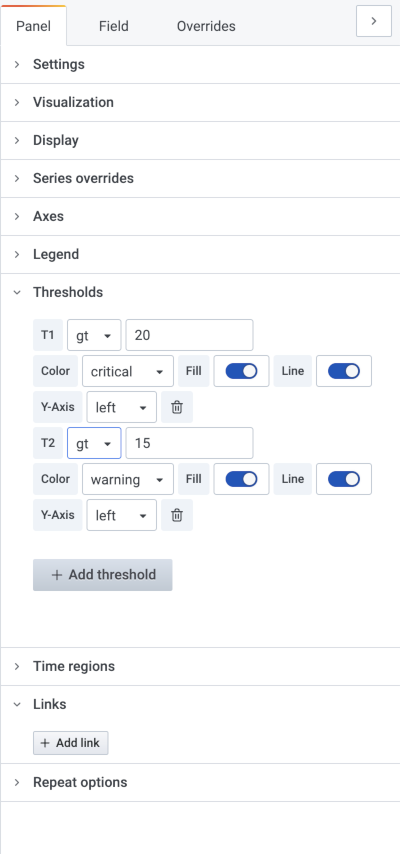

# Мониторинг

Для обеспечения работоспособности функциональности IAM Proxy при его эксплуатации, IAM Proxy предоставляет возможность
получать метрики в формате Prometheus отражающие состояние и статистику по основной функциональности, и позволяющие на
их основе построить гибкий мониторинг.

## Настройка

IAM Proxy предоставляет встроенные механизмы мониторинга на основе экспорта метрик в формате Prometheus, что позволяет
осуществлять комплексный контроль за состоянием сервиса, производительностью и безопасностью. 

## Предусловия

Для получения метрик в формате Prometheus из контейнера iamproxy необходимо установить параметр `PROXY_METRICS_ENABLE` в
значение `true` (подробнее в разделе
[Параметры основной функциональности компонента IAM Proxy](../installation-guide/proxy-deploy-docker-description.md)),
или установить параметр `auth.k8s.monitoring.enabled` в значение`true` (подробнее в
разделе [Установка IAM Proxy в OpenShift/k8s при помощи инструментов Platform V DevOps Tools](../installation-guide/proxy-deploy-ose-cd.md)).
Для VM в профиле установки необходимо установить параметр `proxy_metrics_enable` в значение`true` (подробнее в
разделе [Установка](../installation-guide/installation.md)).

Для получения метрик с контейнеров Ingress/Egress (IGEG) компонентами PVM (Unimon) необходимо установить параметр
`auth.k8s.monitoring.enabled` в значение`true` (подробнее в
разделе [Установка IAM Proxy в OpenShift/k8s при помощи инструментов Platform V DevOps Tools](../installation-guide/proxy-deploy-ose-cd.md)).

Метрики от IAM Proxy предоставляются по протоколу HTTP на отдельном служебном порту `10080` (аутентификации и
авторизации при этом не требуется, для метрик ролевая модель не применяется). Метрики в формате Prometheus доступны по
URI `http://<host>:10080/metrics/` (подробнее в
разделе [Параметры основной функциональности компонента IAM Proxy](../installation-guide/proxy-deploy-docker-description.md)).

## Проверка доступности метрик

Для проверки доступности метрик на виртуальной машине необходимо:

1. Открыть ssh-терминал VM по адресу папки (адрес задается на этапе развертывания, подробнее в
   разделе [Установка](../installation-guide/installation.md)), где установлен IAM Proxy.
2. Выполнить запрос: `curl http://<host>:10080/metrics/`.
3. Убедиться, что метрики отдаются в ответе в формате Prometheus (смотрите пример ниже).

Пример выполнения запроса `curl http://<host>:10080/metrics/` (пояснения к представленным в примере метрикам, приведены
в подразделе "Выводимые метрики и их описание"):

```
# HELP auth_counters Счетчик запросов аутентификации и авторизации
# TYPE auth_counters counter
auth_counters{state="unauthorized_302"} 3
auth_counters{state="oidc_authenticated"} 1
auth_counters{state="oidc_created"} 2
auth_counters{state="oidc_error"} 31
auth_counters{state="oidc_logout"} 2
auth_counters{state="oidc_refresh"} 4
auth_counters{state="oidc_refresh_error"} 2
auth_counters{state="authorized"} 2
# HELP http_connections Число HTTP соединений в настоящий момент
# TYPE http_connections gauge
http_connections{state="active"} 4
http_connections{state="reading"} 0
http_connections{state="waiting"} 2
http_connections{state="writing"} 2
# HELP http_durations Backend, гистограмма времени обработки HTTP-запросов в разрезе upstream+upstream_server+success (в секундах)
# TYPE http_durations histogram
http_durations_bucket{upstream="",upstream_addr="",≈,le="0.005"} 3
http_durations_bucket{upstream="",upstream_addr="",success="",le="0.01"} 3
http_durations_bucket{upstream="",upstream_addr="",success="",le="0.02"} 3
http_durations_bucket{upstream="",upstream_addr="",success="",le="0.03"} 3
http_durations_bucket{upstream="",upstream_addr="",success="",le="0.05"} 3
http_durations_bucket{upstream="",upstream_addr="",success="",le="0.075"} 4
http_durations_bucket{upstream="",upstream_addr="",success="",le="0.1"} 4
http_durations_bucket{upstream="",upstream_addr="",success="",le="0.2"} 5
http_durations_bucket{upstream="",upstream_addr="",success="",le="0.3"} 6
http_durations_bucket{upstream="",upstream_addr="",success="",le="0.4"} 6
http_durations_bucket{upstream="",upstream_addr="",success="",le="0.5"} 6
http_durations_bucket{upstream="",upstream_addr="",success="",le="0.75"} 6
http_durations_bucket{upstream="",upstream_addr="",success="",le="1"} 6
http_durations_bucket{upstream="",upstream_addr="",success="",le="1.5"} 6
http_durations_bucket{upstream="",upstream_addr="",success="",le="2"} 6
http_durations_bucket{upstream="",upstream_addr="",success="",le="3"} 6
http_durations_bucket{upstream="",upstream_addr="",success="",le="4"} 6
http_durations_bucket{upstream="",upstream_addr="",success="",le="5"} 6
http_durations_bucket{upstream="",upstream_addr="",success="",le="10"} 6
http_durations_bucket{upstream="",upstream_addr="",success="",le="+Inf"} 6
http_durations_bucket{upstream="backend_jct_metrics",upstream_addr,"success"="127.0.0.1:10080",le="0.005"} 2
http_durations_bucket{upstream="backend_jct_metrics",upstream_addr,"success"="127.0.0.1:10080",le="0.01"} 2
http_durations_bucket{upstream="backend_jct_metrics",upstream_addr,"success"="127.0.0.1:10080",le="0.02"} 2
http_durations_bucket{upstream="backend_jct_metrics",upstream_addr,"success"="127.0.0.1:10080",le="0.03"} 2
http_durations_bucket{upstream="backend_jct_metrics",upstream_addr,"success"="127.0.0.1:10080",le="0.05"} 2
http_durations_bucket{upstream="backend_jct_metrics",upstream_addr,"success"="127.0.0.1:10080",le="0.075"} 2
http_durations_bucket{upstream="backend_jct_metrics",upstream_addr,"success"="127.0.0.1:10080",le="0.1"} 2
http_durations_bucket{upstream="backend_jct_metrics",upstream_addr,"success"="127.0.0.1:10080",le="0.2"} 2
http_durations_bucket{upstream="backend_jct_metrics",upstream_addr,"success"="127.0.0.1:10080",le="0.3"} 2
http_durations_bucket{upstream="backend_jct_metrics",upstream_addr,"success"="127.0.0.1:10080",le="0.4"} 2
http_durations_bucket{upstream="backend_jct_metrics",upstream_addr,"success"="127.0.0.1:10080",le="0.5"} 2
http_durations_bucket{upstream="backend_jct_metrics",upstream_addr,"success"="127.0.0.1:10080",le="0.75"} 2
http_durations_bucket{upstream="backend_jct_metrics",upstream_addr,"success"="127.0.0.1:10080",le="1"} 2
http_durations_bucket{upstream="backend_jct_metrics",upstream_addr,"success"="127.0.0.1:10080",le="1.5"} 2
http_durations_bucket{upstream="backend_jct_metrics",upstream_addr,"success"="127.0.0.1:10080",le="2"} 2
http_durations_bucket{upstream="backend_jct_metrics",upstream_addr,"success"="127.0.0.1:10080",le="3"} 2
http_durations_bucket{upstream="backend_jct_metrics",upstream_addr,"success"="127.0.0.1:10080",le="4"} 2
http_durations_bucket{upstream="backend_jct_metrics",upstream_addr,"success"="127.0.0.1:10080",le="5"} 2
http_durations_bucket{upstream="backend_jct_metrics",upstream_addr,"success"="127.0.0.1:10080",le="10"} 2
http_durations_bucket{upstream="backend_jct_metrics",upstream_addr,"success"="127.0.0.1:10080",le="+Inf"} 2
http_durations_count{upstream="",upstream_addr="","success"} 6
http_durations_count{upstream="backend_jct_metrics",upstream_addr="127.0.0.1:10080"} 2
http_durations_sum{upstream="",upstream_addr="","success"} 0.426
http_durations_sum{upstream="backend_jct_metrics",upstream_addr,"success"="127.0.0.1:10080"} 0.005
# HELP http_requests_backend Backend, счетчик HTTP-запросов в разрезе host+upstream+upstream_server+success+код_ответа
# TYPE http_requests_backend counter
http_requests_backend{host="platform-ift2.mycompany.ru",upstream="",upstream_addr="","success",status="200"} 3
http_requests_backend{host="platform-ift2.mycompany.ru",upstream="",upstream_addr="","success",status="302"} 3
http_requests_backend{host="platform-ift2.mycompany.ru",upstream="backend_jct_metrics",upstream_addr,"success"="127.0.0.1:10080",status="200"} 2
# HELP http_requests Frontend, счетчик HTTP-запросов в разрезе host+ответвление+код_ответа
# TYPE http_requests counter
http_requests{host="platform-ift2.mycompany.ru",jctroot="",status="200"} 3
http_requests{host="platform-ift2.mycompany.ru",jctroot="",status="302"} 1
http_requests{host="platform-ift2.mycompany.ru",jctroot="/metrics",status="200"} 2
http_requests{host="platform-ift2.mycompany.ru",jctroot="/metrics",status="302"} 2
http_requests{host="platformauth-ift2.mycompany.ru",jctroot="",status="200"} 4
# HELP nginx_metric_errors_total Number of nginx-lua-prometheus errors
# TYPE nginx_metric_errors_total counter
nginx_metric_errors_total 0
```

Для проверки доступности метрик в OpenShift необходимо:

1. Открыть терминал контейнера `iamproxy` в pod IAM Proxy, заданным на этапе развертывания.
2. Выполнить запрос: `curl http://<host>:10080/metrics/`.
3. Убедиться что метрики отдаются в ответе в формате Prometheus

Пример выполнения запроса `curl http://<host>:10080/metrics/` (пояснения к представленным в примере метрикам, приведены
в подразделе "Выводимые метрики и их описание"):

```
# HELP auth_counters Счетчик запросов аутентификации и авторизации
# TYPE auth_counters counter
auth_counters{state="unauthorized_302"} 3
auth_counters{state="oidc_authenticated"} 1
auth_counters{state="oidc_created"} 2
auth_counters{state="authorized"} 2
auth_counters{state="oidc_error"} 31
auth_counters{state="oidc_logout"} 2
auth_counters{state="oidc_refresh"} 4
auth_counters{state="oidc_refresh_error"} 2
# HELP http_connections Число HTTP соединений в настоящий момент
# TYPE http_connections gauge
http_connections{state="active"} 4
http_connections{state="reading"} 0
http_connections{state="waiting"} 2
http_connections{state="writing"} 2
# HELP http_durations Backend, гистограмма времени обработки HTTP-запросов разрезе upstream+upstream_server+success (в секундах)
# TYPE http_durations histogram
http_durations_bucket{upstream="",upstream_addr="",success="",le="0.005"} 3
http_durations_bucket{upstream="",upstream_addr="",success="",le="0.01"} 3
http_durations_bucket{upstream="",upstream_addr="",success="",le="0.02"} 3
http_durations_bucket{upstream="",upstream_addr="",success="",le="0.03"} 3
http_durations_bucket{upstream="",upstream_addr="",success="",le="0.05"} 3
http_durations_bucket{upstream="",upstream_addr="",success="",le="0.075"} 4
http_durations_bucket{upstream="",upstream_addr="",success="",le="0.1"} 4
http_durations_bucket{upstream="",upstream_addr="",success="",le="0.2"} 5
http_durations_bucket{upstream="",upstream_addr="",success="",le="0.3"} 6
http_durations_bucket{upstream="",upstream_addr="",success="",le="0.4"} 6
http_durations_bucket{upstream="",upstream_addr="",success="",le="0.5"} 6
http_durations_bucket{upstream="",upstream_addr="",success="",le="0.75"} 6
http_durations_bucket{upstream="",upstream_addr="",success="",le="1"} 6
http_durations_bucket{upstream="",upstream_addr="",success="",le="1.5"} 6
http_durations_bucket{upstream="",upstream_addr="",success="",le="2"} 6
http_durations_bucket{upstream="",upstream_addr="",success="",le="3"} 6
http_durations_bucket{upstream="",upstream_addr="",success="",le="4"} 6
http_durations_bucket{upstream="",upstream_addr="",success="",le="5"} 6
http_durations_bucket{upstream="",upstream_addr="",success="",le="10"} 6
http_durations_bucket{upstream="",upstream_addr="",success="",le="+Inf"} 6
http_durations_bucket{upstream="backend_jct_metrics",upstream_addr="127.0.0.1:10080",le="0.005"} 2
http_durations_bucket{upstream="backend_jct_metrics",upstream_addr="127.0.0.1:10080",le="0.01"} 2
http_durations_bucket{upstream="backend_jct_metrics",upstream_addr="127.0.0.1:10080",le="0.02"} 2
http_durations_bucket{upstream="backend_jct_metrics",upstream_addr="127.0.0.1:10080",le="0.03"} 2
http_durations_bucket{upstream="backend_jct_metrics",upstream_addr="127.0.0.1:10080",le="0.05"} 2
http_durations_bucket{upstream="backend_jct_metrics",upstream_addr="127.0.0.1:10080",le="0.075"} 2
http_durations_bucket{upstream="backend_jct_metrics",upstream_addr="127.0.0.1:10080",le="0.1"} 2
http_durations_bucket{upstream="backend_jct_metrics",upstream_addr="127.0.0.1:10080",le="0.2"} 2
http_durations_bucket{upstream="backend_jct_metrics",upstream_addr="127.0.0.1:10080",le="0.3"} 2
http_durations_bucket{upstream="backend_jct_metrics",upstream_addr="127.0.0.1:10080",le="0.4"} 2
http_durations_bucket{upstream="backend_jct_metrics",upstream_addr="127.0.0.1:10080",le="0.5"} 2
http_durations_bucket{upstream="backend_jct_metrics",upstream_addr="127.0.0.1:10080",le="0.75"} 2
http_durations_bucket{upstream="backend_jct_metrics",upstream_addr="127.0.0.1:10080",le="1"} 2
http_durations_bucket{upstream="backend_jct_metrics",upstream_addr="127.0.0.1:10080",le="1.5"} 2
http_durations_bucket{upstream="backend_jct_metrics",upstream_addr="127.0.0.1:10080",le="2"} 2
http_durations_bucket{upstream="backend_jct_metrics",upstream_addr="127.0.0.1:10080",le="3"} 2
http_durations_bucket{upstream="backend_jct_metrics",upstream_addr="127.0.0.1:10080",le="4"} 2
http_durations_bucket{upstream="backend_jct_metrics",upstream_addr="127.0.0.1:10080",le="5"} 2
http_durations_bucket{upstream="backend_jct_metrics",upstream_addr="127.0.0.1:10080",le="10"} 2
http_durations_bucket{upstream="backend_jct_metrics",upstream_addr="127.0.0.1:10080",le="+Inf"} 2
http_durations_count{upstream="",upstream_addr=""} 6
http_durations_count{upstream="backend_jct_metrics",upstream_addr="127.0.0.1:10080"} 2
http_durations_sum{upstream="",upstream_addr=""} 0.426
http_durations_sum{upstream="backend_jct_metrics",upstream_addr="127.0.0.1:10080"} 0.005
# HELP http_requests_backend Backend, счетчик HTTP-запросов в разрезе host+upstream+upstream_server+код_ответа
# TYPE http_requests_backend counter
http_requests_backend{host="platform-ift2.mycompany.ru",upstream="",upstream_addr="",status="200"} 3
http_requests_backend{host="platform-ift2.mycompany.ru",upstream="",upstream_addr="",status="302"} 3
http_requests_backend{host="platform-ift2.mycompany.ru",upstream="backend_jct_metrics",upstream_addr="127.0.0.1:10080",status="200"} 2
# HELP http_requests Frontend, счетчик HTTP-запросов в разрезе host+ответвление+код_ответа
# TYPE http_requests counter
http_requests{host="platform-ift2.mycompany.ru",jctroot="",status="200"} 3
http_requests{host="platform-ift2.mycompany.ru",jctroot="",status="302"} 1
http_requests{host="platform-ift2.mycompany.ru",jctroot="/metrics",status="200"} 2
http_requests{host="platform-ift2.mycompany.ru",jctroot="/metrics",status="302"} 2
http_requests{host="platformauth-ift2.mycompany.ru",jctroot="",status="200"} 4
# HELP nginx_metric_errors_total Number of nginx-lua-prometheus errors
# TYPE nginx_metric_errors_total counter
nginx_metric_errors_total 0

```

## Метрики

### Метрики событий аутентификации

| Название                | Описание                                                 | Размерность  | Основные атрибуты                                        |
|-------------------------|----------------------------------------------------------|--------------|----------------------------------------------------------|
| `auth_counters`         | Счетчик событий аутентификации и авторизации             | Количество   | `state="oidc_authenticated"`, `state="authorized"`       |

### Метрики событий подключений

| Название            | Описание                                      | Размерность  | Основные атрибуты                        |
|---------------------|-----------------------------------------------|--------------|------------------------------------------|
| `http_connections`  | Текущее количество активных HTTP-соединений   | Количество   | Число соединений, обрабатывающих запросы |

### Гистограмма времени обработки HTTP-запросов разрезе upstream+upstream_server (в секундах)

| Название                | Описание                                                            | Размерность  | Основные атрибуты                                  |
|-------------------------|---------------------------------------------------------------------|--------------|----------------------------------------------------|
| `http_durations_count`  | Счетчик количества HTTP-запросов, обработанных бэкендом             | Количество   | Количество обращений к upstream                    |
| `http_durations_sum`    | Суммарное время обработки всех HTTP-запросов бэкендом (в секундах)  | Секунды      | Сумма длительности запросов к конкретному  бэкенду |

### Счетчик HTTP-запросов в разрезе host+upstream+upstream_server+код_ответа

| Название                 | Описание                                                 | Размерность  | Основные атрибуты                                                                                                              |
|--------------------------|----------------------------------------------------------|--------------|--------------------------------------------------------------------------------------------------------------------------------|
| `http_requests_backend`  | Счетчик HTTP-запросов, проксированных к бэкенд-сервисам  | Количество   | `host` — доменное имя клиента,<br>`upstream` — имя бэкенда,<br>`upstream_addr` — адрес сервера,<br>`status` — HTTP-код ответа  |

### Счетчик HTTP-запросов в разрезе host+ответвление+код_ответа

| Название         | Описание                                                 | Размерность  | Основные атрибуты                                                                                |
|------------------|----------------------------------------------------------|--------------|--------------------------------------------------------------------------------------------------|
| `http_requests`  | Счетчик HTTP-запросов, поступающих на проксируемый хост  | Количество   | `host` — доменное имя клиента,<br>`jctroot` — путь (ответвление),<br>`status` — HTTP-код ответа  |

## Счетчик успешных/неуспешных бэкенд-вызовов провайдера

| Название                    | Описание                                                      | Размерность  | Основные атрибуты                                                            |
|-----------------------------|---------------------------------------------------------------|--------------|------------------------------------------------------------------------------|
| `auth_idp_requests`         | Счетчик запросов к OIDC-провайдеру с разбиением по статусу    | Количество   | `success="true"` — успешный вызов,<br>`success="false"` — ошибка             |
| `auth_idp_requests_by_url`  | Счетчик запросов к OIDC-провайдеру с разбивкой по URL и коду  | Количество   | `url` — запрашиваемый эндпоинт провайдера,<br>`status` — HTTP-статус ответа  |

### Гистограмма с временем ответа по только успешным вызовам (код меньше 400) на весь прокси

| Название                        | Описание                                                    | Размерность | Основные атрибуты                                                   |
|---------------------------------|-------------------------------------------------------------|-------------|---------------------------------------------------------------------|
| `http_durations_success_front`  | Гистограмма времени обработки успешных запросов (фронтенд)  | Секунды     | Используется для анализа задержек по хостам при кодах ответа < 400  |

### Метрика счетчик по успешным/неуспешным вызовам активного healthcheck

| Название       | Описание                                            | Размерность  | Основные атрибуты                                                         |
|----------------|-----------------------------------------------------|--------------|---------------------------------------------------------------------------|
| `healthcheck`  | Счетчик результатов активного healthcheck бэкендов  | Количество   | `success="1"` — проверка пройдена,<br>`success="0"` — проверка провалена  |

## Метрика счетчик неуспешных попыток теста конфигурации при изменении секретов

| Название                  | Описание                                             | Размерность  | Основные атрибуты                                   |
|---------------------------|------------------------------------------------------|--------------|-----------------------------------------------------|
| `metric_hotreload_retry`  | Счетчик неудачных попыток перезагрузки конфигурации  | Количество   | `state="test_failed"` — тест конфигурации не прошел |

## Метрика состояние сертификатов в разрезе имен файлов

| Название                         | Описание                                  | Размерность | Основные атрибуты                                                                |
|----------------------------------|-------------------------------------------|-------------|----------------------------------------------------------------------------------|
| `metric_hotreload_cert_failure`  | Отражает состояние загрузки сертификатов  | Отсутствует | `state="valid"` — сертификат корректен,<br>`state="invalid"` — ошибка валидации  |

### Метрики ядра SynGX

| Название                     | Описание                                                 | Размерность  | Основные атрибуты                                          |
|------------------------------|----------------------------------------------------------|--------------|------------------------------------------------------------|
| `nginx_metric_errors_total`  | Общее количество внутренних ошибок метрик Nginx (SynGX)  | Отсутствует  | Указывает на проблемы в работе Lua-модуля экспорта метрик  |

## Стандартный dashboard IAM Proxy

В состав дистрибутива входит Dashboard, который позволяет осуществлять мониторинг ключевых точек отказа IAM Proxy и
сервисов защиту которых он осуществляет. Dashboard представляет из себя файл в формате json для импорта в Platform V
Monitor, который располагается в дистрибутиве с бинарными артефактами -
package/scripts/monitoring/pvm-dashboard-for-iamproxy-v1.json

После успешного импорта в интерфейс Platform V Monitor для просмотра будет предоставлено несколько панелей:



1. Кнопка выбора Теннанта - этот параметр определяется в параметрах установки MONA для CDJE в файле *
   opm_unimon.unimon-agent.conf*.
2. Кнопка выбора приложения, определяется label app сервиса из которого извлекаются метрики при помощи unimon-agent.
3. Кнопка выбора namespace в которое установлено приложение.
4. Кнопка выбора POD.
5. Кнопка выбора метрики, которую отдает приложение.
6. Кнопка выбора проксируемого приложения.
7. Панель отображения количества запущенных POD IAM Proxy.
8. Панель, отображающая количество Аутентификаций на IAM Proxy (успешные аутентификации, созданные аутентификации и
   ошибки аутентификации).
9. Панель отображающая нагрузку на Proxy в запросах в секунду.
10. Панель отображающая количество запросов к проксируемуму сервису в минуту, с кодом ответа полученным от этого
    сервиса, выбрать сервис для отображения можно при помощи кнопки 6.
11. Панель, отображающая количество запросов к проксируемуму сервису в секунду, позволяет выбрать сервис для отображения
    при помощи кнопки 6.
12. Гистограмма, отражающая статистику по скорости выполнения запроса, к проксируемуму сервису в секундах. Значение
    снизу отражает время выполнения запроса к сервису, верхнее количество запросов, которое попало в промежуток равный
    или ниже времени обозначенном на шкале внизу.
13. Информационная панель, которая показывает графическое значение выбранной метрики по кнопке 5.
14. Информационная панель, которая показывает общую сводку по выбранной метрике в виде таблицы.

### Отслеживание нагрузки на проксируемый сервис / IAM Proxy

Для выполнения мониторинга нагрузки на проксируемый сервис, используйте соответствующую панель на стандартном Dashboard
IAM Proxy (см. №11 на рисунке Dashboard). Для отображения пределов нагрузки (warning, critical), необходимо задать нужные
значения для `Т1` и `Т2` в параметрах панели:

1. Нажмите на имя панели (Количество запросов в секунду к backend_jct_snoop) и, в раскрывающемся списке меню, выберите
   `Edit`. Либо выделите панель и нажмите клавишу `e`.
2. Справа отобразятся параметры выбранной панели. Раскройте вкладку `Thresholds`.
3. Задайте значения для `Т1` и `Т2` на вкладке `Thresholds`(значения для Т1 и Т2 задаются не в процентах, а в RPS.).



Повторите вышеописанные действия для панели отображающей общую нагрузку на IAM Proxy (см. №9 на скриншоте Dashboard).


