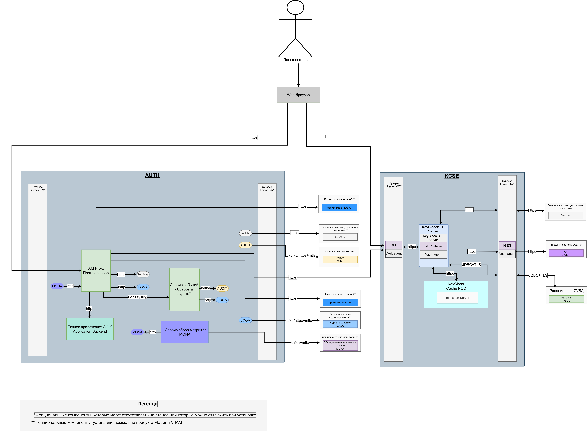

# Взаимодействия

В таблице перечислены межсистемные зависимости компонентов продуктов Platform V IAM SE между собой.
Зависимость вида `опция` подразумевает возможность исключения строгой зависимости в рамках определенных инсталляций за счет конфигурации.

| Код компонента                  | Имя компонента                       | Web-браузер | IAM Proxy | Application backend |  MONA   |  LOGA   | SecMan  | Сервис событий обработки аудита | Подсистема с RDS API |  AUDIT  | KeyCloak Cache POD  | KeyCloak.SE Server | Sinapse Ingress GW | Sinapse Egress GW | Pangolin PSQL |
|---------------------------------|--------------------------------------|:-----------:|:---------:|:-------------------:|:-------:|:-------:|:-------:|:-------------------------------:|:--------------------:|:-------:|:-------------------:|:------------------:|:------------------:|:-----------------:|:-------------:|
| Web-браузер                     | Beb-браузер                          |      -      |   `да`    |        `нет`        |  `нет`  |  `нет`  |  `нет`  |              `нет`              |        `нет`         |  `нет`  |        `нет`        |       `нет`        |      `опция`       |       `нет`       |     `нет`     | 
| IAM Proxy                       | Прокси сервер                        |    `да`     |     -     |       `опция`       |  `да`   |  `да`   |  `да`   |             `опция`             |       `опция`        | `опция` |        `нет`        |       `нет`        |      `опция`       |       `нет`       |     `нет`     |
| Application backend             | Бизнес приложения АС                 |    `нет`    |  `опция`  |          -          |  `нет`  |  `нет`  |  `нет`  |              `нет`              |        `нет`         |  `нет`  |        `нет`        |       `нет`        |       `нет`        |       `нет`       |     `нет`     |
| MONA                            | Сервис сбора метрик                  |    `нет`    |   `да`    |        `нет`        | `опция` |  `нет`  |  `нет`  |              `нет`              |        `нет`         |  `нет`  |        `нет`        |       `нет`        |       `нет`        |       `нет`       |     `нет`     | 
| LOGA                            | Журналирование                       |    `нет`    |   `да`    |        `нет`        |  `нет`  | `опция` |  `нет`  |             `опция`             |        `нет`         |  `нет`  |        `нет`        |       `нет`        |       `нет`        |       `нет`       |     `нет`     |
| SecMan                          | Внешняя система управления секретами |    `нет`    |   `да`    |        `нет`        |  `нет`  |  `нет`  | `опция` |              `нет`              |        `нет`         |  `нет`  |        `нет`        |       `нет`        |       `нет`        |      `опция`      |     `нет`     |
| Сервис событий обработки аудита | Сервис событий обработки аудита      |    `нет`    |  `опция`  |        `нет`        |  `нет`  | `опция` |  `нет`  |                -                |        `нет`         | `опция` |        `нет`        |       `нет`        |       `нет`        |       `нет`       |     `нет`     |                                                                               
| Подсистема с RDS API            | Подсистема с RDS API                 |    `нет`    |  `опция`  |        `нет`        |  `нет`  |  `нет`  |  `нет`  |              `нет`              |          -           |  `нет`  |        `нет`        |       `нет`        |       `нет`        |       `нет`       |     `нет`     |
| AUDIT                           | Аудит                                |    `нет`    |   `нет`   |        `нет`        |  `нет`  |  `нет`  |  `нет`  |             `опция`             |        `нет`         | `опция` |        `нет`        |       `нет`        |       `нет`        |      `опция`      |     `нет`     |
| KeyCloak Cache POD              | KeyCloak Cache POD                   |    `нет`    |   `нет`   |        `нет`        |  `нет`  |  `нет`  |  `нет`  |              `нет`              |        `нет`         |  `нет`  |          -          |        `да`        |       `нет`        |       `нет`       |     `нет`     |
| KeyCloak.SE Server              | Серверная часть платформы KeyCloak   |    `нет`    |   `нет`   |        `нет`        |  `нет`  |  `нет`  |  `нет`  |              `нет`              |        `нет`         |  `нет`  |        `да`         |         -          |      `опция`       |      `опция`      |     `нет`     |
| Synapse Ingress GW              | Ingress Gateway                      |   `опция`   |  `опция`  |        `нет`        |  `нет`  |  `нет`  |  `нет`  |              `нет`              |        `нет`         |  `нет`  |        `нет`        |      `опция`       |         -          |       `нет`       |     `нет`     |
| Synapse Egress GW               | Egress Gateway                       |    `нет`    |   `нет`   |        `нет`        |  `нет`  |  `нет`  | `опция` |              `нет`              |        `нет`         | `опция` |        `нет`        |      `опция`       |       `нет`        |         -         |    `опция`    |
| Pangolin PSQL                   | Реляционная СУБД                     |    `нет`    |   `нет`   |        `нет`        |  `нет`  |  `нет`  |  `нет`  |              `нет`              |        `нет`         |  `нет`  |        `нет`        |       `нет`        |       `нет`        |      `опция`      |       -       |

> Схемы приведены в разделе [Диаграммы развертывания](deployment-diagrams.md).

## Интеграционные взаимодействия при развертывании на VM

В таблице отражены интеграционные взаимодействия при развертывании IAM Proxy на виртуальной машине.

| №  | Потребитель                      | Поставщик                                      | Момент взаимодействия                                                                                                                                                                      | Протокол передачи данных | Технология взаимодействия | Протокол шифрования | Электронная подпись |
|:---|:---------------------------------|:-----------------------------------------------|:-------------------------------------------------------------------------------------------------------------------------------------------------------------------------------------------|:------------------------:|:-------------------------:|:-------------------:|:-------------------:|
| 1  | Пользователь                     | Балансировщик нагрузки IAM KCSE                | Аутентификация Пользователя на `Провайдере аутентификации OIDC`. Завершение сессии на `Провайдере аутентификации OIDC`                                                                     |           HTTP           |                           |      TLS 1.2+       |   Не используется   |
| 2  | Пользователь                     | Балансировщик нагрузки IAM Proxy               | Обращение Пользователя из клиентского приложения (браузер) к UI и API АС через `Proxy Server` (IAM Proxy), или обращение к `Proxy Server` при выполнении шагов связанных с аутентификацией |           HTTP           |                           |      TLS 1.2+       |   Не используется   |
| 3  | Proxy Server, IAM Proxy          | Балансировщик нагрузки IAM KCSE                | Балансировщик нагрузки направляет запрос на `Proxy Server` в момент его получения                                                                                                          |           HTTP           |                           |      TLS 1.2+       |   Не используется   |
| 4  | Proxy Server, IAM Proxy          | Балансировщик нагрузки IAM AZGT                | Первое обращение к UI и API АС через `Proxy Server`, если это обращение требует авторизации в `Авторизация`                                                                                |           HTTP           |                           |      TLS 1.2+       |   Не используется   |
| 5  | Proxy Server, IAM Proxy          | Подсистема с UI и API                          | Обращение к UI и API АС через `Proxy Server`                                                                                                                                               |           HTTP           |                           |      mTLS 1.2+      |   Не используется   |
| 6  | Proxy Server, IAM Proxy          | Подсистема с RDS API                           | Обращение к RDS API АС через `Proxy Server`                                                                                                                                                |           HTTP           |         REST API          |      mTLS 1.2+      |   Не используется   |
| 7  | Proxy Server, IAM Proxy          | Журналирование (LOGA)                          | При появлении записей в журнале работы `Proxy Server` они передаются в `Журналирование` (LOGA)                                                                                             |      Kafka или HTTP      |     REST API при HTTP     |      mTLS 1.2+      |   Не используется   |
| 8  | Proxy Server, IAM Proxy          | Audit (AUDT)                                   | По завершению обработки HTTP запроса к `Proxy Server` выполняется запись в журнал доступа, и по необходимости производится отправка события в `Audit` (AUDT)                               |           HTTP           |         REST API          |      mTLS 1.2+      |   Не используется   |
| 9  | Балансировщик нагрузки IAM KCSE  | Провайдер аутентификации OIDC, IAM KCSE (KCSE) | Балансировщик нагрузки направляет запрос на `Провайдер аутентификации OIDC` в момент его получения                                                                                         |           HTTP           |         REST API          |      mTLS 1.2+      |   Не используется   |
| 10 | Балансировщик нагрузки IAM Proxy | Proxy Server, IAM Proxy                        | Балансировщик нагрузки направляет запрос на `Proxy Server` в момент его получения                                                                                                          |           HTTP           |         REST API          |      mTLS 1.2+      |   Не используется   |
| 11 | Балансировщик нагрузки IAM AZGT  | Авторизация (AZGT)                             | Балансировщик нагрузки направляет запрос на `Авторизация` в момент его получения                                                                                                           |           HTTP           |         REST API          |      mTLS 1.2+      |   Не используется   |
| 12 | Proxy Server, IAM Proxy          | Внешняя система управления секретами (Secman)  | При старте `Proxy Server` получает секреты из `Внешней системы управления секретами` (Secman), а после, периодически проверяет их изменение и обновляет по необходимости                   |           HTTP           |         REST API          |      mTLS 1.2+      |   Не используется   |                         

Примечания:
- вызовы к `Proxy Server`, `Keycloak.SE` и `Авторизация (AZGT)` осуществляются
  через балансировщики нагрузки.

## Интеграционные взаимодействия при развертывании в OpenShift/k8s

### Рекомендованная схема

В таблице отражены интеграционные взаимодействия при развертывании IAM Proxy при развертывании в OpenShift/k8s.

| №  | Потребитель                | Поставщик                                        | Момент взаимодействия                                                                                                                                                                        | Протокол передачи данных | Технология взаимодействия | Протокол шифрования | Электронная подпись |
|:---|:---------------------------|:-------------------------------------------------|:---------------------------------------------------------------------------------------------------------------------------------------------------------------------------------------------|:------------------------:|:-------------------------:|:-------------------:|:-------------------:|
| 1  | Пользователь               | Proxy Server, IAM Proxy                          | Обращение Пользователя из клиентского приложения (браузер) к UI и API АС через `Proxy Server` (IAM Proxy), или обращение к `Proxy Server` при выполнении шагов связанных с аутентификацией   |           HTTP           |                           | TLS на ingress 1.2+ |   Не используется   |
| 2  | Пользователь               | Провайдер аутентификации OIDC, IAM SE (KCSE)     | Аутентификация Пользователя на `Провайдере аутентификации OIDC`. Завершение сессии на `Провайдере аутентификации OIDC`                                                                       |           HTTP           |                           |      TLS 1.2+       |   Не используется   |
| 3  | Proxy Server, IAM Proxy    | Провайдер аутентификации OIDC, IAM SE (KCSE)     | Обращение к `Провайдер аутентификации OIDC` в момент получения/обновления/отзыва аутентификационных JWT-токенов (в токенах обычно имеется информация об УЗ, такая как логин, ФИО, роли в АС) |           HTTP           |         REST API          |      TLS 1.2+       |   Не используется   |
| 4  | Proxy Server, IAM Proxy    | Подсистема с UI и API                            | Обращение к UI и API АС через `Proxy Server`                                                                                                                                                 |           HTTP           |                           | mTLS на egress 1.2+ |   Не используется   |
| 5  | Proxy Server, IAM Proxy    | Журналирование (LOGA)                            | При появлении записей в журнале работы `Proxy Server` они передаются в `Журналирование` (LOGA)                                                                                               |      Kafka или HTTP      |     REST API при HTTP     | mTLS на egress 1.2+ |   Не используется   |
| 6  | Proxy Server, IAM Proxy    | Внешняя система управления секретами (Secman)    | При старте `Proxy Server` получает секреты из `Внешней системы управления секретами` (Secman), а после, периодически проверяет их изменение и обновляет по необходимости                     |           HTTP           |         REST API          |      mTLS 1.2+      |   Не используется   |
| 7  | Proxy Server, IAM Proxy    | Сервис управления политиками Service Mesh (POLM) | Передача параметров `SSM` при старте, и их обновление при изменениях                                                                                                                         |           grpc           |                           |      mTLS 1.2+      |   Не используется   |
| 8  | Synapse Ingress gateway    | Внешняя система управления секретами (Secman)    | Получение сертификатов при старте и обновление их при работе                                                                                                                                 |           HTTP           |         REST API          |      mTLS 1.2+      |   Не используется   |
| 9  | Synapse Ingress gateway    | Сервис управления политиками Service Mesh (POLM) | Передача параметров `SSM` при старте, и их обновление при изменениях                                                                                                                         |           grpc           |                           |      mTLS 1.2+      |   Не используется   |
| 10 | Synapse Egress gateway     | Внешняя система управления секретами (Secman)    | Получение сертификатов при старте и обновление их при работе                                                                                                                                 |           HTTP           |         REST API          |      mTLS 1.2+      |   Не используется   |
| 11 | Synapse Egress gateway     | Сервис управления политиками Service Mesh (POLM) | Передача параметров `SSM` при старте, и их обновление при изменениях                                                                                                                         |           grpc           |                           |      mTLS 1.2+      |   Не используется   |

Примечания:
- вызовы к `Proxy Server`, `Keycloak.SE` и `Авторизация` осуществляются
  через балансировщики нагрузки.

### Схема с отображением опциональных компонент

В таблице отражены интеграционные взаимодействия при развертывании IAM Proxy при развертывании в OpenShift/k8s.

| №  | Потребитель                | Поставщик                                                  | Момент взаимодействия                                                                                                                                                                        | Протокол передачи данных | Технология взаимодействия | Протокол шифрования  | Электронная подпись |
|:---|:---------------------------|:-----------------------------------------------------------|:---------------------------------------------------------------------------------------------------------------------------------------------------------------------------------------------|:------------------------:|:-------------------------:|:--------------------:|:-------------------:|
| 1  | Пользователь               | Proxy Server, IAM Proxy                                    | Обращение Пользователя из клиентского приложения (браузер) к UI и API АС через `Proxy Server` (IAM Proxy), или обращение к `Proxy Server` при выполнении шагов связанных с аутентификацией   |           HTTP           |                           | TLS на ingress 1.2+  |   Не используется   |
| 2  | Пользователь               | Провайдер аутентификации OIDC, IAM SE (KCSE)               | Аутентификация Пользователя на `Провайдере аутентификации OIDC`. Завершение сессии на `Провайдере аутентификации OIDC`                                                                       |           HTTP           |                           |       TLS 1.2+       |   Не используется   |
| 3  | Proxy Server, IAM Proxy    | Провайдер аутентификации OIDC, IAM SE (KCSE)               | Обращение к `Провайдер аутентификации OIDC` в момент получения/обновления/отзыва аутентификационных JWT-токенов (в токенах обычно имеется информация об УЗ, такая как логин, ФИО, роли в АС) |           HTTP           |         REST API          |       TLS 1.2+       |   Не используется   |
| 4  | Proxy Server, IAM Proxy    | Подсистема с UI и API                                      | Обращение к UI и API АС через `Proxy Server`                                                                                                                                                 |           HTTP           |                           | mTLS на egress 1.2+  |   Не используется   |
| 5  | Proxy Server, IAM Proxy    | Подсистема с RDS API                                       | Обращение к RDS API АС через `Proxy Server`                                                                                                                                                  |           HTTP           |         REST API          |                      |   Не используется   |
| 6  | Proxy Server, IAM Proxy    | Audit (AUDT)                                               | По завершению обработки HTTP запроса к `Proxy Server` выполняется запись в журнал доступа, и по необходимости производится отправка события в `Audit` (AUDT)                                 |      Kafka или HTTP      |     REST API при HTTP     | mTLS на egress 1.2+  |   Не используется   |
| 7  | Proxy Server, IAM Proxy    | Единый коллектор телеметрии (COTE)                         | По завершению обработки HTTP запроса к `Proxy Server` выполняется запись в журнал доступа, и по необходимости производится отправка события в `Единый коллектор телеметрии` (COTE)           |      Kafka или HTTP      |     REST API при HTTP     | mTLS на egress 1.2+  |   Не используется   |
| 8  | Proxy Server, IAM Proxy    | Журналирование (LOGA)                                      | При появлении записей в журнале работы `Proxy Server` они передаются в `Журналирование` (LOGA)                                                                                               |      Kafka или HTTP      |     REST API при HTTP     | mTLS на egress 1.2+  |   Не используется   |
| 9  | Proxy Server, IAM Proxy    | Авторизация (AZGT)                                         | Первое обращение к UI и API АС через `Proxy Server`, если это обращение требует авторизации в `Авторизации`                                                                                  |           HTTP           |         REST API          | mTLS на egress 1.2+  |   Не используется   |
| 10 | Proxy Server, IAM Proxy    | Внешняя система управления секретами (Secman)              | При старте `Proxy Server` получает секреты из `Внешней системы управления секретами` (Secman), а после, периодически проверяет их изменение и обновляет по необходимости                     |           HTTP           |         REST API          |      mTLS 1.2+       |   Не используется   |
| 11 | Proxy Server, IAM Proxy    | Сервис управления политиками Service Mesh (POLM)           | Передача параметров `SSM` при старте, и их обновление при изменениях                                                                                                                         |           grpc           |                           |      mTLS 1.2+       |   Не используется   |
| 12 | Synapse Ingress gateway    | Внешняя система управления секретами (Secman)              | Получение сертификатов при старте и обновление их при работе                                                                                                                                 |           HTTP           |         REST API          |      mTLS 1.2+       |   Не используется   |
| 13 | Synapse Ingress gateway    | Сервис управления политиками Service Mesh (POLM)           | Передача параметров `SSM` при старте, и их обновление при изменениях                                                                                                                         |           grpc           |                           |      mTLS 1.2+       |   Не используется   |
| 14 | Synapse Ingress gateway    | Сервис ограничения (квотирования) входящих запросов (SRLS) | При обработке входящих HTTP-запросов через `Synapse Ingress gateway` выполняется проверка лимитов (квот) на количество запросов.                                                             |           grpc           |                           |      mTLS 1.2+       |   Не используется   |
| 15 | Synapse Egress gateway     | Сервис управления политиками Service Mesh (POLM)           | Передача параметров `SSM` при старте, и их обновление при изменениях                                                                                                                         |           grpc           |                           |      mTLS 1.2+       |   Не используется   |
| 16 | Synapse Egress gateway     | Внешняя система управления секретами (Secman)              | Получение сертификатов при старте и обновление их при работе                                                                                                                                 |           HTTP           |         REST API          |      mTLS 1.2+       |   Не используется   |
| 17 | Сервис сбора метрик (MONA) | Proxy Server, IAM Proxy                                    | Периодическое получение метрик состояния `Proxy Server`                                                                                                                                      |           HTTP           |         REST API          |                      |   Не используется   |
| 18 | Сервис сбора метрик (MONA) | Объединенный мониторинг Unimon (MONA)                      | `Сервис сбора метрик` периодически отправляет метрики в `Объединенный мониторинг Unimon` (MONA)                                                                                              |           HTTP           |         REST API          | mTLS на egress 1.2+  |   Не используется   |

Примечания:
- вызовы к `Proxy Server`, `Keycloak.SE` и `Авторизация` осуществляются через балансировщики нагрузки;
- интеграция IAM Proxy с OTTS, для получения авторизационного токена ОТТS, необходимого для выполнения вызова API, отсутствует.