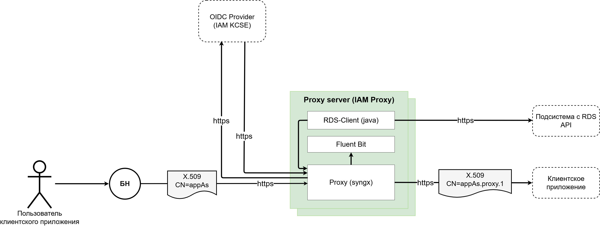
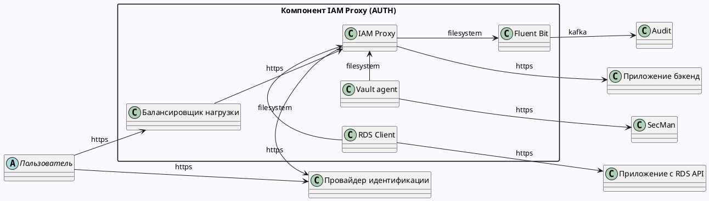
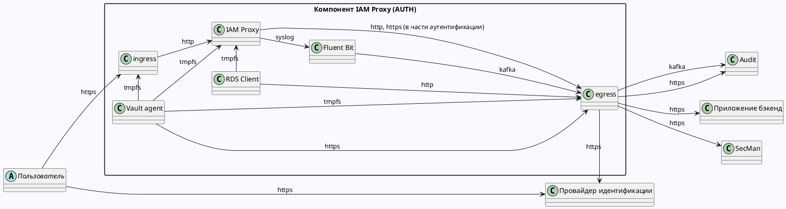

# Компонентно-логическая диаграмма

Для VM:

```puml
@startuml

skinparam packageStyle rectangle
skinparam backgroundColor #F9F9FF
left to right direction

abstract "Пользователь"
class "Провайдер идентификации"
class "Audit"
class "Приложение бэкенд"
class "SecMan"
class "Приложение с RDS API"

"Пользователь" -> "Провайдер идентификации":https

package "Компонент IAM Proxy (AUTH)" {
    "Пользователь" --> "Балансировщик нагрузки":https
    "Балансировщик нагрузки"-->"IAM Proxy":https

    "IAM Proxy"->"Провайдер идентификации":https
    "IAM Proxy"-->"Fluent Bit":filesystem
    "IAM Proxy"--->"Приложение бэкенд":https

    "Vault agent"--->"SecMan": https
    "Vault agent"->"IAM Proxy": filesystem

    "RDS Client"->"IAM Proxy": filesystem
    "RDS Client"--->"Приложение с RDS API": https

    "Fluent Bit"-->"Audit":kafka
}
@enduml
```

Для среды контейнеризации (OSE)

```puml
@startuml
skinparam packageStyle rectangle
skinparam backgroundColor #F9F9FF
left to right direction

abstract "Пользователь"
class "Провайдер идентификации"
class "Audit"
class "Приложение бэкенд"
class "SecMan"

"Пользователь" -> "Провайдер идентификации":https

package "Компонент IAM Proxy (AUTH)" {
    "Пользователь" --> "ingress":https
    "ingress"-->"IAM Proxy":http

    "IAM Proxy"--->"egress":http, https (в части аутентификации)
    "egress"->"Провайдер идентификации":https
    "egress"-->"Приложение бэкенд":https

    "IAM Proxy"-->"Fluent Bit":syslog
    "Fluent Bit"--->"egress":kafka

    "RDS Client"-->"egress":http
    "RDS Client"->"IAM Proxy": tmpfs

   
    "egress"-->"Audit":kafka
    "egress"-->"Audit":https

    "Vault agent"-->"egress": https
    "Vault agent"->"ingress": tmpfs
    "Vault agent"-->"IAM Proxy": tmpfs
    "Vault agent"--->"egress": tmpfs
    "egress"-->"SecMan":https
}
@enduml
```

> Между RDS Client и IAM Proxy происходит взаимодействие файловой системы
