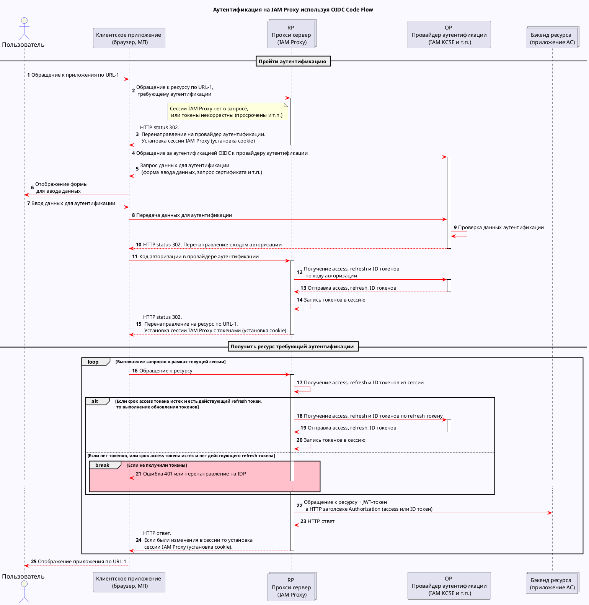
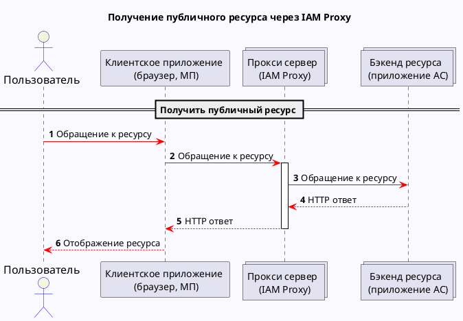
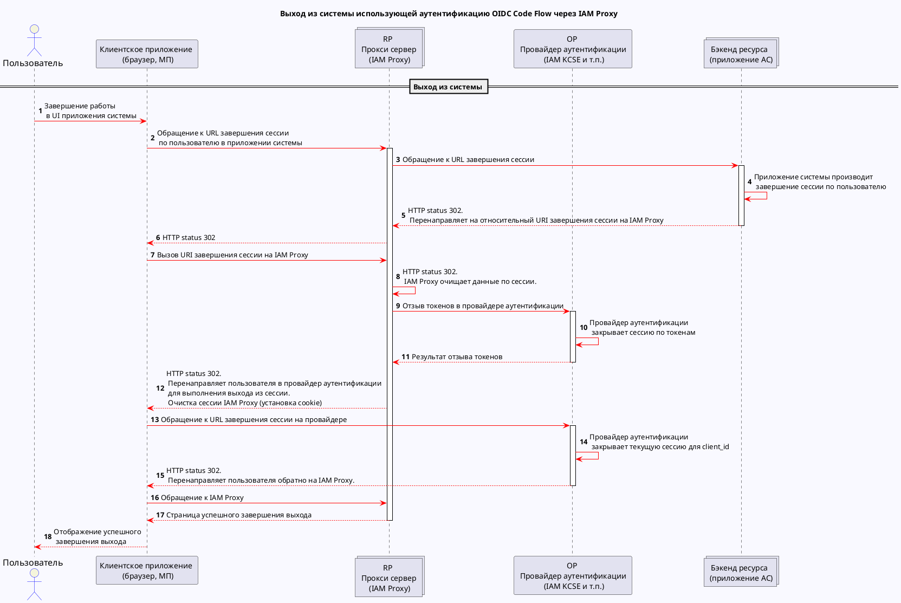
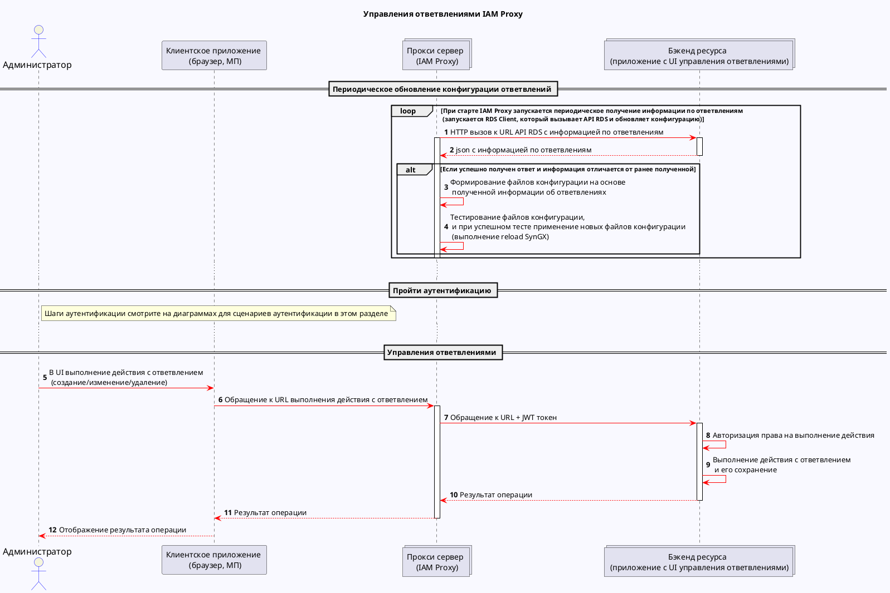
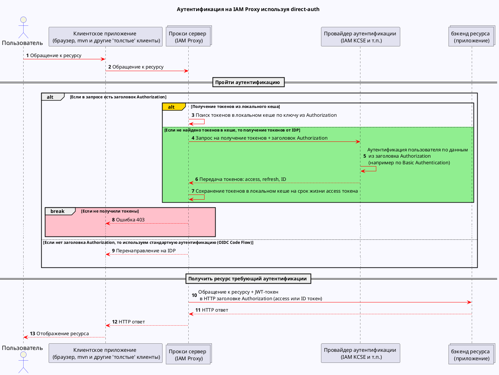
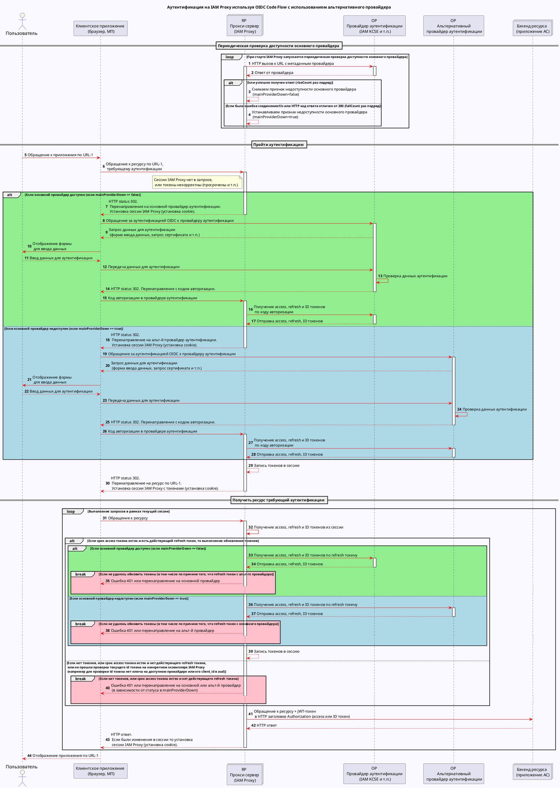
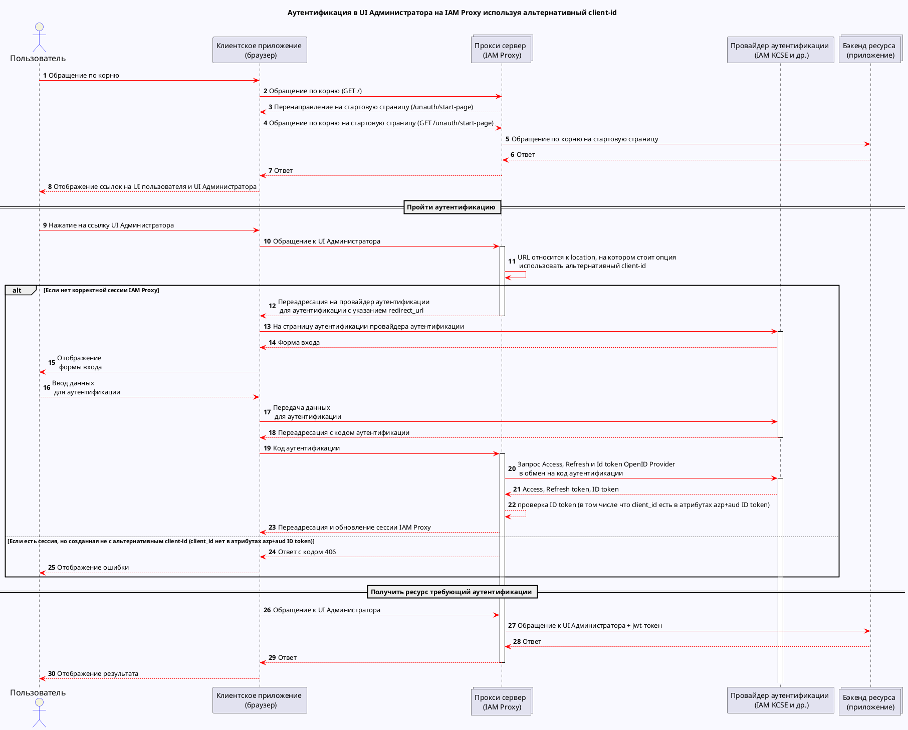
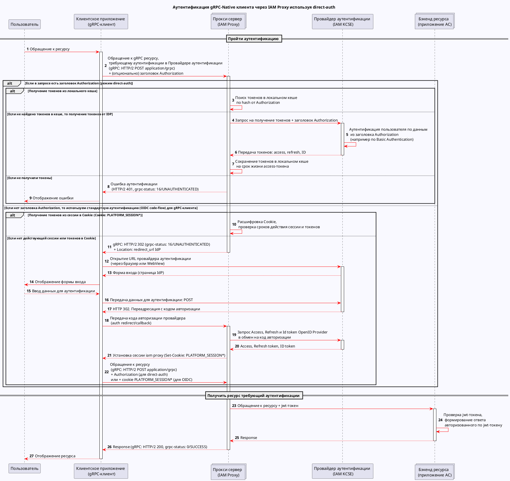

# Диаграммы последовательностей

Диаграммы ниже описывают взаимодействия возникающие при работе пользователя с ресурсами, используя IAM Proxy.

## Диаграмма основного сценария аутентификации используя OIDC Code Flow

Диаграмма описывает взаимодействия возникающие в сценариях:

- [Пройти аутентификацию](../about/use-case-authentification.md)
- [Получить ресурс требующий аутентификации](../about/use-case-accessing-resource.md)

## Диаграмма сценария получения публичного ресурса

Диаграмма описывает взаимодействия возникающие в сценариях:

- [Получить публичный ресурс](../about/use-case-accessing-resource.md)

## Диаграмма сценария выхода из системы

Диаграмма описывает взаимодействия возникающие в сценариях:

- [Выход из системы](../about/use-case-accessing-resource.md)

## Диаграмма сценария управления ответвлениями

Диаграмма описывает взаимодействия возникающие в сценариях:

- [Управление ответвлениями](../about/use-case-junctions-management.md)

Подробнее про реализацию и использование API RDS смотрите в разделе
[Параметры RDS Client](../installation-guide/proxy-deploy-docker-description.md#параметры-rds-client).

## Диаграмма аутентификации используя direct-auth

Диаграмма описывает взаимодействия возникающие в сценариях:

- [Пройти аутентификацию](../about/use-case-authentification.md)
- [Получить ресурс требующий аутентификации](../about/use-case-accessing-resource.md)

Про описание и настройку этой функциональности смотрите в
разделе [Описание настройки IAM Proxy при запуске в контейнере](../installation-guide/proxy-deploy-docker-description.md).

## Диаграмма сценария аутентификации используя OIDC Code Flow с использованием альтернативного провайдера

Диаграмма описывает взаимодействия при использовании функциональности переключения на альтернативный провайдер, возникающие в
сценариях:

- [Пройти аутентификацию](../about/use-case-authentification.md)
- [Получить ресурс требующий аутентификации](../about/use-case-accessing-resource.md)

Про описание и настройку этой функциональности  смотрите в
разделе [Описание настройки IAM Proxy при запуске в контейнере](../installation-guide/proxy-deploy-docker-description.md).

## Диаграмма сценария аутентификации используя OIDC Code Flow с использованием альтернативного client-id

Диаграмма описывает взаимодействия при аутентификации в UI Администратора на IAM Proxy используя альтернативный
client-id, возникающие в сценариях:

- [Пройти аутентификацию](../about/use-case-authentification.md)
- [Получить ресурс требующий аутентификации](../about/use-case-accessing-resource.md)

Про описание и настройку этой функциональности смотрите в
разделе [Описание настройки IAM Proxy при запуске в контейнере](../installation-guide/proxy-deploy-docker-description.md).

### Диаграмма последовательности процесса аутентификации gRPC-Native клиента (используя direct-auth)

Диаграмма описывает взаимодействия при аутентификации gRPC-Native клиента через IAM Proxy используя direct-auth,
возникающие в сценариях:

- [Пройти аутентификацию](../about/use-case-authentification.md)
- [Получить ресурс требующий аутентификации](../about/use-case-accessing-resource.md)

Про описание и настройку этой функциональности смотрите в
разделе [Описание настройки IAM Proxy при запуске в контейнере](../installation-guide/proxy-deploy-docker-description.md).