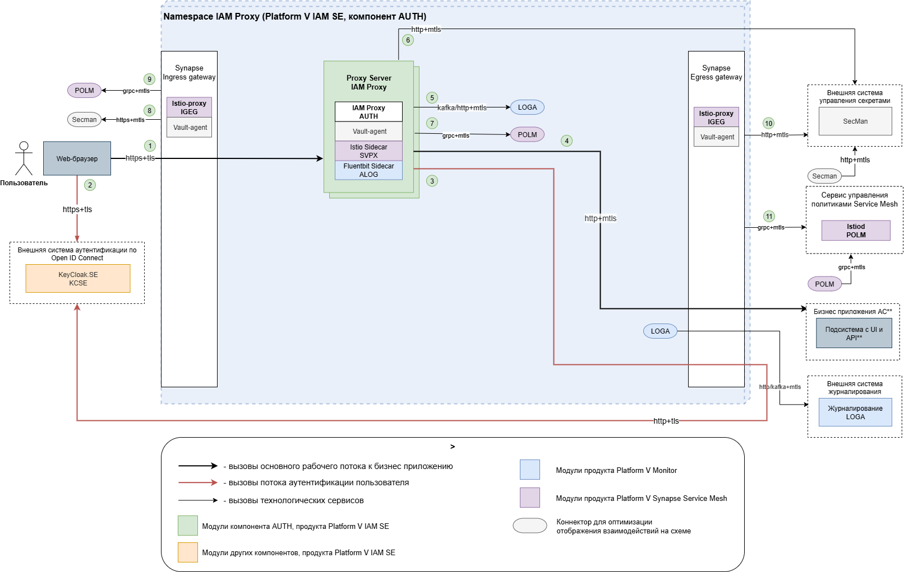
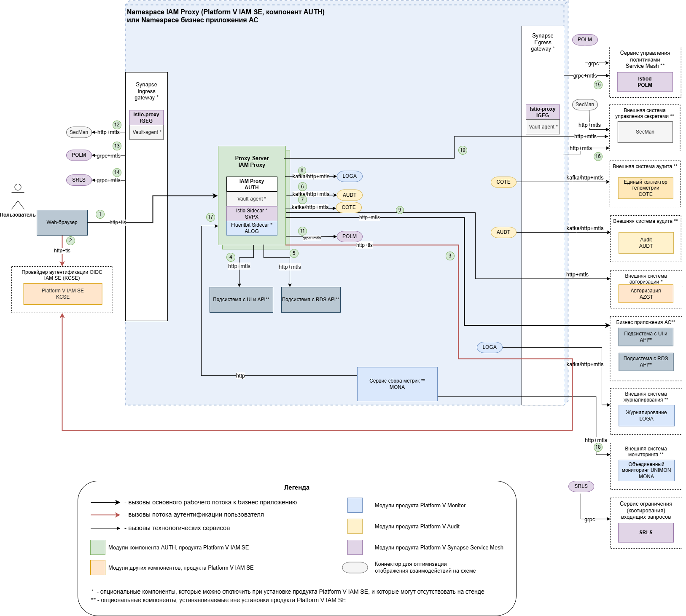

# Диаграмма развертывания AUTH в среде контейнеризации

## Назначение

Продукт предназначен для развертывания в среде контейнеризации.

## Диаграмма развертывания

## Рекомендованная схема

Примечания:
- вызовы к `Proxy Server`, `Keycloak.SE` и `Авторизация` осуществляются
  через балансировщики нагрузки.

### Схема с отображением опциональных компонент

> Данная схема отражает возможности развертывания IAM Proxy с набором ограничений и/или дополнительных действий, которые
> могут не поддерживаться развертыванием из поставки, но могут быть настроены пользователем самостоятельно.

Перечень компонентов,
функциональность которых ограничена в среде контейнеризации:

1. Подключение и использование компонента Объединенный мониторинг Unimon продукта Platform V Monitor (MONA)
   производится установкой pod MONA в namespace IAM Proxy.

