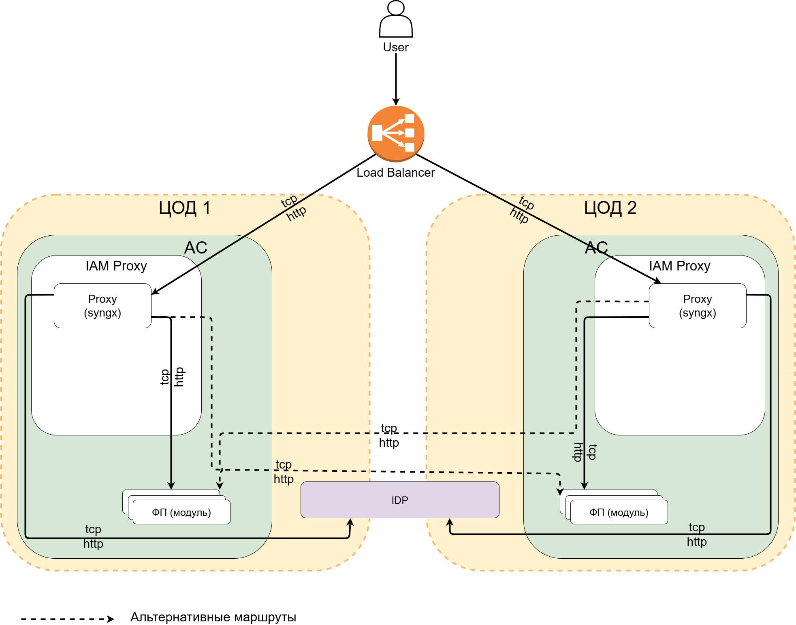

# Схема развертывания AUTH с георезервированием

## Назначение

Продукт предназначен для развертывания в распределенной инфраструктуре с географическим резервированием (геокластеризация),
обеспечивая высокую доступность и отказоустойчивость сервисов аутентификации и авторизации. Архитектура поддерживает работу
в нескольких ЦОДах с едиными ключами шифрования сессий и согласованной конфигурацией IAM Proxy, при этом каждый регион
использует соответствующий локальный Identity Provider. Балансировка трафика осуществляется с использованием 
session affinity для оптимизации производительности, а настройка инфраструктурных балансировщиков выполняется
заказчиком в соответствии с требованиями информационной безопасности и сетевой политики.

## Диаграмма развертывания

## Примечания

1. Ключи для шифрования сессионных cookie, должны быть одинаковыми на всех плечах геокластера IAM Proxy (ЦОДах).
2. Инфраструктурный балансировщик, должен обеспечивать один из видов `session affinity`. Рекомендации по использованию
   возможных настроек, детализируются в разделах описания рекомендаций к настройке балансировщиков L4/L7.
3. Во всех ЦОДах используется одинаковая прикладная конфигурация настройки ответвлений IAM Proxy.
    1. Настройки конкретной инсталляции (региона) IAM Proxy, в части подключения к `Identity Provider` (Провайдеру
       Идентификации), должны соответствовать провайдеру который используется в данной инсталляции (регионе). Например, в
       IAM Proxy в промышленной среде должен использовать `Identity Provider` промышленной среды и должен быть в нем
       зарегистрирован (использовать `Client ID` и `Client Secret` с этого провайдера идентификации).
4. Инфраструктурные балансировщики предоставляются инфраструктурой на стороне заказчика (настройка, сопровождение и
   прочее осуществляется исходя из внутренних требований пользователя).

## Рекомендации к настройке балансировщиков L7

1. Рекомендуется использование любого из перечисленных видов `session affinity`: `Hash`, `IP Hash`,
   `Least Connections` (использование других типов балансировки, могут не обеспечивать максимальную производительность).
2. Использование механизмов `sticky session` при вызовах IAM Proxy является опциональным, но рекомендуется для
   обеспечения максимальной производительности.
3. Для обеспечения балансировки на уровне L7, потребуется настроить терминирование `TLS`, в случае наличия
   таких требований ИБ к сетевой инфраструктуре. Серверные сертификаты должны содержать секцию `SAN` с перечнем
   альтернативных доменных имен.
4. Рекомендуется включить кеширование `TLS` сессий для уменьшения нагрузки на CPU при установке подключений.
   Выполнение данной рекомендации, выполняется по согласованию с требованиями ИБ.
5. Настройте балансировщик для передачи IP-адреса клиента. Это необходимо для корректного аудирования обращений
   клиента (использование `PROXY-protocol` или HTTP заголовка `X-Forwarded-For`). Заголовок `X-Forwarded-For`
   используется для идентификации оригинального IP-адреса клиента, который подключается к веб-серверу, через
   HTTP-прокси или балансировщик нагрузки.
6. На балансировщике рекомендуется обеспечить функциональность `Health Check` для вызываемых `Proxy` на
   уровне L4 или L7.
7. Тайм-аут подключения к IAM Proxy 3 секунды. Тайм-аут закрытия неактивных соединений устанавливается не менее
   аналогичных таймауов, установленных на IAM Proxy (по умолчанию 60 секунд).

## Рекомендации к настройке балансировщиков L4

1. Рекомендуется использование любого из перечисленных видов `session affinity`: `Hash`, `IP Hash`,
   `Least Connections` (использование других типов балансировки, могут не обеспечивать максимальную производительность).
2. Использование механизмов `sticky session` при вызовах IAM Proxy является опциональным, но рекомендуется для
   обеспечения максимальной производительности.
3. Для обеспечения балансировки на уровне L4, потребуется настроить терминирование `TLS`, в случае наличия
   таких требований ИБ к сетевой инфраструктуре.
4. Рекомендуется использовать функциональность `Keep-Alive`, для уменьшения количества сетевых подключений между
   балансировщиком и IAM Proxy.
5. Настройте балансировщик для передачи IP-адреса клиента. Это необходимо для корректного аудирования обращений
   клиента (использование `PROXY-protocol` или сохранение оригинального IP-адреса источника в TCP-пакетах).
6. Тайм-аут подключения к IAM Proxy 3 секунды. Тайм-аут закрытия неактивных соединений устанавливается не менее
   аналогичных таймауов, установленных на IAM Proxy (по умолчанию 60 секунд).
