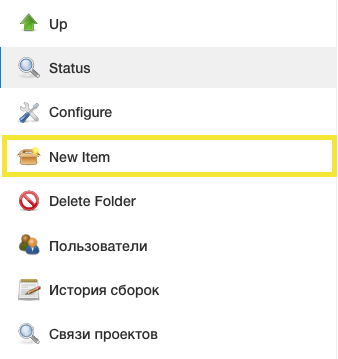
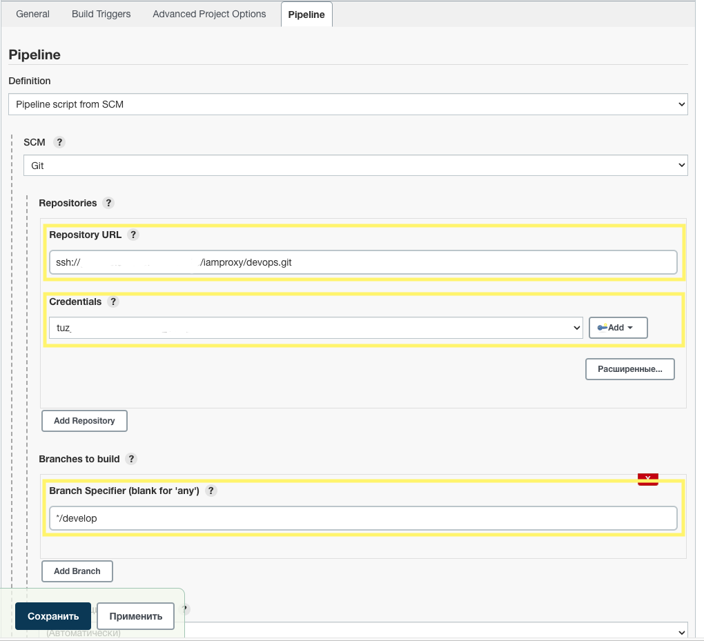
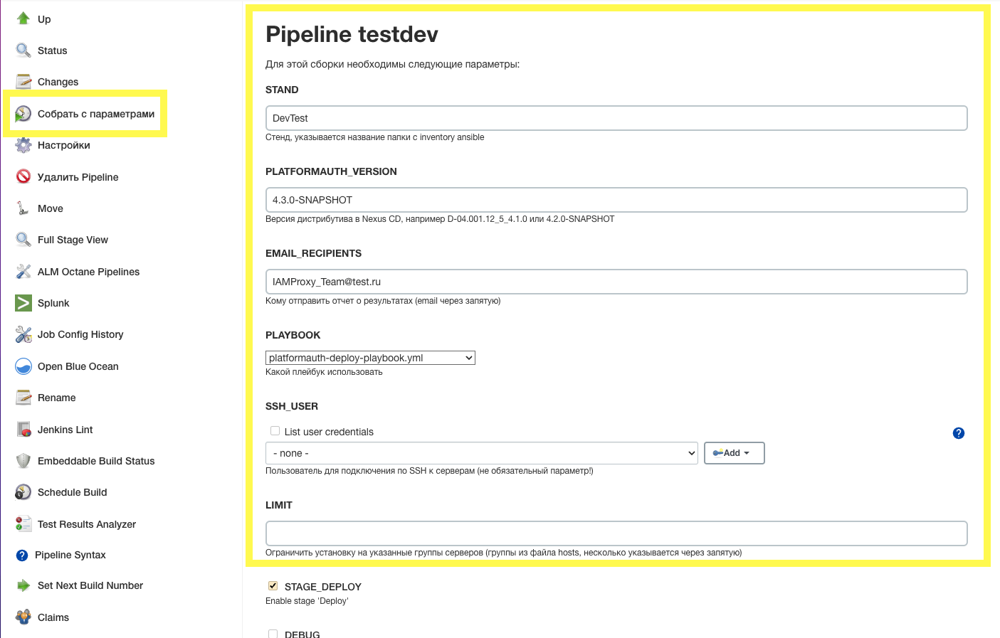
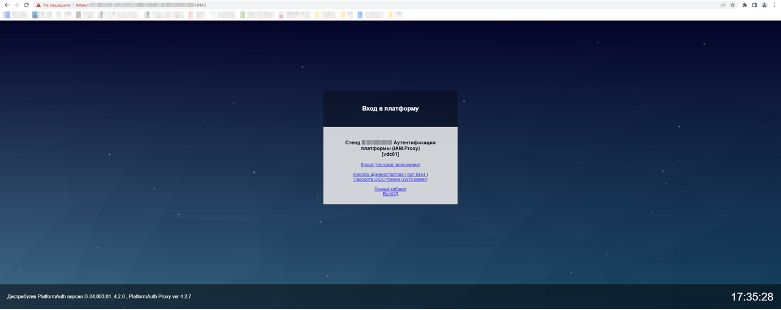

# Установка

## Введение

В разделе описывается установка IAM Proxy на виртуальную машину.

> Установка IAM Proxy в среду контейнеризации OpenShift описана в разделе [IAM Proxy в контейнере](installation-ose.md).

Установка сервиса состоит из следующих основных этапов:

## Порядок установки

[Шаг 1 Подготовка окружения (обязательный)](#шаг-1-подготовка-окружения-обязательный)

[Шаг 2 Подготовка дистрибутива (обязательный)](#шаг-2-подготовка-дистрибутива-обязательный)

[Шаг 3 Создание/изменение профиля развертывания (обязательный)](#шаг-3-созданиеизменение-профиля-развертывания-обязательный)

[Шаг 4 Настройка конфигурационных параметров (обязательный)](#шаг-4-настройка-конфигурационных-параметров-обязательный)

[Шаг 5 Выполнение развертывания (обязательный)](#шаг-5-выполнение-развертывания-обязательный)

[Шаг 6 Проверка результатов (обязательный)](#шаг-6-проверка-результатов-обязательный)

(1)=

### Шаг 1. Подготовка окружения (обязательный)

Смотрите описание в разделе [Подготовка окружения](preparing.md).

(2)=

### Шаг 2. Подготовка дистрибутива (обязательный)

**Цель:** Получение и подготовка установочных файлов
**Последовательность действий:**

1. Получить архивы дистрибутивов (`owned`, `party`, `vendor`)
    - `owned` дистрибутив - артефакты разрабатываемые СБТ, включая зависимости;
    - `party` дистрибутив - артефакты opensource;
    - `vendor` дистрибутив - артефакты сторонних производителей и требующих лицензии.
2. Объединить специальной утилитой архивы дистрибутивов (`owned`, `party`, `vendor`) в один файл дистрибутив продукта,
   который используется для установки продукта.
3. По необходимости разместить полученные артефакты в хранилище ПО (в nexus или аналогичном хранилище).
4. Разархивировать содержимое компонента IAM Proxy в локальный каталог.

**Проверка результата:**

- в рабочем каталоге присутствуют архивы и исполняемые файлы продукта, и файлы `platformauth-deploy-playbook.yml` и
  примеры профиля деплоя в `ansible/inventories/`;
- в хранилище ПО есть артефакты используемые для установки продукта.

(3)=

### Шаг 3. Создание/изменение профиля развертывания (обязательный)

**Цель:** Подготовка конфигурации для конкретного стенда  
**Последовательность действий:**

1. Клонировать репозиторий с шаблонами (или использовать из дистрибутива):
   ```shell
   git clone ssh://git@bitbucket.mycompany.ru:7999/Project/CI_platformauth.git
   ```
2. Создать копию профиля `DemoProfile` как `StandX`.
3. Заполнить файл `hosts` с описанием серверов по группам.

**Проверка результата:**

- файл `ansible/inventories/StandX/hosts` содержит корректные IP/DNS-адреса серверов;
- группы серверов соответствуют архитектурным требованиям.

(4)=

### Шаг 4. Настройка конфигурационных параметров (обязательный)

**Цель:** Задание основных параметров развертывания  
**Последовательность действий:**

1. Заполнить файл `ansible/inventories/StandX/group_vars/all/main.yml`:
    - указать репозиторий Nexus (`nexus_repo_url`);
    - настраивать параметры DNS (`keycloak_dnsname`, `proxy_dnsname`);
    - определить тип стенда (`stend_type`);
    - заполнить остальные параметры указанные ниже в разделе.
2. Для секретных данных использовать зашифрованный файл `vault_main_decrypted.yml`

**Проверка результата:**

- все обязательные параметры заполнены;
- отсутствуют ошибки валидации YAML-файлов.

(5)=

### Шаг 5. Выполнение развертывания (обязательный)

**Цель:** Установка сервисов на целевые серверы  
**Последовательность действий:**

1. Запустить playbook:
   ```shell
   ansible-playbook platformauth-deploy-playbook.yml -i inventories/StandX/hosts --extra-vars "deploy_platformauth_version=1.0.1 tmp_clear=True"
   ```
2. Мониторинг выполнения задач через Jenkins

**Проверка результата:**

- отсутствие ошибок в выводе playbook;
- сервисы запущены на целевых серверах.

(6)=

### Шаг 6. Проверка результатов (обязательный)

**Цель:** Верификация корректности развертывания  
**Последовательность действий:**

1. Проверить доступность сервисов по DNS-именам.
2. Тестировать маршрутизацию запросов через proxy_jct_list.
3. Проверить журналы аудита (если настроено).

**Проверка результата:**

- сервисы отвечают на HTTP(S)-запросы;
- конфигурация ответвлений (`junctions`) применяется корректно.

## Заполнение конфигурационных файлов

### Создание или изменение профиля развертывания

Скопируйте профиль `DemoProfile` из дистрибутива, как шаблонный для нового профиля `StandX`.

`ansible/inventories/DemoProfile -> ansible/inventories/StandX`

### Внесение изменений в конфигурационные файлы профиля стенда

Необходимо внести изменения в параметры профиля `StandX`. В данной документации приводится описание и назначение
определенных параметров. Поставляемые yaml-файлы могут содержать дополнительные комментарии к заполняемым параметрам.
Например, дополнительные примеры и уточнения.

С примерами профилей развертывания можно ознакомиться в каталоге дистрибутива `package/scripts/ansible/inventories`.

#### Заполнение файла `ansible/inventories/StandX/hosts`

Файл содержит список групп и входящих в них серверов, на которые необходимо выполнить установку (группы могут ссылаться
на подгруппы).

| Название группы                  | Описание                                                                                                                                                                      |
|----------------------------------|-------------------------------------------------------------------------------------------------------------------------------------------------------------------------------|
| `keycloak_geo1`, `keycloak_geo2` | указываются сервера Keycloak (может не содержать серверов)                                                                                                                    |
| `keycloak`                       | группа, включающая в себя все группы или сервера Keycloak                                                                                                                     |
| `proxy_geo1`, `proxy_geo2`       | указываются сервера IAM Proxy (минимум один сервер)                                                                                                                           |
| `proxy`                          | группа включающая в себя все группы или сервера IAM Proxy                                                                                                                     |
| `loadbalancer_for_proxy`         | указываются сервера soft-балансировщика для IAM Proxy, обычно необходим на стендах тестирования, и может быть заменен на hw-балансировщик (максимум один сервер)              |
| `loadbalancer_for_keycloak`      | указываются сервера soft-балансировщик для Keycloak, обычно необходим на стендах тестирования, и может быть заменен на hw-балансировщик (максимум один сервер)                |
| `loadbalancer`                   | группа включающая все группы soft-балансировщиков                                                                                                                             |
| `*_geo1`, `*_geo2`               | группы предназначены для разделения серверов по гео-зонам или дата-центрам, что позволяет задавать по ним отдельно параметры и раздельно производить установку или обновление |

Сервера в группах задаются как IP-адреса/DNS-имена или как псевдонимы.

Для серверов так же можно задать дополнительные параметры:

- `ansible_host` - IP-адрес/DNS-имя сервера, куда будет производиться подключение по ssh (может отличаться от адреса
  реального сервера, если для подключения используются шлюзы и т.п.);
- `ipaddr` - IP-адрес сервера;
- `dns_name` - DNS-имя сервера (используется для межсерверных интеграций).

> Примечание:
> В разных группах можно указать один и тот же сервер, но если при этом используется псевдоним сервера,
> то он должен быть обязательно одинаков в разных группах.

Пример задания серверов в группах:

```
...
[proxy_geo1]
proxy_1 ansible_host=172.x.x.140 ipaddr=10.x.x.140 dns_name=node1.platform.mycompany.ru
[keycloak_geo1]
keycloak_1 ansible_host=172.x.x.147 ipaddr=10.x.x.147 dns_name=node1.platformauth.mycompany.ru
[keycloak_geo1]
keycloak_2 ansible_host=172.x.x.148 ipaddr=10.x.x.148 dns_name=node2.platformauth.mycompany.ru
[loadbalancer_for_proxy]
proxy_1 ansible_host=172.x.x.140 ipaddr=10.x.x.140 dns_name=platform.mycompany.ru
[loadbalancer_for_keycloak]
proxy_1 ansible_host=172.x.x.140 ipaddr=10.x.x.140 dns_name=platformauth.mycompany.ru
...
```

##### Рекомендации по формированию DNS имен для серверов

Рекомендуется формировать DNS имя сервера по шаблону:
`[<node_name>.]<component_name>.<product_code>-<stand_code>.<dns_zone>`

Где значения:

- `<node_name>` - Опционально. Имя узла кластера, используется при количестве серверов более одного. Наименование и
  порядковый номер сервера на стенде (пример `node1`);
- `<component_name>` - Наименование компонента/сервиса IAM для которого создается dns-имя (например `iamproxy`);
- `<product_code>` - Код продукта/АС в котором устанавливается IAM Proxy (например `ci00001234`);
- `<stand_code>` - Аббревиатура названия стенда, которая обычно состоит из типа стенда и его номера (например `ift1`);
- `<dns_zone>` - Наименование DNS зоны/домена, в которой планируется создание записи (например `mycompany.ru`).

Пример: `node1.iamproxy.ci00001234-ift1.mycompany.ru`.

Данные рекомендации DNS имени обусловлены сделать имя более понятным и удобным в использовании (носят исключительно
рекомендательный характер и являются необязательными).

При именовании также следует учитывать, что иногда DNS сервера ограничивают максимальную длину DNS имени. Обычно на DNS
серверах есть ограничение в 63 символа на полную длину DNS имени(максимальная длинна в `CNAME` записи). Также в
Keycloak, имя с самого верхнего уровня домена используется как имя узла при организации распределенного cache в кластере
Keycloak, и длинна имени узлов Keycloak (`<node_name>`) имеет ограничение по длине (обычно в 23 символа).

#### Заполнение файла `ansible/inventories/StandX/group_vars/all/main.yml`

Здесь описываются основные параметры развертываемого сервиса.

| Параметр                                   | Описание                                                                                                                                                                                                                                                                                                               | Пример                                                                                                               |
|--------------------------------------------|------------------------------------------------------------------------------------------------------------------------------------------------------------------------------------------------------------------------------------------------------------------------------------------------------------------------|----------------------------------------------------------------------------------------------------------------------|
| `nexus_repo_url`                           | Задать репозиторий, в котором размещен дистрибутив IAM Proxy                                                                                                                                                                                                                                                           | nexus_repo_url: https://nexus.mycompany.ru/nexus/content/repositories/Nexus_PROD                                     |
| `nexus_artifact_id`                        | Задать имя артефакта дистрибутива                                                                                                                                                                                                                                                                                      | nexus_artifact_id: auth-bin                                                                                          |
| `nexus_classifier`                         | Задать класс артефакта                                                                                                                                                                                                                                                                                                 | nexus_classifier: distrib                                                                                            |
| `nexus_url_username`, `nexus_url_password` | Задать под кем аутентифицироваться в Nexus (если данные конфиденциальны, вынести их в файл `ansible/inventories/StandX/group_vars/all/vault_main_decrypted.yml`)                                                                                                                                                       |                                                                                                                      |
| `deployer_user`, `deployer_pass`           | Задать пользователя, под которым будут выполняться задачи по установке на целевых серверах                                                                                                                                                                                                                             | deployer_user: iamproxy-deployer                                                                                     |
| `ansible_user`, `ansible_password`         | Должно присваиваться из переменных `deployer_user`, `deployer_pass`                                                                                                                                                                                                                                                    | ansible_user: "{{ deployer_user }}"<br/>ansible_password: "{{ vault_deployer_pass }}"                                |
| `stend_type`                               | Задать тип стенда. Допустимы следующие значения: `dev`, `ift`, `psi`, `prom`, `nt` (по умолчанию `prom`)                                                                                                                                                                                                               | stend_type: prom                                                                                                     |
| `stend_abbr`                               | Префикс для технических названий (например используется в шаблоне DNS-имен)                                                                                                                                                                                                                                            | stend_abbr: as1-prom                                                                                                 |
| `stend_name`                               | Понятное название стенда для отображения в UI                                                                                                                                                                                                                                                                          | stend_name: АС Моя система                                                                                           |
| `stend_display_name`                       | Понятное название АС установленной на стенде для отображения в UI (по умолчанию `Platform V`, используется при регистрации событий аудита для заполнения поля `АС`)                                                                                                                                                    | stend_display_name: АС Моя система                                                                                   |
| `keycloak_dnsname`                         | DNS-имя используемое на агенте (балансировщика для фронтенд Keycloak).                                                                                                                                                                                                                                                 | keycloak_dnsname: "auth{{ stend_host_suffix }}.mycompany.ru"                                                         |
| `proxy_dnsname`                            | DNS-имя балансировщика для фронтенд Proxy.                                                                                                                                                                                                                                                                             | proxy_dnsname: "as1{{ stend_host_suffix }}.mycompany.ru"                                                             |
| `proxy_use_configuration_from_rds`         | Получать конфигурацию ответвлений из API `RDS API` (будет выполнена установка службы rds-client рядом с прокси)                                                                                                                                                                                                        | proxy_use_configuration_from_rds: True                                                                               |
| `proxy_oidc_client_id`                     | `CLIENT_ID`  используемый на прокси при аутентификации по OIDC на IDP                                                                                                                                                                                                                                                  | proxy_oidc_client_id: PlatformAuth-Proxy                                                                             |
| `proxy_oidc_client_secret`                 | Пароль для аутентификации на провайдере `Open ID Connect`. Параметр обязателен к заполнению в случае установки IAM Proxy без Keycloak. В случае настройки Keycloak развертыванием, этот параметр не задается и будет получен автоматически Keycloak при развертывании. :warning: Влияет на безопасность                | proxy_oidc_client_secret: "{{ vault_proxy_oidc_client_secret }}"                                                     |
| `proxy_oidc_client_id_alt`                 | Альтернативный `CLIENT_ID` используемый на прокси при аутентификации по OIDC на IDP  (необходим при использовании в `applyJctRequestFilter` опции `common/rds-use-client-alt.location.conf`)                                                                                                                           | proxy_oidc_client_id: PlatformAuth-Proxy-2FA                                                                         |
| `proxy_oidc_client_secret_alt`             | Пароль для аутентификации на альтернативном провайдере `Open ID Connect`. Параметр обязателен к заполнению в случае установки IAM Proxy без Keycloak. В случае настройки Keycloak развертыванием, этот параметр не задается и будет получен автоматически Keycloak при развертывании. :warning: Влияет на безопасность | proxy_oidc_client_secret_alt: "{{ vault_proxy_oidc_client_secret_alt }}"                                             |
| `proxy_oidc_alt_idp_client_id`             | `CLIENT_ID` используемый на прокси при аутентификации на альтернативном IDP                                                                                                                                                                                                                                            |                                                                                                                      |
| `proxy_oidc_alt_idp_client_secret`         | Секрет к `CLIENT_ID` при аутентификации на альтернативном IDP                                                                                                                                                                                                                                                          |                                                                                                                      |
| `oidc_alt_idp_discovery_url`               | Задание URL метаданных OIDC альтернативного IDP                                                                                                                                                                                                                                                                        | oidc_alt_idp_discovery_url: "https://auth.my-company2.ru/auth/realms/CustomersAuth/.well-known/openid-configuration" |
| `oidc_alt_idp_scope`                       | Опциональный. Дополнительные scope OIDC при аутентификации на альтернативном IDP                                                                                                                                                                                                                                       |                                                                                                                      |
| `oidc_alt_idp_logout_uri`                  | URI logout на альтернативном IDP (если не задан, будет автоматически получен из `oidc_alt_idp_discovery_url`)                                                                                                                                                                                                          |                                                                                                                      |
| `oidc_idp_healthcheck_uri`                 | URL проверки доступности IDP (если не задан, будет использован URL из `oidc_discovery_url`)                                                                                                                                                                                                                            |                                                                                                                      |
| `oidc_idp_healthcheck_interval`            | Частота вызова URL проверки доступности IDP в миллисекундах                                                                                                                                                                                                                                                            | oidc_idp_healthcheck_interval: 30000                                                                                 |
| `oidc_idp_healthcheck_timeout`             | Timeout подключения при проверке доступности IDP в миллисекундах (по умолчанию 2000)                                                                                                                                                                                                                                   | oidc_idp_healthcheck_timeout: 5000                                                                                   |
| `oidc_idp_healthcheck_fall`                | Количество неуспешных вызовов подряд к URL проверки доступности IDP (по умолчанию 2)                                                                                                                                                                                                                                   |                                                                                                                      |
| `oidc_idp_healthcheck_rise`                | Количество успешных вызовов подряд к URL проверки доступности IDP (по умолчанию 2)                                                                                                                                                                                                                                     |                                                                                                                      |
| `oidc_idp_healthcheck_valid_status`        | Проверка доступности IDP (по умолчанию `200,204,302`)                                                                                                                                                                                                                                                                  | oidc_idp_healthcheck_valid_status: "200,403"                                                                         |
| `proxy_jct_list`                           | Описание параметров ответвлений, описание приведено ниже в разделе "Заполнение раздела с описанием параметров ответвлений"                                                                                                                                                                                             | Пример смотрите ниже                                                                                                 |
| `rds_client_keyAlias`                      | Псевдоним клиентского сертификата для rds-client в файле `proxy-server.p12` (имя файла задается в `rds_client_keyStore`)                                                                                                                                                                                               | rds_client_keyAlias: cert1                                                                                           |
| `audit2_options`                           | Параметры отправки событий в Platform V Audit SE. Описание приведено ниже в разделе "Заполнение раздела параметров отправки в Audit".                                                                                                                                                                                  | Пример смотрите ниже                                                                                                 |

##### Заполнение раздела с описанием параметров ответвлений

В параметре `proxy_jct_list` необходимо задать описание маршрутизации запросов на защищаемые сервисы, на которые будет
осуществляться проксирование. Данный раздел - это список с произвольным количеством элементов, где каждый элемент (
ответвление/junction) описывает параметры проксирования на конкретный бэкенд
(указываются все бэкенд с front-UI, имеющиеся на стенде).

Параметры ответвления:

| Параметр                  | Описание                                                                                                                                                                                                                                                                                                                                                                                                                                                                                                                                   | Пример                                                                                 |
|---------------------------|--------------------------------------------------------------------------------------------------------------------------------------------------------------------------------------------------------------------------------------------------------------------------------------------------------------------------------------------------------------------------------------------------------------------------------------------------------------------------------------------------------------------------------------------|----------------------------------------------------------------------------------------|
| `junctionName` `*`        | Задать понятное описание для отображения ответвления сервиса на технической странице IAM Proxy. На стартовой странице IAM Proxy возможно объединить сервисы в раскрывающиеся группы, путем использования `/`                                                                                                                                                                                                                                                                                                                               | junctionName: `MyGroup/Example`, где `MyGroup` имя группы, а `Example` имя ответвления |
| `junctionPoint`           | Корневой контекст запросов (префикс пути из URL), по которому будет определяться принадлежность запроса к конкретной подсистеме/бэкенд, и в какой бэкенд будет проксироваться запрос. Для проксирования по корню указывается пустое значение (`junctionPoint: ""`). Базовый контекст может включать несколько частей из URL, разделенных `/`.                                                                                                                                                                                              | junctionPoint: `/myapp/service1`                                                       |
| `description`             | Опциональный. Задать расширенное описание проксируемой подсистемы/сервиса на технической странице IAM Proxy                                                                                                                                                                                                                                                                                                                                                                                                                                |                                                                                        |
| `indexUrl`                | Опциональный. URL относительно корня на бэкенд, по которому осуществляется основной вход в UI подсистемы. Пустое значение или `-` позволяет не показывать ссылку/ответвление на стартовой странице IAM Proxy. Данный параметр используется исключительно для формирования ссылки на стартовой странице IAM Proxy, и не оказывает влияния на функциональность проксирования                                                                                                                                                                 | indexUrl: `/admin`                                                                     |
| `transparent` `**`        | Опциональный. "Прозрачность" url (необязателен, `default False`). `True` - при проксировании запросы будут проходить без изменения URL. URL введенный в адресной строке браузера будет совпадать с URL который придет в HTTP-запросе на бэкенд (на сервер приложения). `False` - значение из `junctionPoint` будет вырезано из URL запросов, и вставлено в URL-ы контента ответов. gRPC: опция не изменяет псевдозаголовок `:path` и потому не обеспечивает вырезание префикса из пути gRPC-метода                                         | transparent: `True`                                                                    |
| `protocol` `***`          | Опциональный. `http`/`grpc`, значение по умолчанию `http`. Выбор протокола для проксирования до серверов бэкенд                                                                                                                                                                                                                                                                                                                                                                                                                            | http                                                                                   |
| `https`                   | Опциональный. `True`/`False`, значение по умолчанию `True`. `True` - использовать TLS при подключении к серверам бэкенд указанных в `serverAddresses` (включает использование TLS не только для http, но и для других типов протоколов, например для grpc)                                                                                                                                                                                                                                                                                 | True                                                                                   |
| `sslCommonName`           | Опциональный. Шаблон/значение fqdn для проверки SAN сертификата серверов бэкенд, используется при соединении с бэкенд по HTTPS. Значение `*` отключает проверку сертификатов. (необязателен, `default .mycompany.ru`)                                                                                                                                                                                                                                                                                                                      | sslCommonName: `.mysystem.mycompany.ru`                                                |
| `serverAddresses`         | Опциональный. Список серверов (сервер[:порт[:опции]]), на которые будут проксироваться/балансироваться запросы для данного контекста `junctionPoint`                                                                                                                                                                                                                                                                                                                                                                                       | Пример: `[ "test-host.mycompany.ru:8080" , "test-host.mycompany.mycompany.ru:8080"]`   |
| `applyJctRequestFilter`   | Опциональный. Указание дополнительных опций или конфигурационных файлов, применяемые к данному `junctionPoint`, которые необходимо применить к данному контексту                                                                                                                                                                                                                                                                                                                                                                           | "set-header-host-to-backend , ssl-sni-on"                                              |
| `authorizeByRoleTemplate` | Опциональный. Задается шаблон в формате `lua string pattern` или `regex`. Чтобы задать `regex`, укажите префикс `regex:`. Перед сравнением в шаблон по краям добавляются '^' и '$', чтобы обеспечить полное совпадение шаблона с ролью. Пул ролей, по которым осуществляется сравнение, формируется из общих ролей в ID-токене (роли Realm, это атрибуты: `id_token.realm_access.roles` или `id_token.roles` или `id_token.groups`) и из ролей client в ID-токене (роли client, атрибут:`id_token.resource_access[текущий client].roles`). | `EFS_.*`                                                                               |
| `limitRequests`           | Опциональный. По умолчанию 0. Лимит в количестве запросов в секунду (rps), действующий по конкретному ответвлению, в случае превышении запрос будет задерживаться до соблюдения лимита, но если требуется задержка более 10 секунд, запрос будет отклонен с ошибкой. Лимит применяется в рамках каждого сервера IAM Proxy автономно. При установке параметра `proxy_limit_req_jct_is_per_session` в `true` лимит будет действовать в рамках каждой отдельной сессии пользователя, а не в общем для всего сервера                           | 20                                                                                     |
| `limitRequestsZone`       | Опциональный. По умолчанию ''. Имя зоны действия лимита `limitRequests`. Можно установить одно имя зоны по нескольким ответвлениям, чтобы организовать общий лимит по пулу ответвлений (по этим ответвлениям параметр `limitRequests` также должен устанавливаться одинаковым)                                                                                                                                                                                                                                                             | my_zone_20rps                                                                          |
| `healthcheck.enabled`     | Опциональный. Включение активного `healthcheck` до серверов бэкенд                                                                                                                                                                                                                                                                                                                                                                                                                                                                         | true                                                                                   |
| `healthcheck.path`        | Опциональный. Путь до healthcheck-endpoint на сервере бэкенд                                                                                                                                                                                                                                                                                                                                                                                                                                                                               | /actuator/healthcheck                                                                  |
| `healthcheck.requestBody` | Опциональный. Задание raw-строки HTTP запроса, первый `%s` заменяется на путь, второй `%s` заменяется на сервер (по умолчанию `GET %s HTTP/1.1\r\nHost: %s\r\n\r\n`).                                                                                                                                                                                                                                                                                                                                                                      | HEAD %s HTTP/1.1\\r\\nHost: %s\\r\\n\\r\\n                                             |
| `healthcheck.interval`    | Опциональный. Частота вызова healthcheck-endpoint                                                                                                                                                                                                                                                                                                                                                                                                                                                                                          | 340                                                                                    |
| `healthcheck.timeout`     | Опциональный. Максимальное ожидание ответа при вызове healthcheck-endpoint                                                                                                                                                                                                                                                                                                                                                                                                                                                                 | 600                                                                                    |
| `healthcheck.fall`        | Опциональный. Количество неуспешных вызовов healthcheck-endpoint, для вывода узла из пула балансировки                                                                                                                                                                                                                                                                                                                                                                                                                                     | 2                                                                                      |
| `healthcheck.rise`        | Опциональный. Количество успешных вызовов healthcheck-endpoint, для возврата узла в пул балансировки                                                                                                                                                                                                                                                                                                                                                                                                                                       | 1                                                                                      |
| `healthcheck.validStatus` | Опциональный. С какими HTTP кодами вызовы считаются успешными (несколько кодов указываются через запятую)                                                                                                                                                                                                                                                                                                                                                                                                                                  | 200,204,302,301,403,401                                                                |

> `*` - На стартовой странице допускается объединять ответвления в группы,
> что позволяет в UI упорядочить и уменьшить большой список ответвлений, сгруппировав их в UI.
> Для объединения ответвлений в группу, укажите в `junctionName` название группы,
> затем, через `/` основное название ответвления. \
> Пример: "Группа ответвлений/мое ответвление" - на стартовой странице IAM Proxy в списке появится
> раскрываемая строка с названием "Группа ответвлений", а при ее раскрытии в списке отобразится "мое ответвление".

> `**` - Примеры для разных значений transparent:
>
> **Пример прохождения запроса по "непрозрачному" ответвлению (transparent=false)**
>
> Когда `transparent=false` и `junctionPoint=/JCT-POINT`, то URL будет меняться следующим образом: \
> **Запрос**:
> Browser (URL `https://mycompany.ru/JCT-POINT/myindex.html`) -> IAM Proxy (удаление из URL /JCT-POINT) ->
> BackEnd (URL `https://mycompany.ru/myindex.html`) \
> **Ответ**:
> BackEnd (body `html:href: https://mycompany.ru/mysubpage.html`) -> IAM Proxy (добавление в URL /JCT-POINT) ->
> Browser (body `html:href: https://mycompany.ru/JCT-POINT/mysubpage.html`)
>
> **Пример прохождения запроса по "прозрачному" ответвлению (transparent=true)**
>
> Когда `transparent=true` и `junctionPoint=/JCT-POINT`, то URL не будет меняться: \
> **Запрос**: Browser (URL `https://mycompany.ru/JCT-POINT/myindex.html`) -> IAM Proxy -> BackEnd (URL
> `https://mycompany.ru/JCT-POINT/myindex.html`) \
> **Ответ**: BackEnd (body `html:href: https://mycompany.ru//JCT-POINT/mysubpage.html`) -> IAM Proxy -> Browser (body
`html:href: https://mycompany.ru/JCT-POINT/mysubpage.html`)
>
> Для прозрачного ответвления начальная часть `indexUrl` должна совпадать с `junctionPoint`,
> если это будет не так, то просто ссылка на стартовой странице IAM Proxy не будет вести в это ответвление,
> однако само проксирование по ответвлению будет работать корректно.

> `***` - **Особенности использования gRPC ответвления (protocol=grpc):**
>
> Для HTTP/2 запросов (в том числе и для gRPC) URI-путь будет взят из заголовка **`:path`**.
> На IAM Proxy для gRPC ответвлений поддерживается только прозрачное проксирование (transparent=true),
> и соответственно путь запроса должен в точности совпадать с ожидаемым на бэкенд (обычно это путь вида
> `/pkg.Service/Method`).\
> Для вызова стандартной реализации gRPC бэкенд можно использовать один из вариантов:
> - Сделать ответвление по имени gRPC-сервиса, т.е. задать `junctionPoint: /pkg.Service`,
>   что будет совпадать с каноническим префиксом сервиса в пути gRPC вызова до gRPC-сервиса `pkg.Service` 
>   (если сервисов несколько, то сделать несколько ответвлений под каждый).
> - Сделать на IAM Proxy ответвление на корень для gRPC бэкенд, т.е. для gRPC-ответвления задать `junctionPoint: ""`,
>   тогда внешний URI совпадет с требуемым `:path=/pkg.Service/Method`. 
>   При этом вызов из браузера по корневому контексту будет так-же попадать на сервис с gRPC и может приводить к ошибке,
>   чтобы этого избежать можно использовать опцию `PROXY_REDIRECT_FROM_ROOT_TO_URL`.
>
> Если все же есть потребность с клиентской стороны при вызове использовать дополнительный базовый контекст в URI,
> то это вызовет проблемы для стандартных реализаций gRPC бэкенд.\
> Например, если внешняя ссылка будет иметь вид
> `https://mycompany.ru/JCT-POINT/grpc.my-app.App-Service/MethodUnaryCall`, то на бэкенд
> попадет
> `:path=/JCT-POINT/grpc.my-app.App-Service/MethodUnaryCall`, что для стандартной реализации gRPC-бэкенд приведет к тому,
> что метод не будет найден (ожидается путь `/grpc.my-app.App-Service/MethodUnaryCall`) и будет ответ с кодом
> `UNIMPLEMENTED`.\
> Варианты решения, при необходимости использовать базовый контекст в URI:
> - Вставить перед бэкенд прокси/шлюз, который отрежет префикс из `:path`
>   (например, Envoy/ingress-gateway с правилом `prefix_rewrite`, задав `rewrite.uri: "/"` для `match[].uri.prefix: "/JCT-POINT"`).
> - Учесть префикс при реализации бэкенд. Добавить серверный interceptor/фильтр, который удаляет известный префикс перед 
>   диспетчеризацией метода, или настроить фреймворк gRPC на работу с префиксами (если поддерживается).
>   Требует изменений в приложении.

**Пример заполненного раздела для нескольких ответвлений**:

```yaml
proxy_jct_list:
  - junctionName: Мое приложение
    description: Расширенное описание проксируемой подсистемы/сервиса
    junctionPoint: /my-app
    indexUrl: /my-app/start-page
    sslCommonName: ".my.server.ru" # шаблон имени в SAN сертификата бэкенд-серверов
    #https: False # default True
    transparent: True
    serverAddresses: [ "node1.my.server.ru:443" , "node2.my.server.ru:8443" ]
    applyJctRequestFilter: "set-header-host-to-backend"
  - junctionName: Мое приложение - API
    junctionPoint: /my-app/api
    #indexUrl: /my-app/start-page # закомментировали, чтобы не показывать ссылку на API на стартовой странице IAM Proxy
    sslCommonName: ".my.server.ru" # шаблон имени в SAN сертификата бэкендсерверов
    #https: False # default True
    transparent: True
    serverAddresses: [ "node3.my.server.ru:443" , "node4.my.server.ru:8443" ]
  - junctionName: ФП Авторизация
    description: Подсистема Авторизации
    junctionPoint: /autz
    indexUrl: /autz/admin/index
    sslCommonName: "*" # шаблон имени из CN сертификата бэкенд-серверов (default .mycompany.ru)
    #https: False # default True
    #transparent: False # default False
    serverAddresses: [ "127.0.0.1:8443" ]
```

> Для значений параметров применяются следующие ограничения:
> - при использовании DNS-имен в
>   `serverAddresses` они должны успешно разрешаться в IP на DNS-сервере, который используется на IAM Proxy (иначе конфигурация не будет применена);
> - `applyJctRequestFilter` должен содержать пути к существующим файлам на IAM Proxy;
> - при `https = true` необходимо обеспечить наличие сертификатов ЦС в `TrustStore IAM Proxy`;
> - параметр `junctionPoint` должен быть уникален и не должен заканчиваться на `/`;
> - в случае наличия у всех запросов на приложение одного базового корневого контекста, рекомендуется использовать
    `transparent = true`;
> - использовать в `applyJctRequestFilter` опции `set-header-host-to-backend` и/или `ssl-sni-on` при проксировании в
    `k8s/OS`.

**Пример настройки ответвлений с использованием активного healthcheck**:

```yaml
proxy_jct_list:
  - junctionName: Мое приложение
    junctionPoint: /my-app
    indexUrl: /my-app/start-page
    transparent: True
    serverAddresses: [ "node1.my.server.ru:443" , "node2.my.server.ru:8443" ]
    healthcheck:
      enable: true
      path: /hc/test
      interval: 200000
      timeout: 3000
      fall: 3
      rise: 1
      validStatus: 200,302,204,201,403,401
```

> Описание настроек ответвлений и принцип их работы одинаков для VM и для k8s.

###### Файлы дополнительных опций для ответвлений

Файлы-опции указанные ниже можно указывать в параметре ответвлений `applyJctRequestFilter` (можно указать в профиле
развертывания, несколько опций указываются через запятую, пробелы по краям игнорируются):

| Имя файла/опции                                              | Описание                                                                                                                                                                                                                                                                                                                                                                                                                 |
|--------------------------------------------------------------|--------------------------------------------------------------------------------------------------------------------------------------------------------------------------------------------------------------------------------------------------------------------------------------------------------------------------------------------------------------------------------------------------------------------------|
| common/oidc-unauth-access.location.conf                      | Отключение функциональности по аутентификации/авторизации на ответвлении (при этом в сторону бэкенд не будут переданы в заголовках данные связанные с аутентификацией, то есть это токен, логин и прочие данные)                                                                                                                                                                                                         |
| common/rds-public-access.location.conf                       | Отключение необходимости аутентификации (отключает инициацию аутентификации, и переадресации на IDP). При наличии в сессии действующей аутентификации в бэкенд будет отправляться HTTP заголовок с токеном, при отсутствии аутентификации будет проксирование без токена (и без других заголовков связанных с пользователем).                                                                                            |
| common/rds-no-need-oidc-auth.location.conf                   | Отключение необходимости запроса аутентификации во внешнем провайдере OIDC (это не отменяет необходимости другого типа аутентификации, иначе будет возврат кода 403)                                                                                                                                                                                                                                                     |
| common/rds-mtls-front.location.conf                          | Включение для входящих запросов необходимости аутентификации по клиентскому сертификату (допустимые DN задаются в proxy_mtls_front_verify_dn_regex)                                                                                                                                                                                                                                                                      |
| common/rds-large-upload.location.conf                        | Задание параметров для возможности загрузки больших файлов (до 8Гб) в сторону бэкенд                                                                                                                                                                                                                                                                                                                                     |
| common/rds-set-header-host-to-backend.location.conf          | Переопределение заголовка Host в сторону бэкенд с указанием первого сервера из пула балансировки. Эту опцию необходимо использовать при проксировании в сторону OpenShift/k8s, так как по заголовку `Host` производится маршрутизация в OpenShift/k8s/SSM                                                                                                                                                                |
| common/rds-ssl-sni-on.location.conf                          | Включение передачи имени сервера по SNI, при этом fqdn-имя сервера бэкенд обязательно задается в параметре ответвления `sslCommonName`. Эту опцию необходимо использовать при проксировании в сторону OpenShift/k8s, при терминировании TLS за балансировщиками кластера OpenShift/k8s (`Route`/`Ingress` c типом passthrough), то есть когда для маршрутизации трафика используется SNI на балансировщике кластера k8s. |
| common/rds-ssl-sni-on.server.conf                            | Deprecated. Устаревший аналог `common/rds-ssl-sni-on.location.conf`.                                                                                                                                                                                                                                                                                                                                                     |
| common/set-authz-by-role-admin.location.conf                 | Проксировать только в случае наличия в токене роли функционального администратора IAM Proxy (platformauth_admin)                                                                                                                                                                                                                                                                                                         |
| common/rds-authz-opa.location.conf                           | Включить на ответвлении авторизацию запросов во внешнем сервисе OPA                                                                                                                                                                                                                                                                                                                                                      |
| common/rds-use-authz-by-url.location.conf                    | Включить на ответвлении авторизацию url(аналог сервиса Bridge) во внешнем сервисе Авторизации                                                                                                                                                                                                                                                                                                                            |
| common/rds-use-authz-by-url-bridge.location.conf             | Включить на ответвлении авторизацию url(аналог сервиса Bridge) во внешнем сервисе Авторизации                                                                                                                                                                                                                                                                                                                            |
| common/rds-use-authz-by-url-and-method.location.conf         | Включить на ответвлении авторизацию url+method во внешнем сервисе Авторизации                                                                                                                                                                                                                                                                                                                                            |
| common/rds-use-authz-oauth-jwt.location.conf                 | Авторизация по jwt-токену. Проверка наличия в запросе корректного jwt-токена (передается в заголовке `Authorization`)                                                                                                                                                                                                                                                                                                    |
| common/rds-set-header-auth-token.location.conf               | Задание нестандартного заголовка `AuthToken` для передачи jwt-токена в бэкенд (используется при невозможности использовать заголовок `Authorization`                                                                                                                                                                                                                                                                     |
| common/rds-auth-in-esia.location.conf                        | При аутентификации на Keycloak автоматически выбирать поставщика аутентификации с именем `esia`                                                                                                                                                                                                                                                                                                                          |
| common/rds-opts-cloudera.location.conf                       | Опции под работу UI подсистемы управления кластером на непрозрачном ответвлении                                                                                                                                                                                                                                                                                                                                          |
| common/rds-proxy-buffering-off.location.conf                 | Отключение буферизации на ответвлении, что может потребоваться например для работы SSE                                                                                                                                                                                                                                                                                                                                   |
| common/rds-log-trace.location.conf                           | Включение на ответвлении подробного логирования запросов с заголовками и телом запроса, и запись в основной access-log `/opt/iamproxy/logs/access.log`                                                                                                                                                                                                                                                                   |
| common/rds-log-trace-to-dir.location.conf                    | Аналог `common/rds-log-trace.location.conf`, только запись лога будет в отдельные файлы по шаблону `/opt/iamproxy/logs/trace-$proxy_host-$remote_addr-$upstream_addr.log` ($proxy_host - имя группы серверов ответвления, $remote_addr - IP адрес сетевого клиента, $upstream_addr - сервер бэкенд)                                                                                                                      |
| common/rds-add-header-zone-offline.location.conf             | Добавление заголовка в сторону фронтенда/браузера X-Offline-Active: True                                                                                                                                                                                                                                                                                                                                                 |
| common/rds-add-header-zone-standin.location.conf             | Добавление заголовка в сторону фронтенда/браузера X-StandIn-Active: True                                                                                                                                                                                                                                                                                                                                                 |
| common/rds-extra-large-upload.location.conf                  | Передача больших файлов в запросе(> 8ГБ) (параметр, влияющий на безопасность и пропускную способность)                                                                                                                                                                                                                                                                                                                   |
| common/rds-block-for-custom-keycloak-admin-api.location.conf | Включить на ответвлении блокировку API, входящего в поставку OSS Keycloak для обеспечения нестандартного API KeyCloak.SE                                                                                                                                                                                                                                                                                                 |
| common/rds-block-all-keycloak-admin-api.location.conf        | Включить на ответвлении блокировку доступа ко всему <br/>администраторскому API KeyCloak.SE                                                                                                                                                                                                                                                                                                                              |
| common/rds-remove-domain-session-cookie.location.conf        | Удаление сессионных cookie на родительском домене, если в запросе окажутся дублирующиеся сессионные cookie                                                                                                                                                                                                                                                                                                               |
| common/rds-is-api-req.location.conf                          | Переопределение типа запроса, для ответвления считать, что тип всех запросов - API; данная опция имеет приоритет над другими методами определения типа запроса                                                                                                                                                                                                                                                           |
| common/rds-add-header-efs-jct-rest.location.conf             | Добавление заголовка в сторону фронтенда/браузера с базовым URL, для использования его при вызове REST API бэкенд REST для ЕФС                                                                                                                                                                                                                                                                                           |
| common/rds-disable-sso.location.conf                         | Включить принудительный запрос логин/пароля при каждой аутентификации во внешнем провайдере OIDC (игнорируем SSO)                                                                                                                                                                                                                                                                                                        |
| common/rds-disable-support-isam-headers.location.conf        | Отключение добавления в запросы HTTP-заголовков, аналогично ISAM/WebSeal (iv-user, iv-groups, iv-remote-address)                                                                                                                                                                                                                                                                                                         |
| common/rds-disable-use-clientcert.location.conf              | Отключить использование клиентского сертификата на соединениях со стороны проксируемых серверов бэкенд                                                                                                                                                                                                                                                                                                                   |
| common/rds-healthcheck-active.location.conf                  | Добавление заголовка в сторону фронтенда/браузера с признаком активности функциональности `healthcheck`                                                                                                                                                                                                                                                                                                                  |
| common/rds-http-healthcheck.location.conf                    | Определяем правила обработки статусов ответов от бэкенд, и вывод из балансировки серверов отвечающих HTTP-кодами 500/502/503/504/404                                                                                                                                                                                                                                                                                     |
| common/rds-limit-dry-run.location.conf                       | Отключаем применение лимитов, однако запросы будут учитываться так же, как если бы лимиты применялись                                                                                                                                                                                                                                                                                                                    |
| common/rds-limit-req-off.location.conf                       | Отключение применения лимитов                                                                                                                                                                                                                                                                                                                                                                                            |
| common/rds-no-need-oidc-auth-when-token.location.conf        | Отключение необходимости запроса аутентификации во внешнем провайдере OIDC при наличии в запросе HTTP заголовка "Authorization" (это не отменяет необходимости другого типа аутентификации, иначе будет HTTP-код ответа 403)                                                                                                                                                                                             |
| common/rds-rquid-response-headers.location.conf              | Добавление в HTTP-ответ заголовка `x-iam-rqid` с уникальным id запроса                                                                                                                                                                                                                                                                                                                                                   |
| common/rds-use-aio.location.conf                             | Использование файлового асинхронного ввода-вывода (AIO). Читать файлы в многопоточном режиме, не блокируя при этом рабочий процесс. Может быть полезным при отдаче видео из локальных файлов большому количеству клиентов одновременно                                                                                                                                                                                   |
| common/rds-enable-cors.location.conf                         | Включение поддержки CORS-запросов на ответвлении                                                                                                                                                                                                                                                                                                                                                                         |
| common/rds-cache-control-no-store.location.conf              | Отключение кеширования на агенте/браузере (приводит к заданию в ответе заголовков `Cache-Control`, `Expires`, `Pragma`)                                                                                                                                                                                                                                                                                                  |
| common/rds-cache-control-off.location.conf                   | Отключение изменения заголовков отвечающих за кеширования на агенте/браузере (заголовков `Cache-Control`, `Expires`, `Pragma`)                                                                                                                                                                                                                                                                                           |
| common/rds-client-cert-info.location.conf                    | Добавить заголовки `X-Forwarded-Client-Cert` и `X-SSL-Client-Cert` в сторону бэкенд с информацией о клиентском сертификате с фронтового соединения. Если сертификат предоставлен, но его проверка не прошла, то `X-Forwarded-Client-Cert` будет пустой. а `X-SSL-Client-Cert` будет содержать тело сертификата.                                                                                                          |
| common/rds-keep-cookie-path.location.conf                    | Не изменять path в заголовке Set-Cookie. Если имена cookie начинаются с `__Host-`, эта опция помогает сохранить такие cookie на непрозрачных ответвлениях.                                                                                                                                                                                                                                                               |
| islink                                                       | При applyJctRequestFilter = islink данное ответвление становится просто ссылкой на стартовой странице IAM Proxy, и никак не влияет на функционал по проксированию (и не имеет смысла задавать опции `serverAddresses`, `set-header-host-to-backend , ssl-sni-on` ).                                                                                                                                                      |

> Примечание
>
> Так же в `applyJctRequestFilter` можно указывать не полное имя файла опции, а только название опции (часть имени файла),
> если файл опции имеет вид `common/rds-<name-opt>.location.conf`.
>
> Например, в `applyJctRequestFilter` вместо `common/rds-set-header-host-to-backend.location.conf , common/rds-ssl-sni-on.location.conf`
> можно задать `set-header-host-to-backend , ssl-sni-on`.
> 
> При необходимости можно создавать свои опции для `applyJctRequestFilter`. Для этого необходимо создать файл в 
> `/iamproxy/conf/custom.d/<name-opt>.location.conf` с необходимой в нем конфигурацией nginx, и указать этот 
> файл-опцию в `applyJctRequestFilter` как `custom.d/<name-opt>.location.conf`.   

###### Дополнительные опции serverAddresses

В элементах `serverAddresses` можно через двоеточие указывать дополнительные опции для соединений до серверов бэкенд.
Допустимы любые опции имеющиеся у директивы `server` модуля `ngx_http_upstream_module` в SynGX, в частности:

- `weight` - целое число. Задает вес сервера, по умолчанию 1;
- `max_conns` - целое число. Ограничивает максимальное количество одновременных активных соединений к проксируемому
  серверу. Значение по умолчанию равно 0 и означает, что ограничения нет. При включенных неактивных постоянных
  соединениях, нескольких рабочих процессах и зоне разделяемой памяти, суммарное количество активных и неактивных
  соединений с проксируемым сервером может превышать значение `max_conns`;
- `max_fails` - целое число. Задает количество неудачных попыток работы с сервером, которые должны произойти в течение
  времени, заданного параметром `fail_timeout`, чтобы сервер считался недоступным на период
  `fail_timeout`. По умолчанию количество попыток устанавливается равным 1. Нулевое значение отключает учет попыток. Что
  считается неудачной попыткой, определяется директивами `proxy_next_upstream`, `fastcgi_next_upstream`,
  `uwsgi_next_upstream`, `scgi_next_upstream`, `memcached_next_upstream` и `grpc_next_upstream`;
- `fail_timeout` - время. Задает время, в течение которого должно произойти заданное количество неудачных попыток работы
  с сервером, для того чтобы сервер считался недоступным. И время, в течение которого сервер будет считаться
  недоступным. По умолчанию параметр равен 10 секундам;
- `backup` - флаг используемый для пометки сервера как запасного. На него будут передаваться запросы в случае, если не
  работают основные серверы. Параметр нельзя использовать совместно с методами балансировки нагрузки `hash`,
  `ip_hash` и `random`;
- `tag` - строка, для переопределения имени узла, которое будет использоваться при проверке сертификата этого узла, а
  также для передачи его через SNI при установлении TLS соединения с узлом;
- `resolve` - отслеживает на DNS сервере изменения IP-адресов, соответствующих доменному имени сервера, и автоматически
  изменяет конфигурацию группы серверов без необходимости перезапуска IAM Proxy. Так же включение этого флага, приводит
  к тому, что разрешение fqdn имен происходит не в момент старта IAM Proxy а чуть позже, а ошибки разрешения fqdn имени
  не влияют на общую работоспособность и запуск IAM Proxy (без этой опции старт всего прокси будет неуспешным, если
  будет ошибка разрешения fqdn имени). Данная опция включена по умолчанию, выключить ее можно через опцию
  `proxy_dynamic_resolve_enable`.

> Примечание:
> Полный набор опций для директивы `server` и их актуальное описание смотрите в документации компонента
> "Веб-сервер и обратный прокси-сервер SynGX" (SNGX).

Пример использования дополнительных опций `serverAddresses`:

```yaml
proxy_jct_list:
  - junctionName: Мое приложение
    junctionPoint: /my-app
    transparent: True
    serverAddresses:
      - "server1.mycompany.ru:10500:max_fails=100:fail_timeout=20s"
      - "server2.mycompany.ru:443:max_fails=50"
```

##### Заполнение раздела параметров отправки в Audit

Пример заполнения параметров для отправки в Audit по Kafka:

```yaml
audit2_options:
  kafka_metamodel_topic: audit-global-metamodels-mycompany
  kafka:
    - { name: "Brokers"                              , value: "node1.audit.mycompany.ru:9093,node2.audit.mycompany.ru:9093" }
    - { name: "Topics"                               , value: "IAM-Proxy" }
    - { name: "rdkafka.security.protocol"            , value: "SSL" }
    - { name: "rdkafka.ssl.key.password"             , value: "{{ vault_kafka_ssl_truststore_password }}" }
    - { name: "rdkafka.ssl.key.location"             , value: "/etc/fluent-bit/ssl/logger_cert.key.pem" }
    - { name: "rdkafka.ssl.certificate.location"     , value: "/etc/fluent-bit/ssl/logger_cert.crt.pem" }
    - { name: "rdkafka.ssl.ca.location"              , value: "/etc/fluent-bit/ssl/logger_cacerts_chains.pem" }
    - { name: "rdkafka.sticky.partitioning.linger.ms", value: "4000" }
    - { name: "rdkafka.queue.buffering.max.kbytes"   , value: "5120" }
```

Пример заполнения параметров для отправки в Audit по HTTP API:

```yaml
audit2_options:
  http_api:
    host: "audit.mycompany.ru"
    port: "10443"
    uri: "/proxy-writer/v2/events"
    tls:
      enable: True
      verify: False
      ca_file: "/etc/fluent-bit/ssl/audit_cacerts_chains.pem"
      crt_file: "/etc/fluent-bit/ssl/audit_cert.crt.pem"
      key_file: "/etc/fluent-bit/ssl/audit_cert.key.pem"
```

#### Заполнение файла `ansible/inventories/StandX/group_vars/keycloak.yml`

В этом файле задаются параметры для установки Keycloak (модуль аутентификации пользователей):

- `keycloak_db_address, keycloak_db_name, keycloak_db_user_name` - задать реквизиты подключения к БД Keycloak (чистая
  БД, при отсутствии таблиц они автоматически будут созданы). В `keycloak_db_address` можно указать несколько серверов (
  пример `10.x.x.104:5432`,`10.x.x.105:5432`). В `keycloak_db_name` можно указать дополнительный параметры для jdbc
  драйвера (пример `keycloak?targetServerType=master&prepareThreshold=0`);
- `keycloak_service_user` - логин системного пользователя, под которым будет работать служба keycloak;
- `keycloak_force_install` - `True`/`False`, принудительная полная установка keycloak, с предварительным удалением всех
  старых каталогов/файлов Keycloak на целевом сервере (устанавливается в `True` при проблемах первоначальной установки,
  а после успешной установки необходимо выставить в `False`, чтобы при следующем обновлении случайно не потерять файлы
  размещенные вручную);
- `keycloak_alternative_redirect_uri` - задаем дополнительные разрешенные `redirect_uri `(обычно не требуется задавать,
  если не используются дополнительные DNS-имена до прокси), https://* - разрешает redirect на любые хосты (не
  рекомендуется использовать при развертывании на Пром);
- `keycloak_saml_enabled` - `True`/`False`, опциональный, по умолчанию `False`, включение endpoint SAML на Keycloak
- `keycloak_deploy_custom_modules` - установить дополнительные модули на сервер (указывается имя файла из дистрибутива
  по пути `/keycloak/config/deployments-custom`);
  > Пример `["custom1.jar","custom2.ear"]`
- `swidtag_location_keycloak` - параметр отвечает за конфигурацию пути до файла содержащего swid-tag на VM;
- `kcse-aplj-enabled` - включение/отключение аутентификации через JWT. Допустимые значения `True`/`False`, значение по
  умолчанию `False`;
- `kcse-aplj-mode` - режим репликации Keycloak. Допустимые значения `master`/`standin`, значение по умолчанию `master`;
- `kcse-aplj-kafka-bootstrap-servers` - адрес соединения Kafka с Application Journal. Значение по умолчанию ``;
- `kcse-aplj-zone-id` - зона в Application Journal (должна быть одинаковой для `master` и всех экземпляров stand-in).
  Значение по умолчанию `KCSE`;
- `kcse-aplj-data-types` - типы данных, для которых `master` будет отправлять журналы, а stand-in instances будут их
  читать (для stand-in instances должен быть указан только один тип данных). Значение по умолчанию `PERSISTENCE`;
- `kcse-aplj-ssl-truststore-location`, `kcse-aplj-ssl-truststore-password`, `kcse-aplj-ssl-keystore-location`,
  `kcse-aplj-ssl-keystore-password`, `kcse-aplj-ssl-key-password` - параметры для безопасного SSL-соединения Application
  Journal по Kafka. Значение по умолчанию ``;
  > Для stand-in, также необходимо задать следующие параметры:
  > - `kcse-aplj-plugin-code` - имя плагина в Application Journal, который отвечает за операции с указанным типом
  >   данных `kcse-aplj-data-types` (может быть только один);
  > - `kcse-aplj-max-poll-interval-ms` - необязательный параметр для Kafka в stand-in;
  > - `kcse-aplj-db-username`, `kcse-aplj-db-password`, `kcse-aplj-db-schema` - параметры подключения к базе данных
  >   Keycloak с полными правами чтения и записи (схема должна быть указана такая же, как та, на которой будет
  >   работать текущий Keycloak);
  > - `kcse-aplj-db-master-schema` - Необходимый параметр, если текущий stand-in instances Keycloak запускается на
  >   схеме, название которой отличается от названия схемы, на которой работает `master` Keycloak (НЕ РЕКОМЕНДУЕТСЯ);
  > - `kcse-aplj-replication-init-timestamp` - начать репликацию журналов, созданных в указанное время.
  >   Необходимый параметр, если stand-in instances запускается на копии базы данных работающего master-instances,
  >   задайте '0', чтобы не использовать параметр. Значение по умолчанию `0`;
  > - `kcse-aplj-replication-init-service-id` - начать репликацию журналов, созданных в указанное время
  >   идентификатора сервиса. Необходимый параметр, если stand-in instances запускается на копии базы данных
  >   работающего master-instances, установите '0', чтобы не использовать параметр. Значение по умолчанию `0`;
- `keycloak_undeploy_modules` - удалить модули если они есть на сервере (указывается имя файла, может потребоваться при
  отключении функциональности или для удаления устаревших модулей);
  > Пример `["old1.jar","deprecated2.ear"]`
- `proxy_oidc_client_jwt_signed_cert` - сертификат в формате PEM для аутентификации на OIDC-endpoint методом
  `Signed Jwt`. Если определен этот параметр, то метод аутентификации на KeyCloak.SE будет выставлен в `Signed Jwt` (и
  будет использован сертификат, вместо `client_secret`). Значение задается текстом из открытой части сертификата
  прокси/oidc-клиента (текст между `---BEGIN CERTIFICATE---` и `---END CERTIFICATE---`, с исключением перевода строк и
  пробелов). Закрытый ключ сертификата при этом указывается в параметре `oidc_client_rsa_private_key` (
  для подписания запроса от прокси/oidc-клиента). Применимо только для VM;
  > Пример значения: "MIIKmDCCCICgAwIBAgITGAAAAAS5RQdwBbAYQAAAAAAABDANBgkqhkiG9w0BAQsF ... JB9bF2BQ=="
- `wsSyncSpas` - опциональный, настройки для синхронизации/получения справочников из функциональной подсистемы
  Авторизация (AZGT);
  - `url` - endpoint, по которому опубликован SOAP интерфейс функциональной подсистемы Авторизации;
  - `user, password` - логин/пароль для доступа к SOAP интерфейсу (параметр влияющий на безопасность);
  - `roleOwnerType` - куда сохранять роли, полученные из подсистемы Авторизации (`CLIENT`,
    `REALM`);
  - `roleOwnerName` - имя существующего клиента для сохранения ролей (используется при `roleOwnerType = CLIENT`);
    > Пример: "PlatformAuth-Proxy"
  - `scheduleTrigger` - опциональный, задать периодический запуск синхронизации;
    > Пример: "0 0 4 ? * *" запускать по расписанию каждый день в 4 утра
- `keycloak` - опциональный, настройки для функциональной части Keycloak 
    - `enable_events_config` - `True`. Опциональный, значение по умолчанию `False`, настройки для модуля
      kcse-keycloak-rest-module. Позволяет конфигурировать вкладку событий;
    - `smtpServer` - задать параметры подключения к почтовому серверу по SMTP и пользователя, которые будут
      использоваться Keycloak при отсылке уведомлений по email;
    - `realms` - опциональный, задает список realms для пользователей, создаваемых развертыванием. По умолчанию
      создается один пользовательский realm - `PlatformAuth`;
      > Пример:
      > ```yaml
      > realms: # опциональный, создание и обновление дополнительных realms
      >  - "CustomersAuth"
      >  - "TestRealm"
      > ```
    - `userRealmOptions.afterCreateUserSendEmail` - принимает значения `True`/`False`.
        * значение `True` - при создании пользователя отправляет уведомление по email и одноразовый временный токен на
          смену пароля.
        * значение `False` - при создании пользователя не отправляет уведомление по email и одноразовый временный токен
          на смену пароля;
    - `userRealmOptions.actionTokenGeneratedByAdminLifespan` - задает время жизни токена на смену пароля (в часах);
    - `userRealmOptions.ssoSessionIdleTimeout` - опциональный, время жизни сессии Keycloak по не активности (в минутах);
    - `userRealmOptions.displayName` , `userRealmOptions.displayNameHtml` - отображаемое название сервиса на форме
      входа;
    - `soapApi.verifyCN` - SOAP API по управлению УЗ требует аутентификации по клиентскому сертификату, в данном
      параметре указывается список допустимых CN клиентского сертификата (при mTLS) через `|`, `*` - отключить проверку;
    - `soapApi.rolesFilter` - фильтр по scope ролей, подпадающих под синхронизацию через API. Можно указать несколько
      префиксов ролей через запятую. Если в имени есть `/` то считается, что это роль клиента (пример, фильтр
      `PlatformAuth-Proxy/` подходит под любую роль клиента `PlatformAuth-Proxy`);
      Пример: `platformauth, EFS, PlatformAuth-Proxy/`
    - `version` - опциональный, задает используемую базовую версию Keycloak (версия opensource Keycloak в 
      формате дробного числа `NN.NNN`), используется для включения поддержки старых версий Keycloak и адаптации настроек 
      под конкретную версию Keycloak. По умолчанию 0 (при 0 считается, что используется последняя актуальная версия);
    - `realm_options` - опциональный, список пар значений `name`+`value`, которые будут установлены как опции для
      realm (список доступных опций необходимо смотреть в документации компонента KCSE);
      > Пример:
      > ```yaml
      > realm_options:
      >   - { name: "accessTokenLifespan", value: "{{ 5*60 }}" } # время действия access-token, задается в секундах
      >   - { name: "ssoSessionMaxLifespan", value: "{{ 10*60*60 }}" } # максимальное время жизни сессии, задается в секундах
      > ```
    - `realm_attributes` - опциональный, список пар значений `name`+`value`, которые будут установлены как атрибуты для
      realm (список доступных служебных атрибутов необходимо смотреть в документации компонента KCSE, возможно указывать
      свои произвольные атрибуты);
      > Пример:
      > ```yaml
      > realm_attributes:
      >   - { name: "failureFactor", value: "10" } # количество неуспешных попыток входа до установки временной блокировки
      > ```
    - `infinispan` - опциональный, настройки работы `infinispan`.
      - `config`, опциональный, по умолчанию cache-ispn.xml, файл конфигурации infinispan 
        (в поставке есть cache-ispn.xml, cache-ispn-kcse.xml,  cache-ispn-tcp-rsa.xml);
      - `bind_port` - опциональный, порт по которому будет подключение к кластеру `infinispan`;
      - `tcp_send_buf_size` - опциональный, размер буфера на отправку;
      - `tcp_recv_buf_size` - опциональный, размер буфера на получение;
      - `thread_pool_keep_alive_time` - опциональный, время жизни подключения при отсутствии активности;
      - `thread_pool_min_threads` - опциональный, минимальный размер пула потоков;
      - `thread_pool_max_threads` - опциональный, максимальный размер пула подключений.

Пример заполненного yaml:

```yaml
keycloak_force_install: True
keycloak_admin_user: admin
keycloak_admin_password: "{{ vault_keycloak_admin_password }}"
keycloak_admin_password_temporary: "{{ vault_keycloak_admin_password_temporary }}"

keycloak_realm: PlatformAuth # имя реалм, который будет создан для УЗ пользователей, и где будет создан функциональный администратор
keycloak_funcadmin_user: admin2 # опциональный, логин функц.админа
keycloak_funcadmin_password: "{{ vault_keycloak_funcadmin_password }}" # опциональный, временный пароль будет установлен однократно при создании УЗ

keycloak_metrics_enabled: True # публиковать метрики prometheus на https://<keycloak-host>:9993/metrics , https://<keycloak-host>/auth/realms/<realm>/metrics

### Настройки для DB
keycloak_db_address: "10.x.x.104:5432,10.x.x.105:5432"
keycloak_db_name: "keycloak?targetServerType=master&prepareThreshold=0"
keycloak_db_user_name: keycloak-admin
keycloak_db_password: "{{ vault_keycloak_db_password }}"
keycloak_db_pool_max_size: 100

#имя файла базы ключей на сервере
keycloak_keystore_name: keycloak-application.keystore

keycloak_truststore_name: "{{ keycloak_keystore_name }}"
keycloak_truststore_password: "{{ keycloak_keystore_password }}"
keycloak_truststore_type:  "{{ keycloak_keystore_type }}"

keycloak:
  userRealmOptions:
    actionTokenGeneratedByAdminLifespan: "{{ 3*24 }}"
    ssoSessionIdleTimeout: "{{ 15 }}"
    displayName: "Platform V IAM {{ stend_display_suffix }}"
    displayNameHtml: '<span style="color: white;">Platform </span><span style=''color: red;''>V</span><b> IAM платформы </b>{{ stend_display_suffix }}'
  soapApi: # опциональный, включение API по управлению УЗ на основе SOAP
    verifyCN: "mycompany-auth-svc-idp7-dev2.mycompany.ru | mycompany-auth-svc-idp2-dev2.mycompany.ru" # список допустимых CN клиентского сертификата (при mTLS) через "|", "*" - отключить проверку
    rolesFilter: "platformauth, EFS, PlatformAuth-Proxy/" # фильтр по скоупу ролей, подпадающих под синхронизацию через API
  realm_options:
    - { name: "accessTokenLifespan", value: "{{ 5*60 }}" } # время действия access-token, задается в секундах
    - { name: "ssoSessionMaxLifespan", value: "{{ 10*60*60 }}" } # максимальное время жизни сессии, задается в секундах
    - { name: "passwordPolicy", value: "forceExpiredPasswordChange(3650) and hashAlgorithm(pbkdf2-sha512) and hashIterations(1234)" }
  realm_attributes:
    - { name: "failureFactor", value: "10" } # количество неуспешных попыток входа до установки временной блокировки
  realms: # опциональный, создание и обновление дополнительных realm
    - "CustomersAuth"
    - "TestRealm"
  infinispan:
    config: cache-ispn.xml
  ui:
    read_only_mode: False
### Задание переменных окружения для systemd службы keycloak
  env:
    KEYCLOAK_CLUSTER_NAME: kcse-cluster
    JAVA_MEM_SIZING: -Xms200m -Xmx1400m -XX:MetaspaceSize=200m -XX:MaxMetaspaceSize=1000m
### Задание system-properties для Keycloak
  javaOpts:
    KC_DATASOURCE_JDBC_ENABLE_METRICS: true
# настройки при использовании файла cache-ispn.xml (keycloak.infinispan.config=cache-ispn.xml)
    jgroups.tcp.bind_port: 7800 # default 7800
    jgroups.tcp.recv_buf_size: 5M # default 5M
    jgroups.tcp.send_buf_size: 5M # default 5M
```

#### Заполнение файла `ansible/inventories/StandX/group_vars/proxy.yml`

Заполнение параметров IAM Proxy - модуль проксирования:

- `proxy_dns_servers` - DNS-сервера (через пробел) актуальные для текущего стенда, используемые для определения ip
  адресов по DNS-именам, из модулей прокси;
- `proxy_session_idletime` - время тайм-аута сессии прокси по не активности (в секундах) - устанавливаем значение в 4
  часа;
- `proxy_session_name` - опциональный, по умолчанию `PLATFORM_SESSION`, задает имя сессионной cookie;
- `proxy_session_domain` - имя домена для сессионной cookie (значение '..' позволяет задать родительский домен от
  фронтового fqdn);
- `proxy_session_check_addr` - привязка сессии к клиентскому IP-адресу (`True`/`False`, `default False`);
- `proxy_mtls_key_file` - файл ключа сертификата прокси, для организации mTLS между прокси и проксируемой
  подсистемой/бэкенд. Не обязательный;
- `proxy_mtls_cert_file` - файл сертификата прокси, для организации mTLS между прокси и проксируемой подсистемой/бэкенд.
  Не обязательный;
- `proxy_session_secret`- Секрет используемый для шифрования сессии IAM Proxy (длина должна быть > 100 символом, и НЕ
  должно содержать символов `'\$`;
- `proxy_jct_ssl_name` - по умолчанию при проверке сертификата на проксируемом сервере считаем валидные CN/SAN (из
  сертификатов бэкенд) c таким доменом/host;
- `proxy_to_backend_access_token` - опциональный, `True`/`False`. Значение по умолчанию `False`. Настройка использования
  отправки `access-token` вместо `id-token` в сторону бэкенд;
- `proxy_to_syslog_server` - удаленное логирование событий из IAM Proxy;
- `proxy_to_syslog_format` - значение по умолчанию `main_syslog`. Наименование формата отправляемого события
  access-лога (имеющиеся форматы из "коробки" - `main_pp`, `main_syslog`, `log_json`, `log_json_small`,
  `log_json_audit`, `log_req_resp`);
- `proxy_to_syslog_filtered` - `True`/`False`, , по умолчанию `True`. `True` - фильтровать события и отправлять только
  те, где в `Content-Type` ответа есть одна из строк `text/html`, `application/json`, `application/x`, `False` - не
  фильтровать события перед отправкой;
- `proxy_healthcheck_enable` - опциональный. `True`/`False`, по умолчанию `False`. `True` - включение активного
  `healthcheck` до серверов бэкенд (так же надо включить healthcheck на конкретном ответвлении, параметры смотрите выше,
  в разделе "Заполнение раздела с описанием параметров ответвлений");
- `proxy_keepalive_timeout` - `timeout [header_timeout]`, опциональный, default `180 170`, параметр (timeout)
  ограничивающий время клиентских keepalive соединений, второй параметр (`header_timeout`) попадет в заголовок ответа в
  формате: `Keep-Alive: timeout=header_timeout` (по умолчанию будет заголовок `Keep-Alive: timeout=170`);
- `proxy_keepalive_backend_connections` - по умолчанию отключен. Опциональный, параметр устанавливает максимальное
  **число неактивных** постоянных соединений с серверами группы (в сторону бэкенд), которые будут сохраняться в cache
  каждого рабочего процесса (при превышении этого числа наиболее давно не используемые соединения закрываются);
- `proxy_keepalive_backend_timeout` - по умолчанию `60s`. опциональный, задает тайм-аут, в течение которого неактивное
  постоянное соединение с сервером группы (в сторону бэкенд) не будет закрыто;
- `proxy_sticky_backend_by_session_enable` - Опциональный. `True`/`False`, по умолчанию `False`, настройка использования
  привязки подключения клиента к серверу группы (в сторону бэкенд) по hash от `session_id+real_ip`;
- `proxy_ssl_session_cache` - опциональный, default `none`, настройка использования cache SSL сессий клиентских
  подключений, в параметре указывается объем памяти выделенный под cache в мегабайтах (в 1 мегабайте может поместиться
  около 4000 SSL сессий), так же можно указать `none`(разрешение использования cache на клиенте) или `off`(запрет
  использования cache);
- `proxy_support_isam_headers` - опциональный, `default True`, `True` - добавлять в запросы HTTP-заголовки аналогично
  `ISAM/WebSeal` (`iv-user`, `iv-groups`, `iv-remote-address`). Функциональность является устаревшей (deprecated), и
  поддержка данной функциональности будет прекращена в релизе Platform V IAM SE 5.0.0;
- `swidtag_location` - параметр отвечает за конфигурацию пути до файла содержащего swid-tag на VM.

> Параметры `authz_spas` указываются если необходимо использовать функциональность авторизации по URL
> на разрешениях которые предоставляет Авторизация:
> - `authz_spas_url` - опциональный, url для вызова API функциональной подсистемы Авторизация;
> - `authz_spas_secret` - опциональный, секрет для вызова API функциональной подсистемы Авторизации;
> - `authz_spas_ticket_lifetime` - опциональный, частота обновления запроса функциональной подсистемы Авторизации, в
>   секундах;
> - `authz_spas_ticket_failed_lifetime` - опциональный, частота получения запроса функциональной подсистемы Авторизации,
>   если ранее попытка была неуспешной, в секундах;
> - `authz_spas_rights_lifetime` - опциональный, частота обновления полномочий из функциональной подсистемы Авторизации,
>   в секундах;
> - `authz_spas_rights_failed_lifetime` - опциональный, частота обновления полномочий из функциональной подсистемы
>   Авторизации, если ранее попытка была неуспешной, в секундах;
> - `authz_spas_ssl_verify` - опциональный, проверять сертификат на endpoint `authz_spas_url`.

- `authz_http_opts` - опциональный, включить авторизацию HTTP-запроса с указанными параметрами. Формат вида
  "uri_regexp:post_arg_name=str1${token_attr_name}str2;
- `oidc_discovery_url` - опциональный, задание URL метаданных OIDC IDP;
- `oidc_logout_uri` - опциональный, задание URL на который делать `redirect` при `logout`;
- `oidc_use_idp_provider` - опциональный, вход на Keycloak через заранее указанного внешнего провайдера;
- `oidc_scope` - опциональный, задание дополнительных скоупов OIDC при аутентификации;
- `oidc_ssl_verify` - опциональный, проверять сертификат на endpoint OIDC;
- `oidc_use_client_cert` - опциональный, использовать клиентский сертификат на endpoint OIDC;
- `oidc_host_gray` - использовать для подключения к OIDC IDP отдельный ip:port, а не тот который в URL из
  `oidc_discovery_url` (может потребоваться при необходимости использовании серых адресов IDP);
- `oidc_post_logon_by_token_call_uri` - вызвать endpoint на IDP после восстановления по токену сессии на прокси;
- `oidc_access_token_expires_leeway_rand` - опциональный, за сколько секунд до истечения access-токена обновить токены (
  реальное количество секунд будет выбрано случайным образом от этого числа, а ошибка обновления будет проигнорирована
  если access-токен действителен). Можно указать проценты от времени действия access-токена, например 20% или 0.2;
- `oidc_reuse_refresh_count` - опциональный, default -1, определяет количество повторных использований одного refresh
  токена (значение менее 0 снимает ограничение).

> Полный перечень параметров используемых для установки и настройки IAM Proxy в разрезе сред и инструментов установки,
> приведен в разделе [Соответствие имен параметров для разных сред и инструментов установки](params.md);.

#### Заполнение конфиденциальных параметров, влияющих на безопасность

- параметры задать в `ansible/inventories/StandX/group_vars/all/vault_main_decrypted.yml` (игнорируется git, и хранится
  только локально).
  > Список приведен для примера, и может быть как расширен, так и уменьшен по необходимости.
  > Все переменные `vault_*` используются исключительно на уровне yaml-файлов ansible профиля развертывания.
    - `vault_deployer_pass` - пароль пользователя, с которым происходит вход при развертывании по ssh.
    - `vault_keycloak_admin_password` - пароль технического администратора (используется только при развертывании).
    - `vault_keycloak_admin_password_temporary` - временный пароль технического администратора (используется только при
      развертывании).
    - `vault_keycloak_db_password` - пароль к БД keycloak (параметр, влияющий на безопасность).
    - `vault_keycloak_keystore_password` - пароль к базе сертификатов/ключей keycloak (файл `keycloak-keystore.p12`).
    - `vault_keycloak_smtpServer_user_password` - пароль пользователя, под которым отправляются email-уведомления.
    - `vault_proxy_session_secret` - секрет используемый для шифрования сессии IAM Proxy (длина должна быть > 100
      символом, и НЕ должно содержать символов `'\$"` ).
      > Содержимое параметра - это случайный набор символов, который можно сгенерировать как вручную,
      > так и какими-то утилитами.
      > Необходимо учесть, что сгенерированная последовательность должна состоять
      > из печатных символов ASCII (за исключением символов `'\$"`), не должна содержать невидимых символов или
      > символов управления (например, символов переноса строк).
      > Одним из возможных вариантов генерации подобной последовательности на Unix-совместимой станции является
      > использование следующей команды в терминале (или консоли bash):
      > `head /dev/urandom | LC_ALL=C tr -dc "(-[]-~" | head -c 512`
- зашифровать файл с помощью ansible-vault, для этого:
  > Ниже только рекомендация, но необязательный подход к шифрованию секретов. Допустимо шифровать как файлы целиком,
  > так и переменные по отдельности, используя отдельно утилиту ansible-vault.
    - записать vault-пароль в `ansible/inventories/StandX/group_vars/all/vault-password.txt` (игнорируется git, и
      хранится только локально);
    - скопировать файлы из `ansible/inventories/StandX/group_vars/all/` на ПК с установленным ansible (linux);
    - выполнить команду из каталога с файлами `chmod a+x encrypt_vaults.sh && ./encrypt_vaults.sh`;
    - в результате файл `vault_main_decrypted.yml` будет зашифрован и записан в `vault_main_encrypted.yml`;
    - скопировать файл `vault_main_encrypted.yml` в каталог профиля `ansible/inventories/StandX/group_vars/all/`.

#### Заполнение файлов-секретов

> Тут используются сертификаты, описание получения которых описано далее в разделе "Выпуск сертификатов"

- следующие файлы размещаются в каталоге `ansible/inventories/StandX/files/` (необходимость конкретного файла зависит от
  используемой функциональность):
    - `keycloak-keystore.p12` - база сертификатов/ключей keycloak, в которой содержится сертификат для организации HTTPs
      на keycloak (смотрите ниже описание выпуска сертификатов в ЦС);
    - `proxy-server.crt.pem` - сертификат для организации HTTPs на прокси;
    - `proxy-server.key.pem` - закрытый ключ для организации HTTPs на прокси;
    - `proxy-server.p12` - из этой базы rds-client берет клиентский сертификат для mTLS при подключении по HTTPs к rds
      api (обычно там тот же сертификат, что и в `proxy-server.*.pem`, но в формате PKCS12);
    - `fluentbit-server.crt.pem` - сертификат для организации `tls+kafka keycloak → fluent-bit`;
    - `fluentbit-server.key.pem` - закрытый ключ для `fluentbit-server.crt.pem`;
    - `trusted_ca_*.cer` - доверенные центры сертификации в формате DER, которые выдали сертификаты IAM Proxy и/или
      смежным серверам (это как минимум корневой и промежуточный ЦС);
    - `trusted_ca_*.crt.pem` - доверенные центры сертификации в формате PEM, которые выдали сертификаты IAM Proxy и/или
      смежным серверам (это как минимум корневой и промежуточный ЦС);
    - `trusted_keycloak_*.cer` - доверенные центры сертификации в формате DER, для аутентификации на keycloak по
      клиентскому сертификату (нужен, если `keycloak_funcadmin_required_auth_cert`: True);
    - `client_trusted_chain.crt.pem` - доверенные центры сертификации в формате PEM, для аутентификации на proxy по
      клиентскому сертификату (нужен, если задан `proxy_mtls_front_verify_dn_regex`).
- для конфиденциальных файлов добавляется расширение `.decrypted` (эти файлы игнорируется git, и хранятся только
  локально), они будут позже шифроваться;
- зашифровать конфиденциальные файлы с помощью ansible-vault, для этого можно использовать такой подход:
    - записать vault-пароль в `ansible/inventories/StandX/files/vault-password.txt` (игнорируется git, и хранится только
      локально) (параметр, влияющий на безопасность);
    - скопировать файлы из `ansible/inventories/StandX/files/` на ПК с установленным ansible (linux);
    - выполнить команду из каталога с файлами `chmod a+x encrypt_vaults.sh && ./encrypt_vaults.sh`;
    - в результате файлы `file_name.xxxxx.decrypted` будут зашифрованы и записаны в `file_name.xxxxx`;
    - скопировать зашифрованные файлы `file_name.xxxxx` в каталог профиля `ansible/inventories/StandX/files/`.

В случае необходимости использования SecMan, ознакомьтесь с инструкцией по настройке интеграции
с [Vault на VM](vault-vm.md) или [Vault в OSE](vault-ose.md).

#### Добавление файлов, которые необходимо доставить до серверов

В случае необходимости доставки отдельных произвольных файлов до серверов, они размещаются в подкаталогах
`ansible/inventories/StandX/files/`:

- `proxy/*` - файлы и подкаталоги из этого каталога будут доставлены до серверов proxy, в каталог `/opt/iamproxy/`;
- `keycloak/*` - файлы и подкаталоги из этого каталога будут доставлены до серверов keycloak, в каталог
  `/opt/keycloak/` (переменная `keycloak_home`). Файлы из `keycloak/post-deploy/*.sh` будут запущены на серверах
  keycloak в конце развертывания сервера keycloak.

> Примечание
>
> Любые файлы `*.j2` будут обработаны как ansible-шаблоны, и попадут на сервера без расширения j2.
>
> При необходимости добавления custom-файлов конфигурации на сервера IAM Proxy, их можно добавить в каталог
> `proxy/conf/custom.d/`, и они будут доставлены до серверов в каталог `/opt/iamproxy/conf/custom.d/`.
> Описание именования custom-файлов и их назначение смотрите в разделе [Каталоги и файлы для настройки](proxy-deploy-docker-description.md).

## Сохранение профиля в GIT

После внесения всех изменений, наш каталог с профилем сохраняется в GIT, и размещается под версионный контроль.
Сохранение лучше делать в отдельной ветке, соответствующей типу среды или конкретному стенду.

```shell
git branch StandX
git checkout StandX
git commit -a -m "init StandX"
git push origin
```

Примечание: Для хранения профилей развертывания и установки, использование версионного хранилища необязательно. Данный
подход приведен как рекомендация.

## Выпуск сертификатов

Для работы HTTPS по фронтовым DNS-именам потребуются сертификаты, выпущенные Центром Сертификации.

Так же потребуются сертификаты для межмодульного взаимодействия по TLS.

Создайте сертификаты на используемые в сервисах DNS-имена (должны быть в поле SAN сертификата), с использованием
доверенных ЦС (ниже указаны рекомендуемые CN):

- `platform-standx.mycompany.ru`(значение из параметра `proxy_dnsname`, для пром `platform.mycompany.ru`);
- `platformauth-standx.mycompany.ru`(значение из параметра `keycloak_dnsname`, для пром `platformauth.mycompany.ru`);
- `platform-fluentbit-standx.mycompany.ru`(обмен по TLS между Keycloak и Fluent Bit, для пром
  `platform-fluentbit.mycompany.ru`);
- `platform-rds-standx.mycompany.ru`(значения из параметра `rds_server_urls`, для пром `platform-rds.mycompany.ru`).

Для каждого сертификата нужно будет ОБЯЗАТЕЛЬНО в альтернативных DNS-псевдонимах (`Subject Alternative Names`)
указать все используемые под сервис DNS-имена (fqdn всех nodes и под балансировщик при его наличии, например
`platform-standx.mycompany.ru`, `node1.platform-standx.mycompany.ru`), и желательно (но не обязательно)
указать IP всех конечных серверов включая балансировщик (нужно в случе если планируется обращаться к серверам по IP).

## Регистрация DNS-имен в службе DNS

Доменные имена IAM Proxy и Keycloak.SE `platform-standx.mycompany.ru` , `platformauth-standx.mycompany.ru`
необходимо зарегистрировать в DNS, указав для них IP-адреса балансировщиков (или IP самого сервера если он один)
для IAM Proxy и Keycloak.SE соответственно. Для корректного функционирования решения достаточно заведения в DNS записи с
типом `A` или `CNAME`.

Если имеется несколько серверов у компонента, то для каждого отдельного сервера рекомендуется зарегистрировать во
внутреннем DNS отдельное имя, прибавив к основному DNS-имени приставку `node1.`, `node2.` и так далее. Пример имен двух
серверов Keycloak: `node1.platformauth-standx.mycompany.ru`, `node2.platformauth-standx.mycompany.ru`

## Создание в Jenkins задачи по установке

При использовании Jenkins для установки, необходимо в нем создать задачу с типом `pipeline`, которая будет запускать
`ansible-playbook` установщика.

Создание задачи:

1. Найти Jenkins-файл в дистрибутиве: `package/scripts/jenkins/PlatformAuth_CDL.jenkinsfile`.
2. Скопировать Jenkins-файл в тот же Git-репозиторий (например в папку `jenkins/`), где размещаются профили
   развертывания. В Jenkins-файл правим по желанию значения в `defaultValue` секции `parameters{}` под свой стенд, чтобы
   не вводить их потом каждый раз.
3. Перейти в Jenkins и создать Jenkins job c типом `Pipeline'.\
   
4. В блоке `Pipeline`, в поле `Definition` необходимо выбрать `Pipeline script from SCS`, затем в поле `SCM` выбрать
   `GIT`.
5. В поле `Repository URL` указываем ссылку на Git-репозиторий из п.2.
6. В поле `Credentials` указываем учетную запись которая имеет доступ на чтение к Git-репозиторию.
7. Прописываем git-ветку в поле `Branch Specifier`, в `Script Path` относительный путь до Jenkins-файла (
   например `jenkins/PlatformAuth_CDL.jenkinsfile`) и нажимаем `Сохранить`.\
   
8. Нажимаем кнопку `Собрать сейчас`. Сборка возможно будет с ошибкой, но это нормально. На этом этапе Jenkins job
   добавит необходимые параметры запуска из Jenkins-файла, и при следующем запуске они появятся в job.
9. После обновления страницы появится кнопка `Собрать с параметрами`, по которой можно будет запустить сборку с
   параметрами:
    - `STAND`- наименование стенда, то есть `inventory` для `ansible` (это имя папки в `ansible/inventories/`, например
      `StandX`);
    - `PLATFORMAUTH_VERSION`- версия артефакта дистрибутива размещенного в Nexus;
    - `EMAIL_RECIPIENTS`- опциональный параметр, email для уведомлений о результате выполнения job;
    - `PLAYBOOK`- имя файла с playbook;
    - `SSH_USER`- опциональный параметр, учетная запись ssh-пользователя для подключения к хостам, ее необходимо
      указывать
      __только__ при запуске подготовки серверов, когда необходимы привилегии `sudo root`;
    - `LIMIT`- опциональный параметр, задать ansible параметр `limit` для ограничения установки на выбранные
      хосты/группы, которые расположены файле hosts (например, когда нужно установить новую версию на часть серверов);\
      
    - `STAGE_DEPLOY`- включить выполнение запуска указанного playbook;
    - `DEBUG`- включение подробного уровня логирования в ansible (-vvv);
    - `USE_SECMAN`- включить использование хранилища секретов Hashicorp Vault.

Дополнительно, для нормальной работы может потребоваться создать credentials в Jenkins с ID:

- `VAULT_PASSWD` - с типом `Secret text`, в нем сохраняется секрет, на котором зашифрованы в ansible-vault параметры
  профиля развертывания (в нем сохраняется содержимое из файла `ansible/inventories/StandX/files/vault-password.txt`
  используемого в разделах "Заполнение файлов-секретов" и "Заполнение конфиденциальных параметров, влияющих на
  безопасность");
- `SSH_USER` - с типом `SSH Username with private key`, в нем сохраняется закрытый ssh-ключ, который обычно выбирается
  **только** при запуске **подготовки** серверов (при запуске `platformauth-system-prepare-playbook.yml`);
- `Secman_app_role` - с типом `Vault App Role Credential`, в нем сохраняется информация о роли и секретах хранимых в
  Hashicorp Vault.

## Установка сервиса на сервера стенда

### Выполнение скриптов подготовки серверов

Все действия, требующие прав суперпользователя (root) вынесены в отдельные shell-скрипты, которые необходимо
предварительно выполнить на серверах, предназначенных для развертывания.

Скрипты подготовки, включенные в дистрибутив (список в порядке очередности запуска):

- `prep-deployers.sh` - выполняется на всех серверах в первую очередь. При запуске скрипта необходимо будет задать
  пароль для ssh-пользователя (логин `iamproxy-deployer`, логин можно изменить задав переменную окружения
  `DEPLOYER_USER`), под которым будет производиться развертывание (значение паорля из переменной профиля
  `vault_ansible_ssh_pass`). Так же пароль можно указать при запуске `prep-deployers.sh` в первом параметре или в
  переменной окружения `DEPLOYER_PASS` (параметр, влияющий на безопасность), если пароль не указан при запуске он будет
  запрошен в терминале, если пароль менее 8 символов или начинается со строки "disable" то учетная запись будет создана
  заблокированной и без shell (c `nologin`);
- `prep-keycloak.sh` - выполняется на всех серверах группы `keycloak`;
- `prep-iamproxy.sh` - выполняется на всех серверах группы `proxy`;
- `prep-lb-iamproxy.sh` - выполняется на всех серверах группы `loadbalancer`;
- `prep-fluent-bit.sh` - выполняется на всех серверах группы proxy, keycloak при условии, что существует переменная
  `logger_options`;
- `prep-vault-agent.sh` - выполняется на всех серверах группы `loadbalancer`;
- `unprep-all.sh` - удалить все установленные ранее компоненты сервиса, и все преднастройки;
- `prep-deployers-dev.sh` - скрипт предназначен для использования на тестовых стендах, так как дает полное sudo для
  создаваемого пользователя. Для пром-стендов используйте prep-deployers.sh.

> Примечания:
>
> Файл дистрибутива `system-prepare.zip` содержит все файлы необходимые для подготовки серверов к установке
> (файлы, скрипты, пакеты необходимые для установки), и для подготовки серверов необходимо использовать его.
>
> При ручной установке важен порядок запуска скриптов.

Описание прав linux-пользователей, которые создаются скриптами подготовки -`prep-keycloak.sh`, `prep-iamproxy.sh`,
`prep-deployers-dev.sh`,`prep-deployers.sh`,`prep-fluent-bit.sh`, `prep-vault-agent.sh`.

| Учетная запись    | Описание полномочий и функциональности                                                                     | Объекты доступа                                           |
|-------------------|------------------------------------------------------------------------------------------------------------|-----------------------------------------------------------|
| iamproxy-deployer | Права запуска команд под пользователем службы                                                              | users: keycloak, iamproxy, fluent-bit, vault              |
| iamproxy          | Чтение и запись объектов, управление службой iamproxy                                                      | /opt/iamproxy                                             |
| keycloak          | Чтение и запись объектов, управление службой keycloak                                                      | /opt/keycloak-se                                          |
| vault             | Чтение и запись объектов, управление службой vault-agent и подключением tmpFS в каталог /opt/vault/secrets | /opt/vault                                                |
| fluent-bit        | Чтение и запись объектов, управление службой fluent-bit                                                    | /etc/fluent-bit, /var/run/fluent-bit, /etc/fluent-bit/ssl |

### Запуск скриптов используя ansible-playbook

Необходимо подготовить job в Jenkins, как описано выше в разделе "Создание в Jenkins задачи по установке".

При запуске подготовки все параметры указываем так же, как и при основном развертывании, за исключением параметров:

- в `PLAYBOOK` выбирается значение `platformauth-system-prepare-playbook.yml`;
- в `SSH_USER` выбирается `Jenkins credential` с закрытым ssh-ключом учетной записи для подключения к хостам по ssh,
  данная учетная запись должна иметь привилегии `sudo root` на всех серверах на которые будет производиться установка.

Если нет потребности использовать Jenkins, то можно запустить и без него. Пример запуска playbook из командной строки:

```shell
cd ansible
ansible-playbook platformauth-deploy-playbook.yml \
  -i inventories/StandX/hosts \
  --vault-password-file ~/vault-password.txt \
  --extra-vars "deploy_platformauth_version=D-01.000.03-1.0.1 tmp_clear=True ansible_user=myusername ansible_password= ansible_ssh_private_key_file=~/.ssh/mykey.pem"
```

### Запуск скриптов вручную

В случае невозможности использовать ansible для запуска скриптов под привилегированным пользователем, их можно выполнить
вручную на каждом сервере из консоли.

Пример установки скриптов:

```shell
# На сервера из списка (на все сервера сервиса) скопировать из дистрибутива файл system-prepare.zip и из каталога с этим архивом
# выполнить следующие команды (под пользователем root):
sudo yum -y install unzip
unzip system-prepare.zip -d /tmp && cd /tmp/system-prepare
chmod a+x *.sh
sudo ./prep-deployers.sh

# сервера keycloak:
# На данных серверах выполнить
sudo ./prep-keycloak.sh

# сервера iamproxy:
# На данных серверах выполнить
sudo ./prep-iamproxy.sh
sudo ./prep-rds-client.sh
sudo ./prep-fluent-bit.sh
```

### Запуск развертывания сервиса на стенд

Необходимо подготовить job в Jenkins, как описано выше в разделе "Создание в Jenkins задачи по установке".

1. Откройте job по установке, и нажимаем "Собрать с параметрами".
2. Заполните параметры сборки:
    - `STAND`, наименование стенда, то есть `inventory` для `ansible` (это имя папки в `ansible/inventories/`, например
      `StandX`);
    - `PLATFORMAUTH_VERSION`, версия устанавливаемого артефакта дистрибутива компонента AUTH, размещенного в Nexus;
    - `PLAYBOOK`, выбираем playbook `platformauth-deploy-playbook.yml`;
3. Нажать "Собрать" и ожидать завершения задачи.
4. Если выполнение задачи завершилось успешно, то проверьте работоспособность развернутого стенда.
   > Для проверки работоспособности можно пойти на корневую страницу IAM Proxy по ссылке
   > `https://<iam_proxy_hostname>:<proxy_https_port>/` ,\
   > где:
   > - iam_proxy_hostname - FQDN IAM Proxy (параметр профиля `proxy_dnsname`);
   > - proxy_https_port - порт, определенный в профиле развертывания (параметр `lb_https_port`).
   >
   > Если все успешно, то должны получить примерно такую страницу:\
   > 

**Обратите внимание, что при развертывании IAM Proxy с использованием аутентификации на Identity Provider, необходимо
будет пройти аутентификацию и ввести учетные данные на IDP, а потом уже можно будет попасть на корневую страницу.**

> Развертывание так же возможно из командной строки вручную, пример:
>
> ```shell
> cd ansible
> ansible-playbook platformauth-deploy-playbook.yml \
>   -i inventories/StandX/hosts \
>   --vault-password-file ~/vault-password.txt \
>   --extra-vars "deploy_platformauth_version=D-01.000.03-1.0.1 tmp_clear=True"
> ```

## Загрузка ролевой модели сервиса в Авторизацию

Для того чтобы назначать пользователю роли (в частности роль функционального администратора сервиса аутентификации)
необходимо добавить их в ролевую модель Авторизации, для этого выполните следующие шаги:

1. Создайте в Авторизации модуль с именем `platformauth`.
2. Импортируйте в модуль ролевую модель из файла (файл из дистрибутива `keycloak/config/roleModel_platformauth.xml`).

## Полный переход на работу через сервисы аутентификации платформы

При доступе пользователей к любым ресурсам приложений, следует перейти на использование проксирования через сервис
аутентификации платформы (компонент IAM Proxy), или же в приложениях использовать прямую интеграцию по `Open ID Connect`
с провайдером платформы (компонент KeyCloak.SE).

## Объединение разделенного дистрибутива

В случае получения поставки в виде разделенного дистрибутива, и если потребуется восстановить дистрибутив из
разделенного на `owned` и `3rd-party` части, необходимо для объединения использовать job jenkins, идущую в поставке.

Данный job загружает из `Nexus/URL` две части (`owned` и `3rd-party`), объединяет их, и выгружает объединенный
дистрибутив в Nexus/URL.

Файл ее конфигурации находится в дистрибутиве по пути:
`package/scripts/tools/import-job-to-jenkins/config_Inject3rdParty_Job.xml`

### Параметры job

| Параметр                 | Описание                                                           |
|--------------------------|--------------------------------------------------------------------|
| NEXUS_DOWNLOAD_CREDS     | Credentials для скачивания разделенного дистрибутив                |
| OWNED_PART_DOWNLOAD_URL  | Полный URL к owned-части разделенного дистрибутива                 |
| NEXUS_UPLOAD_CREDS       | Credentials для закачивания восстановленного дистрибутива          |
| NEXUS_UPLOAD_URL         | Корневой URL NEXUS, куда закачиваем дистрибутив (часть до groupId) |
| UPLOAD_ARTIFACT_GROUP_ID | groupId полного восстановленного дистрибутива                      |
| UPLOAD_ARTIFACT_ID       | artifactId восстановленного дистрибутива                           |
| UPLOAD_DISTRIB_VERSION   | Версия восстановленного дистрибутива                               |
| UPLOAD_CLASSIFIER        | classifier восстановленного дистрибутива                           |
| CLEANUP                  | Очистить директорию после выполнения job                           |

### Описание работы job

1. По переданному URL (OWNED_PART_DOWNLOAD_URL), в коде job за счет замены подстроки `owned-distrib.zip`
   на `party-distrib.zip` и на `owned.pom`, произойдет скачивание owned-части, party-части и pom-файлов.
2. Запустится процесс слияния owned-части и party-части дистрибутива средствами утилиты inject3rdParty. Далее запустится
   процесс дополнительного слияния owned-части и party-части дистрибутива с помощью отдельного sh-скрипта.
3. Выполнится выгрузка восстановленного дистрибутива по указанным параметрам в Nexus.

## Примечания

- параметры влияющие на безопасность отмечены по тексту примечанием - `(параметр, влияющий на безопасность)`;
- полный перечень параметров, используемых для установки и настройки IAM Proxy в разрезе сред и инструментов установки,
  приведен в разделе [Соответствие имен параметров для разных сред и инструментов установки](params.md);
- процесс интеграции с Platform V Audit SE (AUDT), Журналирование (LOGA), Объединенный мониторинг Unimon (MONA), Единый
  коллектор телеметрии (COTE) приведен в разделе
  [Дополнительные материалы](../additional-materials/index.md);
- при сборке дистрибутива программного продукта Platform V IAM SE файлы swid-tag подкладываются в дистрибутив средствами
  DOT. При развертывании в контейнерной среде в манифестах контейнерных образов аннотации с информацией о swid-тегах
  доставляются средствами DOT.


