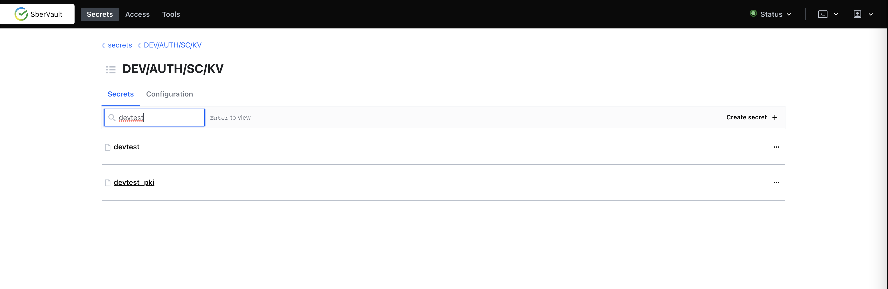
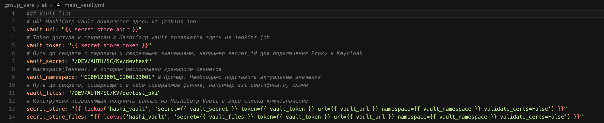
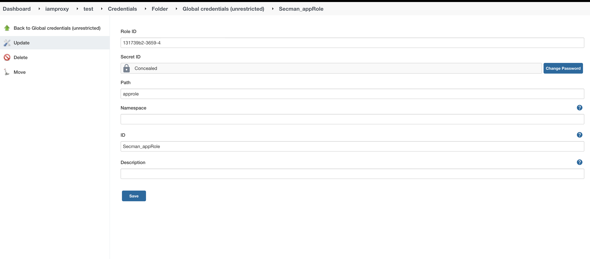
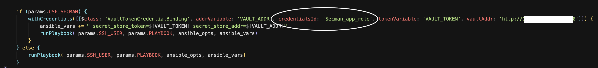
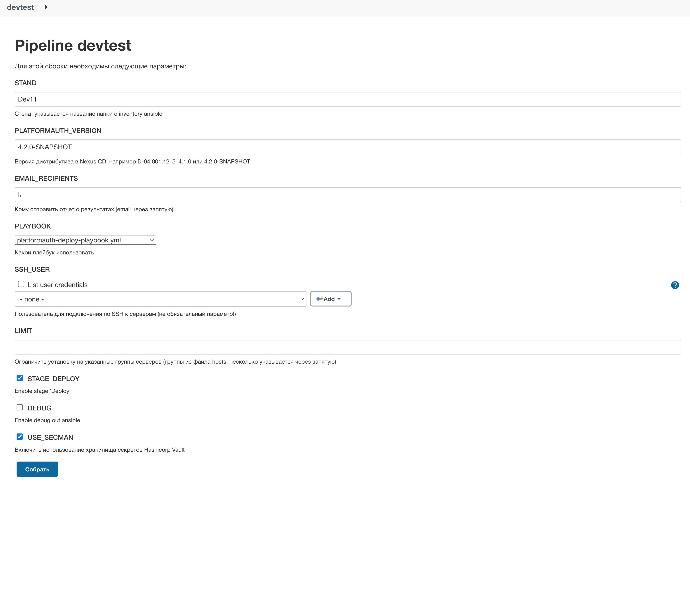

# Использование Vault на виртуальной машине

## Назначение

Vault - это инструмент, который обеспечивает безопасный и надежный способ хранения, распространения и управления
секретами. IAM Proxy может использовать Vault на этапе развертывания для получения паролей от учетных записей,
сертификатов, закрытых ключей.

## Настройка использования Vault на виртуальной машине

### Создание секретов в Vault

Для использования Vault с IAM Proxy, необходимо предварительно разместить секреты на сервере Vault, для этого выполните
следующие действия:

1. В UI Vault создайте хранилище с типом `KV` для размещения паролей и т.п., где в ключе задается имя переменной, а в
   значении пароль. Имена ключей (переменных) должны соответствовать именам приведенных в Таблице 1 (эти имена
   используются в ansible при установке, в `main_vault.yml`, а путь до хранилища задается в переменной
   ansible-inventory `vault_secret`).\
   
2. При использовании Vault Agent на VM, в UI Vault создайте хранилище с типом `KV` для размещения паролей и т.п.
   используемых на Vault Agent. В хранилище как ключ задается имя переменной, а в значении пароль. Имена ключей (
   переменных) должны соответствовать именам приведенных в Таблице 2 (эти имена используются в шаблонах на Vault Agent,
   а путь до хранилища задается в переменной ansible-inventory `vault_agent_secret`).
3. В UI Vault создайте хранилище с типом `KV` для размещения сертификатов и баз ключей/сертификатов. В хранилище как
   ключ задается имя файла, а в значении содержимое файла. В случае с базами ключей не текстового формата, файл базы
   должен быть закодирован по стандарту `base64` и задан в значении секрета текстом (допускаются переводы строк), при
   этом в имя ключа (файла)
   добавляется окончание `.base64` (например `keycloak-keystore.p12.base64`). Имена ключей (файлов) должны
   соответствовать Таблице 3.

Таблица 1

| Имя ключа/переменной              | Описание                                                                                                                |
|-----------------------------------|-------------------------------------------------------------------------------------------------------------------------|
| deployer_pass                     | Пароль пользователя iamproxy-deployer                                                                                   |
| keycloak_admin_password           | Пароль администратора realm master компонента KeyCloak.SE                                                               |
| keycloak_admin_password_temporary | Временный пароль администратора realm master компонента KeyCloak.SE                                                     |
| keycloak_db_password              | Пароль пользователя БД Postgres компонента KeyCloak.SE                                                                  |
| keycloak_funcadmin_password       | Пароль функционального администратора realm PlatformAuth компонента KeyCloak.SE                                         |
| keycloak_keystore_password        | Пароль от хранилища ключей для компонента KeyCloak.SE                                                                   |
| nexus_url_password                | Пароль пользователя nexus для скачивания дистрибутива IAM Proxy                                                         |
| proxy_session_secret              | Секрет используемый для шифрования сессии IAM Proxy (длинна д.б. > 100 символом, и НЕ должно содержать символов `'\$` ) |
| rds_client_keyStorePassword       | Пароль хранилища ключей приложения RDS Client                                                                           |
| rds_client_trustStorePassword     | Пароль хранилища доверенных сертификатов ЦС приложения RDS Client                                                       |
| spas_wsSyncSpas_password          | Пароль пользователя для синхронизации с Авторизацией                                                                    |
| proxy_oidc_client_secret          | client_secret для подключения IAM Proxy к KeyCloak.SE по OIDC                                                           |

Таблица 2

| Имя ключа/переменной          | Описание                                                                                                                                                          |
|-------------------------------|-------------------------------------------------------------------------------------------------------------------------------------------------------------------|
| PROXY_SESSION_SECRET          | секрет для шифрования сессии, полное описание смотрите в [Описание параметров компонента IAM Proxy](proxy-deploy-docker-description.md)                           |
| PROXY_OIDC_CLIENT_ID          | client-id, полное описание смотрите в [Описание параметров компонента IAM Proxy](proxy-deploy-docker-description.md)                                              |
| PROXY_OIDC_CLIENT_SECRET      | secret для client-id , полное описание смотрите в [Описание параметров компонента IAM Proxy](proxy-deploy-docker-description.md)                                  |
| PROXY_OIDC_CLIENT_ID_ALT      | альтернативный `CLIENT_ID` используемый для аутентификации по `OIDC` на `IDP` [Описание параметров компонента IAM Proxy](proxy-deploy-docker-description.md)      |
| PROXY_OIDC_CLIENT_SECRET_ALT  | секрет к альтернативному `CLIENT_ID` [Описание параметров компонента IAM Proxy](proxy-deploy-docker-description.md)                                               |
| OIDC_CLIENT_RSA_PRIVATE_KEY   | ключ для аутентификации на IDP методом private_key_jwt, полное описание смотрите в [Описание параметров компонента IAM Proxy](proxy-deploy-docker-description.md) |
| AUTHZ_BY_OAUTH_JWT_PUBLIC_KEY | ключ для проверки JWT из запроса , полное описание смотрите в [Описание параметров компонента IAM Proxy](proxy-deploy-docker-description.md)                      |
| AUTHZ_SPAS_SECRET             | ключ при обращении к API Авторизации, полное описание смотрите в [Описание параметров компонента IAM Proxy](proxy-deploy-docker-description.md)                   |
| ttl                           | задается частота обновления с сервера секретов на Vault Agent (например 1h)                                                                                       |

Таблица 3

| Имя ключа/файла            | Описание                                                                                                                                                                                 |
|----------------------------|------------------------------------------------------------------------------------------------------------------------------------------------------------------------------------------|
| proxy-server.crt.pem       | Сертификат для организации https на прокси (имя файла опционально и задается через параметр `proxy_cert_file`)                                                                           |
| proxy-server.key.pem       | Закрытый ключ для организации https на прокси (имя файла опционально и задается через параметр `proxy_key_file`)                                                                         |
| proxy-client-mtls.crt.pem  | Клиентский сертификат для организации mtls с backend (файл опционален и задается через параметр `proxy_mtls_cert_file`, если не задан будет использован файл из `proxy_cert_file`)       |
| proxy-client-mtls.key.pem  | Закрытый ключ для организации для организации mtls с backend (файл опционален и задается через параметр `proxy_mtls_key_file`, если не задан будет использован файл из `proxy_key_file`) |
| trusted_chain.crt.pem      | Сертификаты доверенных центров сертификации в формате PEM, которые выдали сертификаты нам и/или смежным серверам (это как минимум корневой и промежуточный ЦС)                           |
| proxy-server.p12.base64    | База сертификатов/ключей IAM Proxy в которой содержится сертификат для организации https на keycloak                                                                                     |
| keycloak-server.p12.base64 | База сертификатов/ключей keycloak в которой содержится сертификат для организации https на keycloak                                                                                      |
| ttl                        | задается частота обновления с сервера секретов на Vault Agent (например 1h)                                                                                                              |

### Настройка профиля установки (ansible inventory)

1. Из дистрибутива взять демо-профиль установки `DemoProfile-with-Vault`
   или `DemoProfile-OnlyProxy-with-Vault` (`<дистрибутив>/package/scripts/ansible/inventories/DemoProfile-*`), и на основе него
   создать профиль под свой стенд.
2. В `main_vault.yml` указать пути к хранилищам секретов (созданных выше) используемых в ansible. В
   переменной `vault_secret` указать путь до хранилища с паролями и т.п., а в `vault_files` указать путь до хранилища
   содержащего файлы (сертификаты, ключи, keystore).
3. Если используется Vault Agent на VM, то в `vault_agent.yml` указать пути к хранилищам секретов используемых на Vault
   Agent, в переменной `vault_agent_secret` указать путь до хранилища с паролями и т.п., а в `vault_agent_files` указать
   путь до хранилища содержащего файлы (сертификаты, ключи, keystore).

Пример: \

### Настройка Jenkins

1. Перейти в Jenkins и создать учетные данные (credential) с параметрами подключения к Vault типа `App Role`(
   рекомендуется создать с ID `vault_approle`). \
   
2. Если используется Vault Agent на VM, то создать в Jenkins учетные данные (credential) с ID `vault_approle_creds`, c
   параметрами подключения к Vault типа `Username Password`, указав как имя пользователя `role-id`, а как
   пароль `secret-id` (как альтернатива этому credential, можно задать в `vault_agent.yml` в
   переменной `vault_approle_id` значение `role-id` текстом, а `secret-id` доставлять на целевые сервера вручную или
   отдельным процессом в файл `/opt/vault/secrets/secretid`).
3. В файле pipeline Jenkins Job (`<дистрибутив>/package/scripts/jenkins/PlatformAuth_CDL.jenkinsfile`) необходимо указать ID
   созданных учетных данных (credential), если они отличаются от рекомендованных. \
   
4. При запуске Jenkins Job развертывания поставить чекбокс `USE_SECMAN` в параметрах запуска, а в параметре `vaultAddr`
   указать адрес сервера Vault. \
   

## Настройка использования Vault Agent на виртуальной машине

Предварительно может быть выполнена установка пакета vault-agent на VM (не средствами установки IAM Proxy).

> Если установка пакета vault-agent выполняется отдельно на VM, и должна быть выполнена до запуска скриптов подготовки.
>
> Установка предусмотрена средствами автоматизированной установки IAM Proxy из URL до rpm 
> (параметр `url_download_vault_agent_rpm`) или из zip-файла с исполняемым файлом `vault`(параметр `vault_path_agent_zip`).

Для включения использования Vault Agent при установке, в профиле установки необходимо задать переменные:

- `vault_agent_use: True` - включение функциональности Vault Agent;
- `vault_path_agent_zip` - путь до zip-архива с Vault Agent (с исполняемым файлом `vault`, размещенный на том сервере,
  где запускается playbook. Пример: "/tmp/vault-agent-1.0.0-distrib.zip";
- `url_download_vault_agent_rpm` - от куда загрузить RPM-пакет Vault Agent, при выполнении скриптов подготовки
  серверов (если не указывать, то нужно использовать `vault_path_agent_zip` или предварительно вручную Vault Agent
  устанавливать на серверах).
  Пример: "http://repo.mycompany.ru/altlinux_trusted_repo/rpm/CI03163472_SCMNAGENTLIN-01.013.00-52-distrib.rpm"
- `vault_validate_certs: False` - включение проверки SSL и т.п. при подключении по SSL (если задается в True, то
  необходимо указать доверенные ЦС в файле `files/trusted_ca_vault.crt.pem`);
- `vault_agent_secret` - путь до хранилища секретов с паролями и секретными значениями (например secret для подключения
  IAM Proxy к IDP);
- `vault_agent_files` - путь до хранилища секретов, содержащего в себе содержимое файлов, например ssl сертификаты;
- `vault_approle_id` - role-id от approle Vault, который нужно доставить до VA;
- `vault_approle_secret_id` - secret-id от approle Vault, который нужно доставить до VA;
- `vault_approle_mount_path` - путь в API, по которому доступна approle;
- `vault_approle_wrapped_token` - одноразовый токен для получения secret-id;
- `vault_secret_id_wrap_ttl_minutes` - время жизни wrapped-токена для secret-id в минутах (влияет на частоту обновления
  wrapped-токена);
- `vault_agent_certs_pki` - путь до PKI engine, позволяющий получать ssl сертификаты и ключи;
- `vault_agent_certs_pki_cn` - CN для получаемого сертификата из PKI (по умолчанию stend_abbr);
- `vault_agent_certs_pki_san` - SAN для получаемого сертификата из PKI (по умолчанию proxy_dnsname);
- `vault_agent_backend_certs_pki` - путь до PKI engine, позволяющий получать клиентский сертификат и ключ для
  подключения к бэкенд (по умолчанию будет использован сертификат с `vault_agent_certs_pki`);
- `vault_path_tokens` - путь до каталога на целевых серверах, для размещения role-id и secret-id для vault-agent;
- `vault_roleid_filename` - имя файла на целевых серверах с role-id на Vault;
- `vault_secretid_filename` - имя файла на целевых серверах с secretid на Vault;
- `vault_wrapped_token_filename` - имя файла на целевых серверах, куда будет сохранен токен по которому будет получен
  secretid (с сервера Vault) в случае потери secretid (например после перезагрузки сервера);
  
> Примечание
>
> Значения для `vault_approle_id` и `vault_approle_secret_id` (`role_id` и `secret_id`) рекомендуется задавать,
> как параметры при запуске ansible-playbook (в job pipeline из дистрибутива используется
> jenkins-cred-id="vault_approle_creds" с типом usernamePassword, для задания `role_id` и `secret_id`).
> Или до запуска установки доставлять `role_id` и `secret_id` на сервера в
> файлы /opt/vault/tokens/roleid и /opt/vault/secrets/secretid
> (в последнем случае параметры vault_approle_id и vault_approle_secret_id не нужно задавать в профиле установки,
> и нужно убрать их из профиля).
