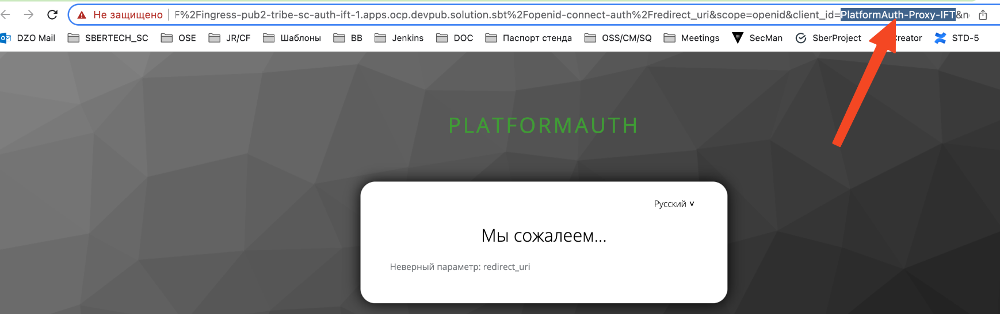

# SecMan. Ротация секретов в контейнере IAM Proxy (PROXY_OIDC_CLIENT_ID)

## Описание

## параметры приемки

1. Проверить, что Deployment сервиса содержит аннотации подключения Vault-agent сайдкара.
2. Провести замену секретов в Secman и дождаться обновления секретов на подах.
3. Удостовериться, что секреты сервиса IAM Proxy изменились на новые.

## Предусловия

1. Проверить, что Deployment сервиса содержит аннотации подключения Vault-agent сайдкара.

## Шаги проверки

1. **Действие**:

   В Deployments основного модуля
   auth-iamproxy найти и выбрать для теста один из используемых секретов, задаваемых в виде
   {{- with secret "..." -}}
   В АРМ Secret Management перейти на вкладку Secrets Engines, а затем в
   каталог, в котором хранится секрет. Запомнить текущее значение секрета.

   В АРМ Secret Management перейти на вкладку Secrets Engines, а затем в
   каталог, в котором хранится секрет. Запомнить (Сохранить) текущее значение секрета.

   **Тестовые данные**:

   |  |
   | --- |
   | vault.hashicorp.com/agent-inject-template-oidc-auth-secrets: | {{- with secret "DEV_DZO/A/DEV/AUTH/KV/OSE.pub2-tribe-sc-auth-ift-1" -}}  {{- $proxy_oidc_client_id := or .Data.PROXY_OIDC_CLIENT_ID "" -}} |

2. **Действие**:

   На вкладке DEV_DZO/A/DEV/AUTH/KV/OSE.pub2-tribe-sc-auth-ift-1
   Добавить время жизни секретов - утановить значение ttl:5s , что будет эквивалентно 5 сек

   **Успешный результат**:

   добавлено ttl

3. **Действие**:

   Для применения изменений выполненых на шаге 2 выполнить рестарт пода приложения.

   **Успешный результат**:

   Рестарт пода выполнен успешно

4. **Действие**:

   В АРМ Secret Management в каталоге, в котором хранится секрет изменить значение(value) в секрете. В рамках кейса допустимо некорректное значение.

   **Успешный результат**:

   Секрет изменен

5. **Действие**:

   В логах контейнера приложения проверить, что секрет был изменен
   для этого найти строку:

   /secrets/PROXY_OIDC_CLIENT_ID
   [monitor-on-modify.sh] ### MODIFIED ### (2023-07-12T09:21:39+03:00)
   [monitor-on-modify.sh] wait secretRefreshingWindow (5 s)

   **Успешный результат**:

   Ротация секрета в vault успешна.
   Строка найдена

6. **Действие**:

   В консоли OSE перейти на вкладку Workloads -> Pods. Выбрать pod и перейти
   на вкладку Terminal.

   **Успешный результат**:

   Выполнено

7. **Действие**:

   В Terminal выполнить команду просмотра содержимого секрета.

   **Тестовые данные**:

   Файл можно посмотреть с помощью команды cat.
   Синтаксис команды: cat {путь к файлу}

   bash-4.4$ cat /secrets/oidc-auth-secrets.server.conf

   **Успешный результат**:

   В терминале выведено содержимое файла.

8. **Действие**:

   Проверить, что значение секрета в файле на стенде совпадает с новым
   значением в
   Secret Management.

   **Успешный результат**:

   Значения совпадают.

9. **Действие**:

   В браузере вести URL защищенного ресурса (Proxy)
   Выполнить аутентификацию

   **Успешный результат**:

   Произошла ошибка аутентификации
   так как при редиректе прокси на IDP в uri невалидное значение client_id

   

10. **Действие**:

    Вернуться в АРМ Secret Management в каталоге, в котором хранится секрет, вернуть валидное значение

    **Успешный результат**:

    Секрет сохранен

11. **Действие**:

    В логах контейнера приложения проверить, что секрет был изменен
    для этого найти строку:

    /secrets/PROXY_OIDC_CLIENT_ID
    [monitor-on-modify.sh] ### MODIFIED ### (2023-07-12T09:21:39+03:00)
    [monitor-on-modify.sh] wait secretRefreshingWindow (5 s)

    **Успешный результат**:

    Ротация секрета в vault успешна.
    Строка найдена

12. **Действие**:

    В Terminal пода выполнить команду просмотра содержимого секрета.
    Файл можно посмотреть с помощью команды cat.
    Синтаксис команды: cat {путь к файлу}

    bash-4.4$ cat /secrets/oidc-auth-secrets.server.conf

    **Успешный результат**:

    В терминале выведено содержимое файла.
    значение секрета в файле на стенде совпадает с новым
    значением в Secret Management.

13. **Действие**:

    В браузере вести URL защищенного ресурса (Proxy)
    Выполнить аутентификацию

    **Успешный результат**:

    Аутентификация выполнена успешно