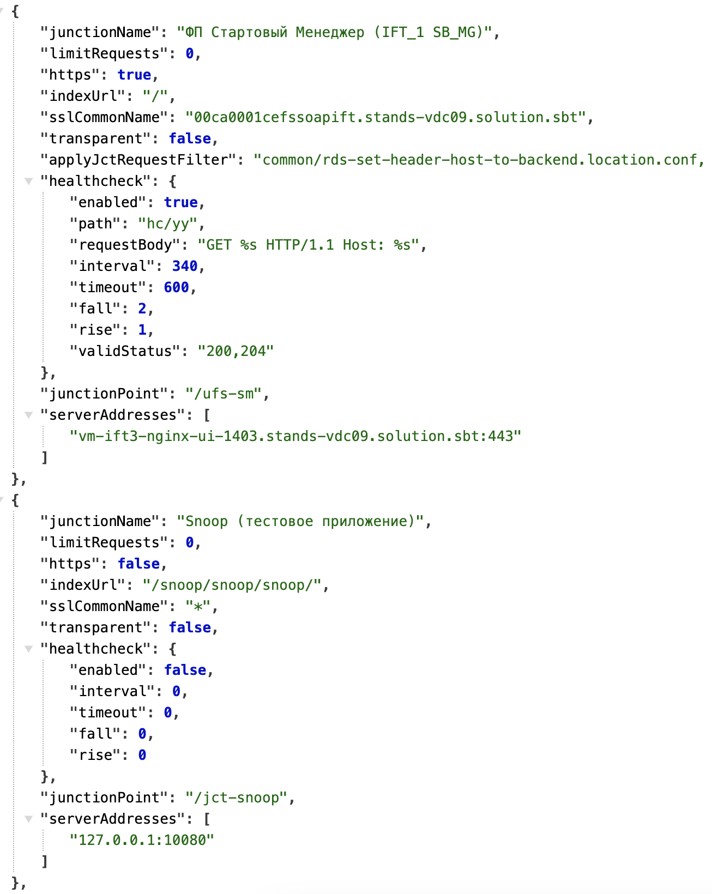

# Проверка активного healtcheck до бэка в разрезе ответвлений

## Описание

- `PROXY_HEALTHCHECK_ENABLE` - True/False, опциональный, default False, True - включение активного healthcheck до серверов бэка (проверяются ответвления, в которых есть строка '/rds-healthcheck' в applyJctRequestFilter, или `True` в healthcheck.enable), будет вызов GET /healthcheck(изменение через healthcheck.enable) каждые 10 сек.(изменение через healthcheck.interval), и ожидается в ответе http-код 200\302(изменение через healthcheck.validStatus) для живогоузла (статус доступен по url `http://127.0.0.1:10080/status/healthcheck`).

## Предусловия

|  |
| --- |
|  |

## Шаги проверки

1. **Действие**:

   Выполнить вход в неймспейс проекта auth-iamproxy, перейти по пути /deployments/auth-iamproxy/environment и проверить опцию PROXY_HEALTHCHECK_ENABLE=True

   **Успешный результат**:

   Опция установлена, значение True. Настройки применены успешно.

2. **Действие**:

   Выполнить выполнить изменение конфигурации тестового ответвления. Если не подключен RDS и конфигурация вычитывается из RDS_START_CONF, то в /deployments/auth-iamproxy/yaml на тестовом ответвлении добавить конфигурацию healthcheck:
   ```
   {.....,
   "healthcheck": {
   "enable": true
   },
   ...}
   ```
   Сохранить.

   **Тестовые данные**:

   варианты конфигурирования healthcheck на ответвлении:

   

   **Успешный результат**:

   Настройки применены успешно.

3. **Действие**:

   Перейти в терминал pod(s) auth-iamproxy и выполнить запрос healtcheck:
   ```
   bash-4.4$ curl -kv '127.0.0.1:10080/status/healthcheck'
   ```

   **Тестовые данные**:

   bash-4.4$ curl -kv '127.0.0.1:10080/status/healthcheck'
   * Trying 127.0.0.1...
   * TCP_NODELAY set
   * Connected to 127.0.0.1 (127.0.0.1) port 10080 (#0)
   > GET /status/healthcheck HTTP/1.1
   > Host: 127.0.0.1:10080
   > User-Agent: curl/7.61.1
   > Accept: */*
   >
   < HTTP/1.1 200 OK
   < Server: SynGX
   < Date: Wed, 06 Nov 2024 14:22:31 GMT
   < Content-Type: text/plain
   < Transfer-Encoding: chunked
   < Connection: keep-alive
   < Keep-Alive: timeout=170
   < Expires: Thu, 01 Jan 1970 00:00:01 GMT
   < Cache-Control: no-cache
   <
   Nginx Worker PID: 399
   Upstream backend_jct_snoop-local (NO checkers)
   Primary Peers
   127.0.0.1:10080 up
   Backup Peers

   Upstream backend_jct_snoop (NO checkers)
   Primary Peers
   240.240.121.236:25040 up
   Backup Peers

   Upstream backend_jct_snoop_snoop
   Primary Peers
   240.240.165.250:25060 DOWN
   Backup Peers

   Upstream backend_jct_ufs-ift.bf-dpa
   Primary Peers
   240.240.37.39:25100 up
   240.240.227.84:25101 DOWN
   Backup Peers

   Upstream backend_jct_ufs-security-manager (NO checkers)
   Primary Peers
   240.240.65.203:25000 up
   Backup Peers

   Upstream backend_jct_ufs-sm (NO checkers)
   Primary Peers
   240.240.22.48:25020 up
   Backup Peers
   * Connection #0 to host 127.0.0.1 left intact
   bash-4.4$

   **Успешный результат**:

   В ответвлениях, где не настроен фильтр `applyJctRequestFilter: "common/rds-healthcheck-active.location.conf"` или `"healthcheck": {"enable": false}`, то в ответе возвращается статус `(NO checkers)`.