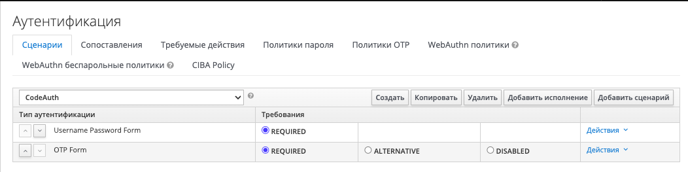

# Параллельная работа под рядовым и привилегированным пользователем

## Описание

Привилегированные пользователи АС входят в систему с использованием двух факторов аутентификации, а обычные пользователи входят по одному фактору

## Предусловия

На стенде выполнена настройка для входа под альтернативным client_id:
1. На IDP создан альтернативный proxy_client - [PlatformAuth-Proxy-Alt](https://kcse-pub2-tribe-sc-kcse-ift-2.apps.ocp.devpub.solution.sbt/auth/admin/master/console/#/realms/PlatformAuth/clients/b4f1159f-0534-48c1-837a-ed31955736a4) с типом confidential, в настройках клиента в "Переопределении потока аутентификации" для "Сценарий браузера" утстановить flow CodeAuth.
Настройка сценария:
 
2. При деплое заданы ключи для альтернативного клиента в VAULT: **proxy_oidc_client_id_alt** и **proxy_oidc_client_secret_alt**
3. Подготовлены два тестовых ответвления:
- для входа под обычным пользователем (фильтров не требуется):
{
 "https": "False",
 "indexUrl": "/snoop/",
 "junctionName": "Snoop / тестовое приложение",
 "junctionPoint": "/jct-snoop",
 "serverAddresses": [
 "127.0.0.1:10080"
 ],
 "sslCommonName": ".dev.sbt"
},

- для входа привилегированного пользователя, на ответвлении задан фильтр - "applyJctRequestFilter": "common/rds-use-client-alt.location.conf":
пример со стенда ИФТ2
{
 "applyJctRequestFilter": "common/rds-use-client-alt.location.conf",
 "https": "False",
 "indexUrl": "/snoop/",
 "junctionName": "Snoop / тестовое приложение Альтернативный клиент",
 "junctionPoint": "/jct-snoop-alt",
 "serverAddresses": [
 "127.0.0.1:10080"
 ],
 "sslCommonName": ".dev.sbt"
}

## Шаги проверки

1. **Действие**:

   Выполнить вход на защищенный ресурс под рядовым пользователем (на стенде настроено ответвление для входа по одному ФА).

   **Успешный результат**:

   Получена форма для ввода логина и пароля, после ввода логина и пароля пользователь успешно аутентифицирован. Интерфейс доступен

2. **Действие**:

   Выполнить вход на защищенный ресурс под привилегированным пользователем (на стенде настроено ответвление для входа по 2ФА, вход под альтернативным client_id) в режиме инкогнито либо в другом браузере.

   **Успешный результат**:

   Получена форма для ввода логина и пароля, после ввода логина и пароля, получена форма для ввода кода ОТП, пользователь успешно аутентифицирован. Интерфейс доступен.

3. **Действие**:

   Завершить работу под рядовым пользователем.

   **Успешный результат**:

   Выполнен выход из системы успешно.

4. **Действие**:

   Проверить, что при завершении работы под рядовым пользователем сессия под привилегированным пользователем продолжает существовать

   **Успешный результат**:

   Сессия под привилегированным пользователем продолжает существовать.