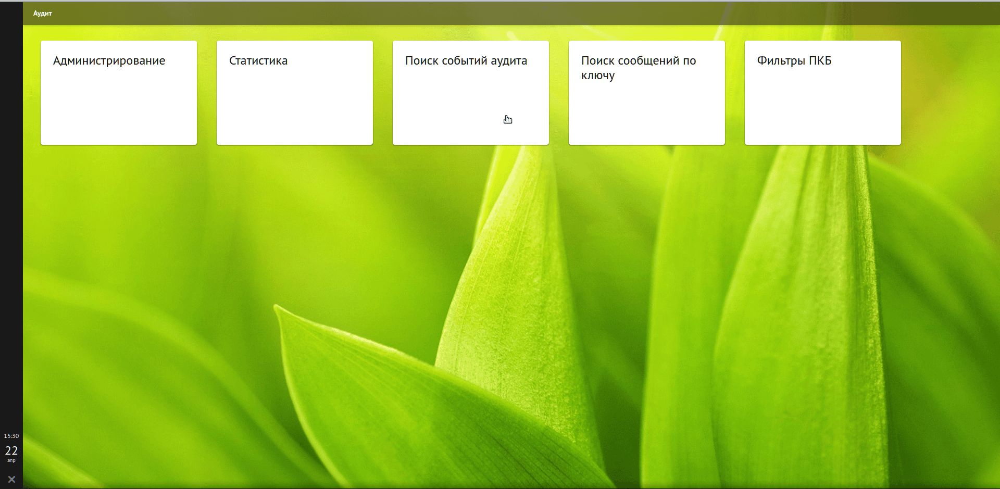
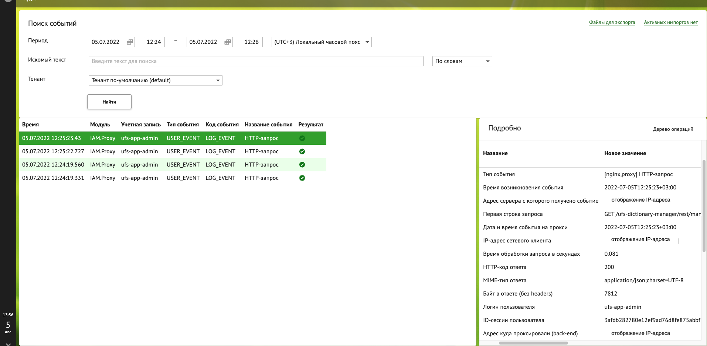

# Аудит

## Интеграция

Подразумевается два возможных сценария интеграции с Platform V Audit SE (AUDT)/Platform V Monitor (COTE):

1. Отправка событий в Platform V Audit SE (AUDT)/Platform V Monitor (COTE) компонентом Fluent Bit. События отправляемые Fluent Bit представляют собой
   HTTP-запрос. Проверка запроса происходит посредством фильтра.

Для IAM Proxy, всегда используется асинхронный режим отправки событий.

## События передаваемые из IAM Proxy в Platform V Audit SE (AUDT)/Platform V Monitor (COTE)

События формируются с использованием метамодели, которая расположена в дистрибутиве в файлах:

- `owned-distrib/package/bh/iamproxy/config/conf/common/iamproxy-audit-metamodel.json.j2`.

> Описание и требования к структуре метамодели приведено в документации продукта Platform V Audit SE (AUDT)/Platform V Monitor (COTE).

### Типы событий

| Тип события   | Описание                  | Компонент передающий событие |
|:--------------|:--------------------------|:-----------------------------|
| USER_EVENT    | HTTP-запрос               | IAM Proxy                    |

> Прочие события из IAM Proxy в Platform V Audit SE (AUDT)/Platform V Monitor (COTE) не передаются.

### Атрибуты событий

#### IAM Proxy (USER_EVENT)

| Атрибут           | Описание                                                             | Пример                                                                                        |
|-------------------|----------------------------------------------------------------------|-----------------------------------------------------------------------------------------------|
| authn.userName    | Логин пользователя                                                   | ivanov-ii                                                                                     |
| authn.userSession | ID-сессии пользователя                                               | 64116d0f-abbe-49e6-a01d-2d55937b3df4                                                          |
| server.addr       | Адрес сервера с которого получено событие и [processId:connectionId] | 10.x.x.29 [3783031:3827632]                                                                   |
| jct.root          | Контекст ответвления, с которым сопоставлен запрос                   | /fh.ift1.ctl.gf1                                                                              |
| jct.server        | Адрес куда проксировали запрос (бэкенд)                              | 10.x.x.37:9443                                                                                |
| req.id            | Внутренний уникальный ID запроса                                     | 8504fe1cceb40ad7e44caca11da54cad                                                              |
| req.rqUid         | Сквозной уникальный ID запроса                                       | 8504fe1cceb40ad7e44caca11da54cad                                                              |
| req.head          | Строка HTTP-запроса                                                  | POST /fh.ift1.ctl.gf1/ufs-circuit-breaker-manager/rest/v1/dictionaries/terbanks/list HTTP/1.1 |
| req.client_ip     | IP-адрес клиента (XFF заголовок)                                     | 10.x.x.32[]                                                                                   |
| req.date          | Дата и время события                                                 | 2025-10-01T12:08:40+03:00                                                                     |
| req.time          | Время обработки запроса (секунды)                                    | 0.030                                                                                         |
| resp.bytes        | Объем ответа без заголовков                                          | 1408                                                                                          |
| resp.status       | HTTP-код ответа                                                      | 200                                                                                           |
| resp.content_type | MIME-тип содержимого ответа                                          | application/json;charset=utf-8                                                                |
| @timestamp        | Временная метка события (Unix timestamp)                             | 1759309720.994154                                                                             |
| moduleId          | Идентификатор модуля, сгенерировавшего событие                       | IAM.Proxy                                                                                     |
| moduleVersion     | Версия модуля                                                        | 4.6.0                                                                                         |
| nodeId            | Идентификатор узла в кластере                                        | node4.platform-ift3.sc.dev.mycompany                                                          |
| tags              | Метки для категоризации события                                      | ["product:IAM","component:AUTH","name:iamproxy","sourceSystem:Platform V"]                    |

> Примечание:
> - **@timestamp** и **createdAt** представляют время события в формате Unix timestamp.
> - **tags** содержат метаданные для фильтрации и анализа событий (например, продукт, компонент, источник).
> - **moduleId/moduleVersion** указывают на источник события (модуль и его версию).
> 
> Отправляются в Аудит события только по не ресурсным HTTP запросам (ресурсные, это картинки, стили, шрифты, js и т.п.).
> Такими запросами считаются те, в ответе на которые заголовок `X-Content-Type` начинается с одной из строк:
> - `text/html`
> - `application/json`
> - `application/x`

## Просмотр логов

Для удобства просмотра логов необходимо воспользоваться пользовательским интерфейсом Platform V Audit SE (AUDT)/Platform V Monitor (COTE). Для этого выполните следующие действия:

**Примечание:**  
Для доступа к функционалу просмотра событий требуется:
- аутентификация в системе (например, через OpenID Connect);
- наличие ролей, предоставляемых администратором, таких как `AuditViewer`, `SecurityAdmin` или аналогичных, в зависимости от политики доступа вашей организации.

1. Перейдите в Platform V Audit SE (AUDT)/Platform V Monitor (COTE);
2. Нажмите на "Поиск событий аудита";
3. Укажите период событий и нажмите кнопку "Найти".

## Распространенные HTTP-коды

| Код состояния | Описание               |
|---------------|------------------------|
| 200           | Ок (Все хорошо)        |
| 401           | Ошибка аутентификации  |
| 403           | Доступ запрещен        |
| 431           | Запрос слишком большой |

## Расположение логов

### Proxy-сервер

- `/opt/iamproxy/logs/access.log`;
- `/opt/iamproxy/logs/error.log`.

### При использовании IAM Proxy как программного балансировщика

- `/opt/iamproxy/lb-logs/access-lb-iamproxy.log`;
- `/opt/iamproxy/lb-logs/error-lb-iamproxy.log`.

### RDS Client

- `/opt/iamproxy/rds-client/logs/log-\*.log`.

### Сервис обработки логов (Fluent Bit)

- `/var/log/messages`;
- `/var/log/fluent-bit/java.log`.

## События безопасности и/или метамодель аудита

IAM Proxy формирует события аудита в соответствии с заданной метамоделью и передает их в **Platform V Audit SE (AUDT)** / **Platform V Monitor (COTE)** через компонент Fluent Bit. Регистрируются только события, связанные с обработкой HTTP-запросов, имеющих бизнесовую значимость (не ресурсные: не статические файлы вроде изображений, JS, CSS и т.п.).

События отправляются в асинхронном режиме и соответствуют типу `USER_EVENT`. Ниже приведена таблица с описанием событий и параметров аудита.

| Наименование события     | Описание события                                                                 | Параметры события                                                                                                                                                                                                                                                          | Описание параметров                                                                                                                                                                                                                                                                            |
|--------------------------|----------------------------------------------------------------------------------|----------------------------------------------------------------------------------------------------------------------------------------------------------------------------------------------------------------------------------------------------------------------------|------------------------------------------------------------------------------------------------------------------------------------------------------------------------------------------------------------------------------------------------------------------------------------------------|
| `HTTP_REQUEST_EXECUTED`  | Обработка HTTP-запроса через IAM Proxy (успешная или неуспешная)                 | `authn.userName`, `authn.userSession`, `server.addr`, `jct.root`, `jct.server`, `req.id`, `req.rqUid`, `req.head`, `req.client_ip`, `req.date`, `req.time`, `resp.bytes`, `resp.status`, `resp.content_type`, `@timestamp`, `moduleId`, `moduleVersion`, `nodeId`, `tags`  | Событие фиксирует факт обработки запроса прокси. Включает данные пользователя, контекст запроса, технические параметры соединения, время выполнения, результат ответа и метаданные системы. Передается только для запросов с содержимым типа `text/html`, `application/json`, `application/x`. |

## Настройка параметров аудита

### Метамодель

Конфигурационные файлы метамодели расположены в дистрибутиве:

- `iamproxy-audit-metamodel.json.j2`.

### Формат событий

События передаются в JSON-формате согласно требованиям Platform V Audit SE (AUDT)/Platform V Monitor (COTE).

## Отправка событий во внешний сервис аудита

Режим отправки событий аудита **IAM Proxy (AUTH)** представлен в таблице:

| Наименование модуля | Режим отправки событий                                                                                                         |
|---------------------|--------------------------------------------------------------------------------------------------------------------------------|
| **Fluent Bit**      | Асинхронный режим, HTTP-запросы с проверкой через фильтр                                                                       |

> **Примечание**: Все события передаются в Platform V Audit SE с использованием метамодели, описанной выше.